# 大河智链供应链综合服务平台 — PRD v1.7

> **项目名称**：大河智链物流股份有限公司（demo）供应链综合服务平台
> **文档版本**：v1.7（按甲方 drawio v3 重大重画：6 个 sheet 全部对齐）
> **适用阶段**：一期建设（T+40，~2026 年 7 月中旬上线）
> **编写日期**：2026-07-08
> **配套原型**：https://dhzl-supply-chain.vercel.app

> 📌 **v1.7 关键变更（按甲方 drawio v3 重画）**：
> - **§4.2 入库**：补"担保方审核"环节 + "货主方盖章"状态
> - **§4.3 融资**：补"质押反担保合同" + 货主方 3 次盖章（监管/担保/资金方后）
> - **§4.4 在库**：补"定期巡库 + 盘库记录 + 巡库异常"主线 + 追保跳转 §4.5 子流程
> - **§4.5 解押**：重大修正！**先还款登记 → 再解押申请**（不是"先申请再还款"）
> - **§4.6 质物清单更新**（新增）：三方确认+盖章流程
> - **§4.7 出库申请**（新增）：与解押分开的独立流程
> - **§4.9 状态机表**（新增）：统一 20+ 状态定义
>
> 📌 **v1.6 关键变更（阴需修正）**：
> - 系统无实际线上扣款/打款能力，仅做流程化登记
> - 删除"银行扣款/扣款失败/补足余额"等线上分支

---

## 第一部分 产品概述

### 1.1 项目背景
大河智链物流股份有限公司（demo）是大河控股冷链物流投资运营平台，定位于服务冻品（牛肉/羊肉/水产等冷链）供应链金融业务。本次系统建设旨在重构升级原中信梧桐港承建的供应链管理系统，解决流程不通、风控薄弱、系统对接不畅等问题，**一期 7 月中旬上线，二期 8 月底（适配期现货代采），三期 9 月底（B2B 交易平台）**。

### 1.2 业务定位
- **核心业务**：现货质押融资监管（已开展）+ 期现货代采（二期）
- **货品种类**：进口冻品（牛肉为主，含羊肉、山羊肉、羔羊肉等）
- **典型融资规模**：单笔 30 万 ~ 300 万元
- **典型融资期限**：≤ 120 天

### 1.3 政策合规
响应《关于规范中央企业贸易管理严禁各类虚假贸易的通知》《加快数智供应链发展专项行动计划》等政策要求，全流程留痕、可审计、可追溯。

---

## 第二部分 用户角色与权限

### 2.1 角色清单
| 角色 | 主体 | 核心职责 |
|---|---|---|
| **货主方** | 上下游贸易商（融资企业） | 货物提供方、融资申请方、还款方 |
| **监管方** | 大河智链平台 | 准入审核、入库验收、在库监控、出库指令、风控处置 |
| **担保方** | 合作担保公司（如中原担保） | 核保、出具担保函、代偿 |
| **资金方** | 合作银行（民生、中信等） | 授信审批、放款、贷后管理 |

### 2.2 内部岗位（监管方细化）
| 岗位 | 职责 |
|---|---|
| 业务员 | 客户准入尽调、合同录入 |
| 风控经理 | 准入审核、价格盯市、预警处理 |
| 财务 | 账单核算、对账 |
| 运营 | 日常监控、异常处置 |

### 2.3 角色权限矩阵
| 功能模块 | 货主方 | 监管方 | 担保方 | 资金方 |
|---|:---:|:---:|:---:|:---:|
| 客户准入申请 | ✓ 创建 | ✓ 审核 | ✓ 审核 | ✓ 录入授信 |
| 入库申请 | ✓ 创建 | ✓ 审核/验收 | — | — |
| 融资申请 | ✓ 创建 | ✓ 审核 | ✓ 出函 | ✓ 放款 |
| 在库监控 | ✓ 查看自有 | ✓ 全量监控 | ✓ 关联查询 | ✓ 关联查询 |
| 质物清单 | ✓ 查看 | ✓ 签章 | ✓ 签章 | — |
| 解押/出库 | ✓ 申请 | ✓ 指令 | — | ✓ 扣款确认 |
| 月度账单 | ✓ 确认/付款 | ✓ 开具 | — | — |
| 贷后管理 | — | ✓ 协助 | ✓ 协助 | ✓ 主导 |

---

## 第三部分 业务模型

### 3.1 业务模式
#### 3.1.1 现货质押模式（已开展，核心）
**流程**：客户准入 → 入库评估 → 质押融资 → 在库监管 → 出库结算
**货权归属**：客户（货物所有权归客户，质押给监管方，监管方受担保方委托监管）
**典型案例**：DHZL_JMY_2025120101 熟牛腱 22,000kg 货值 ¥1,628,000 放款 ¥1,130,000

#### 3.1.2 期现货代采模式（二期规划）
**流程**：上下游合作确定 → 客户交 20% 保证金 → 大河 80% 配资 → 海外采购 → 清关 → 入库 → 客户还款赎货
**货权归属**：大河智链（货权逐步转移至客户）

### 3.2 关键业务参数
| 参数 | 数值 | 说明 |
|---|---|---|
| **质押率** | 80% | 放款金额 = 评估货值 × 80% |
| **货值评估下浮** | 5%-10% | 取市场价下浮，冻品价格波动大 |
| **监管费率** | 1.16‰ / 年 | 按日计费，按月结算 |
| **担保费率** | 1.5% / 年 | 单笔结清后结算 |
| **装卸费** | 70 元 / 吨 | 入出库合计 |
| **预警线** | -5% | 价格下跌 5% 触发提醒 |
| **熔断线** | -10% | 价格下跌 10% 触发追保 |
| **融资期限** | ≤ 120 天 | 最长 4 个月 |
| **期货代采保证金** | 20% | 下游交存 |

### 3.3 核心业务数据样例
- **客户**：郑州某冷链贸易有限公司（统一社会信用代码 91XXXXXXXXMAXXXXXXXX）、郑州某冷链物流有限公司
- **货品 SKU**：14 种（如 MNG_SNJ_3191397 熟牛腱、AU_QGNXG_1265 去骨牛心管）
- **仓库**：物流港二期大河智链监管库（自有）、郑州融万（第三方）、天津港国际（第三方）
- **借据号格式**：LN3019202XXXXXXXXX（中国民生银行）

---

## 第四部分 核心业务流程

### 4.1 准入与授信流程

> 💡 **4 角色协作 + 异常分支**：横向 LR 布局，4 个角色泳道（垂直方向），跨角色流转用带文字标签的箭头清晰标注。红色虚线 = 异常回退，🟡 黄色 = 转交/撤回。

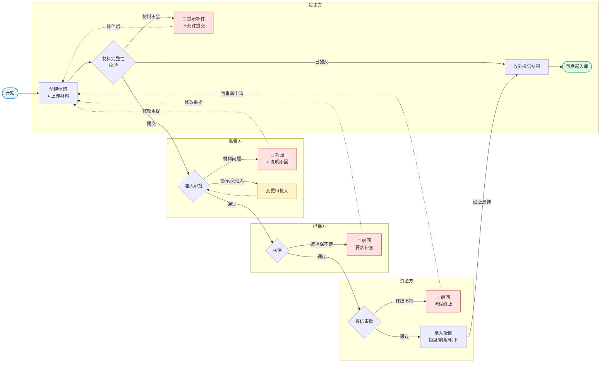

**关键节点**：
- 货主填写准入调查报告（统一模板，含企业基本情况、财务、风险分析）
- 监管方调用征信接口自动核验（工商/司法/行政处罚/征信评分）
- 担保方需查看反担保措施
- 银行录入授信额度、期限、利率

### 4.2 入库与质押流程

> 📐 **v1.7 重大调整**
> - 流程**3 角色 3 级审核**：货主方 → **担保方** → 监管方 → 仓库方入库
> - **货主方"查看申请单并盖章"** 是必经环节（状态：待货主方盖章）
> - **担保方**在监管方之前审核（drawio 明确顺序：货主→担保→监管）
> - 仓库方在监管方审核通过后才"添加入库记录"
> - 取消/作废/删除：货主在待提交前可删除，在审核中可作废

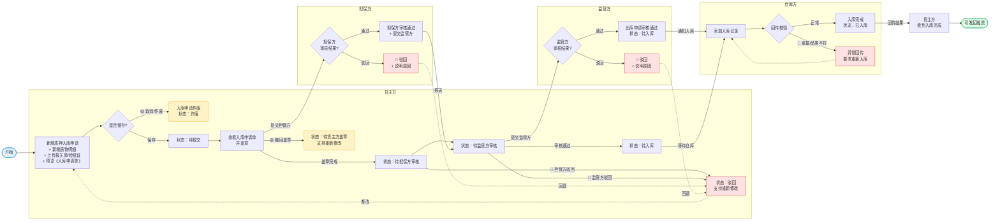

**关键规则**：
- 货值评估 = 市场价（牧集/肉交所）×（1 - 5%~10%）
- 系统自动建议评估单价，监管方可微调（±5%）
- 质物清单含：货品名称、厂号、件数、入库重量、评估单价、货值、放款金额、存储场地、银行借据号
- **审核顺序**：货主盖章 → 担保方 → 监管方 → 仓库入库（不可跳级）

**§4.2 状态机**（按 drawio）：
- 待提交 / 待货主方盖章 / 待担保方审核 / 待监管方审核 / 待入库 / 已入库 / 驳回 / 作废 / 无效

### 4.3 融资与放款流程（**v1.7 按甲方 drawio v3 重大重画**）

> 📐 **v1.7 重大调整（按甲方 drawio v3）**：
> - 流程涉及 4 角色，**货主方有 3 次盖章**（监管后 + 担保后 + 资金方后）
> - 涉及**两份核心单据**：《质物清单》+《质押反担保合同》
> - 审核顺序：**监管方 → 担保方 → 资金方**（不可跳级）
> - 放款环节：资金方线下打款 + 上传放款证明 + 电子回单登记
>
> ⚠ **【正需修正 v1.6】放款场景同 §4.5/§4.4**：资金方**线下完成银行打款**（受托支付），系统不发起实际转账。

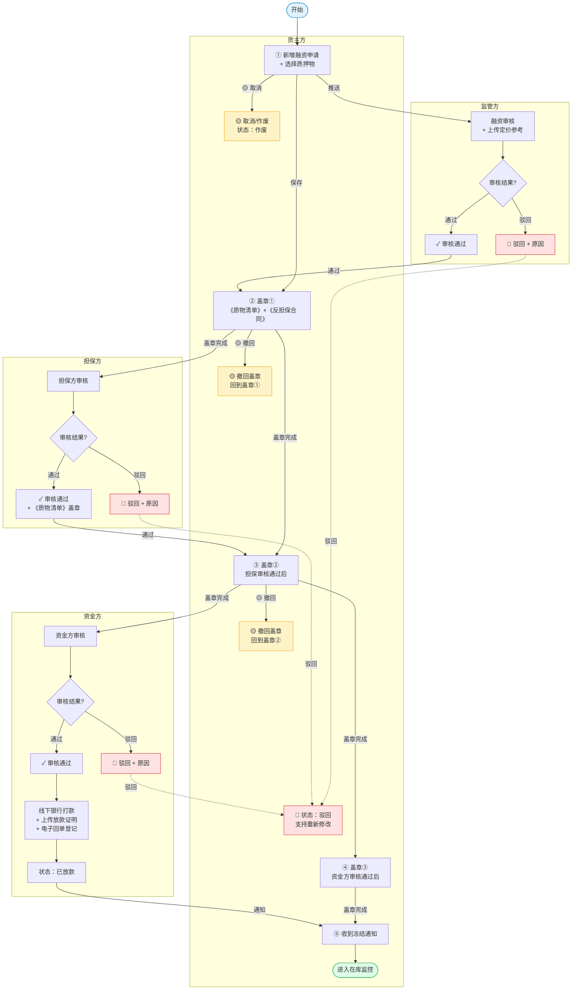

**关键计算**：
- 放款金额 = 评估货值 × 80%
- 资金成本预估 = 担保费（1.5%/年×天数）+ 监管费（1.16‰/年×天数）
- 还款方式：到期一次性还本付息 / 按月结息到期还本
- 受托支付：资金可付至客户指定账户或上游采购商

**关键单据**（甲方新增）：

- **《质物清单》**：货主方 + 监管方 + 担保方 + 资金方 四方盖章
- **《质押反担保合同》**：货主方 + 担保方 双方盖章（监管方审核通过后）

**§4.3 状态机**（按 drawio）：
- 待提交 / 待监管方确认 / 待监管方盖章 / 待融资方盖章 / 待担保方确认 / 待担保方盖章 / 待放款 / 已放款 / 待还款 / 驳回

### 4.4 在库监控流程（**v1.7 按甲方 drawio v3 重大重画**）

> 📐 **v1.7 重大调整（按甲方 drawio v3）**：
> - 流程**拆为 2 条并行主线**：
>   - **主线 A：定期巡库**（仓库方 → 盘库记录 → 是否异常 → 推送预警）
>   - **主线 B：价格盯市**（RPA 抓取 → 计算在库货值 → 货值是否跌破 → 推送预警）
> - 预警后处理：发起提前还款提示 → **提前线下还款** → **直接跳 §4.5 解押出库子流程**（不再是独立闭环）
> - 补"定期巡库 + 上传盘库记录"环节（之前完全缺失）
> - 4 角色泳道：监管方/系统 + 货主方/融资方 + 担保方 + 资金方
>
> ⚠ **【正需修正 v1.6】追保还款同样无线上扣款能力**：货主方线下还款 → 上传回执单 → 资金方确认（与 §4.5 一致）。

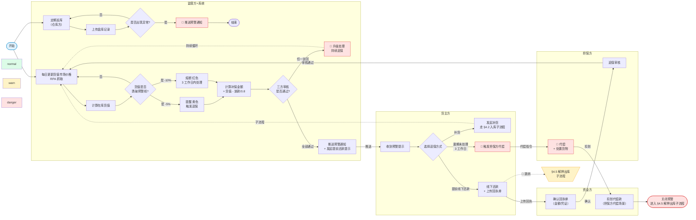

**RPA 配置**：
- 抓取频率：每日 09:30（开市后）
- 数据源：牧集网、肉交所（人工可调整）
- 货品 SKU：14 种（见数据字典）

### 4.5 解押与出库流程（**v1.7 按甲方 drawio v3 重大重画**）

> 📐 **v1.7 重大调整（按甲方 drawio v3）**：
> - 流程**拆为阶段 A + 阶段 B**：**先还款登记 → 再解押申请**（不是"先申请再还款"）
> - 阶段 A 涉及 2 角色（货主方 + 资金方），阶段 B 涉及 3 角色（货主方 + 监管方 + 担保方）
> - **货主方两次盖章**：阶段 B 监管方审核通过后 + 担保方审核通过后，货主方各盖一次《质物清单》
> - 仓库方放行**不在本流程**（出库走 §4.7 出库申请流程）
> - 资金方在解押审核环节**不参与**（仅在阶段 A 还款登记时参与确认回单）
>
> ⚠ **【正需修正】系统无实际扣款能力**：阶段 A 的"线下还款"为货主方与资金方线下完成，**系统只做流程化登记**。

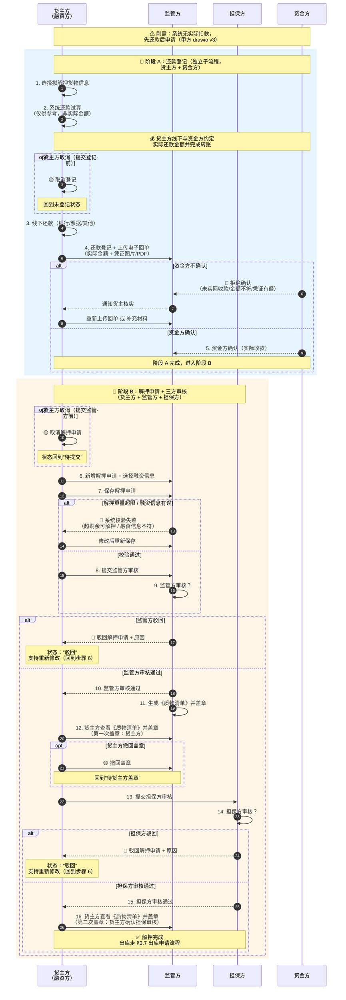

**关键规则**：
- **阶段顺序不可颠倒**：必须先完成阶段 A（还款登记）才能进入阶段 B（解押申请）
- **货主方两次盖章**：第 12 步（监管审核通过后）+ 第 16 步（担保审核通过后）
- 出库单价 = 入库时确定的评估单价（**非动态价格**）
- 客户可分批出库，最后一批按总额减已出金额计算
- **回单字段**（必须）：实际还款金额、还款方式（转账/票据/其他）、还款日期、凭证图片/PDF、付款账户、收款账户
- **资金方不确认场景**：（a）未实际收款；（b）实际金额 < 试算金额；（c）凭证有疑

**§4.5 状态机**（按 drawio）：
- 待提交 / 待监管方确认 / 待监管方盖章 / 待担保方确认 / 待担保方盖章 / 待融资方盖章 / 已还款 / 驳回 / 作废 / 无效

### 4.6 质物清单更新流程（**v1.7 新增，按甲方 drawio v3**）

> 📐 **v1.7 新增流程**：解押/补货/价格预警等场景下，需要更新《质物清单》，涉及**三方确认+盖章**。任一方驳回 → 重新出具。

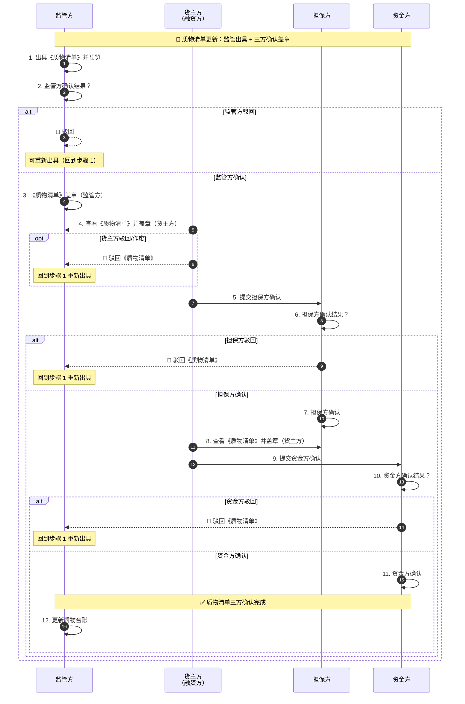

**关键规则**：
- 三方顺序确认：监管方 → 货主方 → 担保方 → 货主方 → 资金方（货主方盖章 2 次）
- 任一方驳回 → 回到"监管方出具"重新生成清单
- 质物清单涉及货品名称、厂号、件数、重量、评估单价、货值、放款金额、存储场地、借据号

**§4.6 状态机**（按 drawio）：
- 待出具 / 待货主方盖章 / 待担保方盖章 / 待资金方盖章 / 已确认 / 驳回（任一方）

---

### 4.7 出库申请流程（**v1.7 新增，按甲方 drawio v3**）

> 📐 **v1.7 新增流程**：与解押流程**分开**（§4.5 是解押还款 + 申请，§4.7 是**实际出库**）。解押完成后，货主方需要单独走"出库申请"才能真正提货。

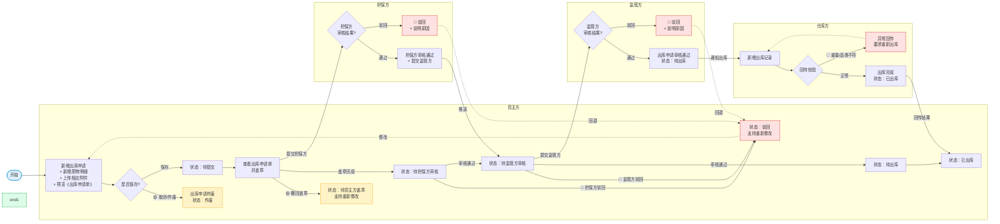

**关键规则**：
- **出库申请与解押申请分开**：解押完成（§4.5 阶段 B 结束）后，货主方才能发起出库申请
- **审核顺序**：货主盖章 → 担保方 → 监管方 → 仓库出库（与 §4.2 入库流程对称）
- 货物实际出库必须由仓库方执行（监管方下发出库指令后）

**§4.7 状态机**（按 drawio）：
- 待提交 / 待货主方盖章 / 待担保方审核 / 待监管方审核 / 待出库 / 已出库 / 驳回 / 作废

### 4.8 结算与还款流程
- **监管费**：按月在库货值 × 1.16‰ / 365 × 当月天数
- **担保费**：单笔业务结清后结算 = 放款金额 × 1.5% / 365 × 实际占用天数
- **仓储费**：自有仓按天计费（30 元/m²/月）
- **装卸费**：70 元/吨（入出合计）
- **结算单生成**：每月 1 日自动生成上月账单
- **客户确认** → 付款 → 系统核销

### 4.9 申请类业务统一状态机表（**v1.7 新增**）

> 📐 **v1.7 新增**：甲方 drawio 各流程都有 8-13 个状态，整合成统一表便于开发/测试对照。

| 状态值 | 含义 | 适用流程 | 状态颜色 |
|---|---|---|---|
| `draft` | 草稿 | 全流程通用 | 灰色 |
| `pending_submit` | 待提交 | 货主方未提交 | 灰色 |
| `pending_owner_seal` | 待货主方盖章 | §4.2 / §4.7 | 黄色 |
| `pending_guarantor` | 待担保方审核 | §4.2 / §4.3 / §4.5 / §4.7 | 蓝色 |
| `pending_guarantor_seal` | 待担保方盖章 | §4.5 / §4.6 | 蓝色 |
| `pending_platform` | 待监管方审核 | §4.2 / §4.3 / §4.5 / §4.7 | 紫色 |
| `pending_platform_seal` | 待监管方盖章 | §4.5 / §4.6 | 紫色 |
| `pending_owner_seal_2` | 待货主方二次盖章 | §4.5 / §4.6 | 黄色 |
| `pending_funding` | 待资金方审核 | §4.3 | 橙色 |
| `pending_funding_seal` | 待资金方盖章 | §4.3 / §4.6 | 橙色 |
| `pending_funding_payment` | 待放款 | §4.3 | 橙色 |
| `pending_inbound` | 待入库 | §4.2 | 紫色 |
| `pending_outbound` | 待出库 | §4.7 | 紫色 |
| `repaid` | 已还款 | §4.5 | 绿色 |
| `released` | 已放款 | §4.3 | 绿色 |
| `inbound_completed` | 已入库 | §4.2 | 绿色 |
| `outbound_completed` | 已出库 | §4.7 | 绿色 |
| `rejected` | 驳回 | 全流程通用 | 红色 |
| `voided` | 作废 | 全流程通用 | 灰色 |
| `invalid` | 无效 | 全流程通用 | 灰色 |

---

## 第五部分 系统架构

### 5.1 一期功能模块
1. **基础服务**：个人/企业认证、合作主体档案、权限、主数据管理、消息通知
2. **数字供应链平台**：合同、业务线、订单、收发货、收付款、发票
3. **智慧仓储管理平台**：入库/出库、库存、监控（视频/温度）、巡库、磅房称重、PDA
4. **供应链金融平台**：资产管理、融资申请/审核、放还款、额度管理
5. **全生命周期风险管理**：主体准入、敞口/额度、价格盯市、追保、预警

### 5.2 一期菜单结构（v1 已实现）
**货主方**（7 个页面）：首页 / 准入 / 入库 / 在库监控 / 融资 / 质物清单 / 解押出库 / 月度账单
**监管方**（5 个页面）：首页 / 准入审批 / 入库审批 / 在库监控大盘 / 融资审核 / 解押出库审批
**担保方**（1 个页面）：首页 / 融资审核
**资金方**（1 个页面）：首页 / 放款审核

### 5.3 系统对接
| 对接方 | 方式 | 状态 |
|---|---|---|
| WMS 仓库管理 | 数据对接 | 一期目标 |
| 新宁园区系统 | 已对接（112.4.90.146） | 完成 |
| 银行系统 | API 直连 | 民生/中信进行中 |
| 第三方价格（牧集/肉交所） | RPA 抓取 | 一期实现 |
| OA / 短信 / 小程序 | 通知推送 | 一期目标 |

---

## 第六部分 页面级详细说明

> **每个页面包含**：页面标识 / 用途 / 关键字段 / 业务规则 / 跳转逻辑 / 交互方式 / 异常处理

### 6.1 通用：登录页（/login）

- **页面 ID**：LOGIN_001
- **页面用途**：用户身份认证入口，支持 4 角色一键登录（演示）+ 账号密码登录
- **关键字段**：手机号、密码、验证码、角色标识
- **业务规则**：
  - 平台用户均需实名认证（姓名+身份证+手机号三要素）
  - 企业认证通过第三方核查（工商/司法/违法）
  - 角色绑定企业账号（每个企业分配企业管理员）
- **跳转逻辑**：
  - 登录成功 → `/dashboard`（根据角色展示不同 Dashboard）
  - 失败 → Toast 提示，保持登录页
- **交互方式**：
  - 4 个角色按钮一键登录（演示用）
  - 表单登录（生产用）：手机号/密码/验证码
- **异常处理**：登录失败 5 次锁定 30 分钟；网络异常 Toast 提示

### 6.2 通用：Dashboard（/dashboard）

- **页面 ID**：DASH_001（4 角色共用，内容通过 JS 分支）
- **页面用途**：工作台首页，展示当前用户核心数据 + 待办 + 预警
- **关键字段**：根据角色不同
  - 货主方：授信总额度 / 已用额度 / 可用额度 / 在贷笔数 / 月度账单 / 价格预警
  - 监管方：活跃客户 / 在库货值 / 融资余额 / 待办审批 / 风险预警
  - 担保方：担保总额度 / 在保余额 / 待审核融资
  - 资金方：授信总额 / 在贷余额 / 本月放款 / 不良率 / 五级分类
- **跳转逻辑**：点击各模块 → 对应功能页
- **交互方式**：角色切换器（顶部）→ 整个 Dashboard 联动刷新
- **异常处理**：数据加载失败 → 显示"重试"按钮

### 6.3 货主方-准入申请（/customer/admission）

- **页面 ID**：ADM_C_001
- **页面用途**：货主方提交准入申请 + 查看准入进度
- **关键字段**：
  - 企业基本信息：企业名称、统一社会信用代码、法定代表人、注册资本、成立日期、经营范围
  - 联系人信息：联系人姓名、电话
  - 申请材料：营业执照、财务报表、完税证明、征信报告（PDF/JPG/PNG）
  - 数据授权协议（必勾）
- **业务规则**：
  - 准入流程：货主提交 → 监管方审核 → 担保方审核 → 资金方录入授信（4 步）
  - 申请材料至少 4 项
  - 提交后进入"待审核"状态
- **跳转逻辑**：
  - "新建准入申请" → 弹出创建弹窗
  - 各角色菜单切换后查看状态变化（监管/担保/资金方各有自己的审批页）
- **交互方式**：
  - 列表：筛选（状态/关键字）、查看详情、进度可视化（4 个圆点）
  - 创建：分步表单（基本信息/联系人/材料）、文件拖拽上传、数据授权勾选
- **异常处理**：必填字段未填 → 红色星号提示；上传文件 > 20MB → 拒绝

### 6.4 货主方-入库申请（/customer/inbound）

- **页面 ID**：INB_C_001
- **页面用途**：货主方提交入库申请（支持新货入库 / 货权转移）
- **关键字段**：
  - 入库基本信息：入库仓库、入库方式（新货/货转）、车牌号、司机信息
  - 货物明细：货品（SKU）、件数、净重、评估单价、评估货值
  - 随附单据：报关单、检验检疫证、入境货物检验检疫证明、货权转移单
- **业务规则**：
  - 系统根据市场价自动建议评估单价（下浮 5%-10%）
  - 同一申请可包含多个货品
  - 总评估货值 = Σ（件数 × 重量 × 评估单价）
- **跳转逻辑**：
  - 提交后 → 监管方入库审批
  - 审批通过 → 入库 → 系统自动生成质物清单
- **交互方式**：
  - 列表：状态筛选、查看详情
  - 创建：表单填写 + 货品动态添加（+ 添加货品按钮）
- **异常处理**：货品未选择 → 提示；重量 ≤ 0 → 提示

### 6.5 货主方-融资申请（/customer/financing）

> 📌 **v1.7 扩展版**（基于 Axure RP 原型）：本页面是 v1.7 §4.3 融资流程的**入口页**，含 3 次货主方盖章。原型图请参考 `/assets/screenshots/10-financing-create.png` 等（需从 RP 导出）。

#### 6.5.1 页面入口与权限

| 项目 | 说明 |
|---|---|
| **页面 ID** | FIN_C_001 |
| **页面 URL** | `/customer/financing` |
| **所属角色** | 货主方（操作人 operator / 盖章人 sealUser）|
| **入口位置** | 顶部导航"融资管理"→ 融资申请 |
| **关联页面** | 准入（前置） → 入库（前置） → 融资（本页） → 质物清单（后续） |
| **查看权限** | 仅货主方本人（本企业的融资申请）|
| **操作权限** | 操作人：创建/编辑草稿/查看/催办<br>盖章人：创建/盖章/查看/催办<br>非盖章人提交 = 保存草稿（系统不发起审核）|

#### 6.5.2 页面布局（Axure RP 截图）

**列表页**：


> 图中红框处：①顶部新建按钮 ②状态筛选 Tab ③货主方盖章进度列 ④列表行 ⑤操作列（查看/盖章/质物清单）

**创建表单**：


> 图中红框处：①6 步流程进度条 ②质押入库单选择 ③质物清单预览 ④申请金额输入 ⑤资金成本预估

**详情页**：


> 图中红框处：①顶部状态卡 ②8 步审批进度 ③单据信息 ④操作按钮（动态变化）

**盖章弹窗（融资 3 次盖章）**：
  

> 图中红框处：①3 步进度条 ②单据预览 ③印章选择 ④法律声明 ⑤下一步提示

#### 6.5.3 字段规则（列表列）

| 字段 | 类型 | 必填 | 校验规则 | 来源 | 示例 |
|---|---|---|---|---|---|
| 融资编号 | string | - | 系统自动生成：DHZL_&lt;客户简称&gt;_YYYYMMDDNN | 系统 | `DHZL_JMY_2025122201` |
| 关联入库单 | string | - | 从已入库未融资的单据选 | 系统 | `IN_20260705001` |
| 货品 | string | - | 展示质押入库单的主货品 | 关联 | `水煮山羊肉 MNG_SZSYR_BWS` |
| 评估货值 | number | - | 入库时评估单价×重量 | 关联 | `¥1,499,400.00` |
| 质押率 | enum | - | 固定 80% | 系统常量 | `80%` |
| 申请融资金额 | number | ✓ | = 评估货值 × 80%（可手动调整，但 ≤ 80%）| 客户输入 | `¥1,190,000.00` |
| 融资期限 | enum | ✓ | 60/90/120 天 | 客户输入 | `120 天` |
| 还款方式 | enum | ✓ | `到期一次性还本付息` / `按月结息到期还本` | 客户输入 | `到期一次性` |
| 资金成本预估 | number | - | 自动计算 = 担保费 + 监管费 | 计算 | `¥2,355.13` |
| 状态 | enum | - | 见 §6.5.6 状态机 | 系统 | `pending_owner_seal` |
| 货主方盖章进度 | object | - | 1/2/3 次盖章记录 | 系统 | `⏳ 待盖章①` |
| 创建时间 | datetime | - | 提交时自动记录 | 系统 | `2026-07-05 14:32` |
| 创建人 | string | - | 当前登录用户 | 系统 | **操作人提交时**：`陈志强（操作人）`<br>**盖章人提交时**：`李雪（盖章人）` |

#### 6.5.4 字段规则（创建表单）

| 字段 | UI 组件 | 必填 | 校验规则 | 错误提示 | 默认值 |
|---|---|---|---|---|---|
| 选择质押入库单 | select | ✓ | 必须从"已入库未融资"列表选<br>支持搜索 bizNo / 货品名 | `请先完成入库申请` | 自动加载最近一笔 |
| 货品预览 | readonly card | - | 选中入库单后自动加载 | - | 关联展示 |
| 评估货值 | readonly number | - | = 件数 × 净重 × 评估单价 | - | 自动计算 |
| 申请融资金额 | number input | ✓ | ≤ 评估货值 × 80%<br>≥ 100 元（最低起融）| `超过可用额度 ¥X` | `评估货值 × 80%` |
| 融资期限 | radio | ✓ | 60 / 90 / 120 三选一 | - | `120 天` |
| 还款方式 | radio | ✓ | 2 选 1 | - | `到期一次性还本付息` |
| 资金成本预估 | readonly card | - | = 担保费(1.5%/年×天数) + 监管费(1.16‰/年×天数) | - | 实时计算 |
| 备注 | textarea | - | ≤ 500 字 | - | 空 |

#### 6.5.5 交互说明（按用户操作）

**操作 1：进入列表页**

1. 顶部导航点击"融资管理"→ "融资申请"
2. 系统加载本企业的所有融资申请（按创建时间倒序）
3. 默认 Tab = 全部，按状态徽标颜色分类显示
4. 列表默认显示 20 条/页，可翻页

**操作 2：新建融资申请**

1. 点击右上角"📝 新建融资申请"按钮
2. 弹出创建表单 modal
3. 选择质押入库单 → 系统自动加载该入库单的货品/货值
4. 修改申请金额（如需，≤ 80%）
5. 选择融资期限（60/90/120）
6. 选择还款方式
7. 系统实时计算"资金成本预估"（黄色提示框）
8. 勾选"已阅读并同意《融资协议条款》"（必勾）
9. 点击"提交申请"按钮
   - 若当前用户是盖章人（sealPermission=true）→ 状态变为 `pending`（待监管方审核），跳详情页
   - 若当前用户是操作人（无盖章权限）→ 状态变为 `draft`（草稿），Toast 提示"请通知盖章人完成签章"
10. 系统自动站内信通知监管方

**操作 3：货主方盖章①（监管方审核通过后触发）**

1. 监管方审核通过后，状态变为 `pending_owner_seal`
2. 货主方打开列表 → 盖章进度列显示 `⏳ 待盖章①`
3. 点击"🔖 去盖章"按钮 → 跳转到 `/customer/seal-flow.html?bizNo=XXX&seal=1`
4. 在签章页：
   - 左侧单据预览（《质物清单》+《质押反担保合同》合订本）
   - 右侧印章选择（公司公章/财务章/法人章/合同章）
5. 拖动印章到盖章区域
6. 勾选"本人确认本签章具有法律效力"
7. 点击"确认签章并提交" → 状态变为 `pending_guarantor`（待担保方审核）
8. 系统自动站内信通知担保方

**操作 4：货主方盖章②（担保方审核通过后触发）**

1. 担保方审核通过后，状态变为 `pending_owner_seal_2`
2. 货主方列表盖章进度列显示 `⏳ 待盖章②`
3. 点击"🔖 去盖章②" → 跳转到 `/customer/seal-flow.html?bizNo=XXX&seal=2`
4. 流程同盖章①
5. 完成后状态变为 `pending_funding`（待资金方审核）

**操作 5：货主方盖章③（资金方审核通过后触发）**

1. 资金方审核通过后，状态变为 `pending_owner_seal_3`
2. 货主方列表盖章进度列显示 `⏳ 待盖章③`
3. 点击"🔖 去盖章③" → 跳转到 `/customer/seal-flow.html?bizNo=XXX&seal=3`
4. 流程同盖章①（但只盖《质物清单》，不含反担保合同）
5. 完成后状态变为 `released`（已放款，货物冻结）
6. 系统自动站内信通知货主方"已成功放款 ¥X"

**操作 6：撤回盖章**

1. 在盖章完成后的 30 分钟内，货主方可在盖章页点"撤回盖章"按钮
2. 状态回退到上一个状态（如盖章①撤回 → 回到 `pending` 监管方审核）
3. 系统通知对应审核方重新审核
4. 30 分钟后不可撤回（避免无限循环）

**操作 7：驳回后修改重提**

1. 任一审批方驳回后，状态变为 `rejected`
2. 列表行变红，显示驳回原因（hover 详情）
3. 货主方点击"✏️ 修改重新提交" → 跳回创建页（保留原数据）
4. 修改后点击"重新提交" → 状态回到 `pending`
5. 重新进入审核流程

**操作 8：催办**

1. 在审核中状态下（>24h），货主方点击"📞 催办"按钮
2. 系统站内信通知当前审核方（最多 1 次/24h，避免骚扰）
3. 按钮变为灰色"已催办"，24h 后可再次点击

**操作 9：查看质物清单**

1. 点击"📄 查看质物清单"按钮
2. 跳转到 `/customer/pledge-list?bizNo=XXX`
3. 在质物清单页可查看 5 步签章进度

#### 6.5.6 状态机

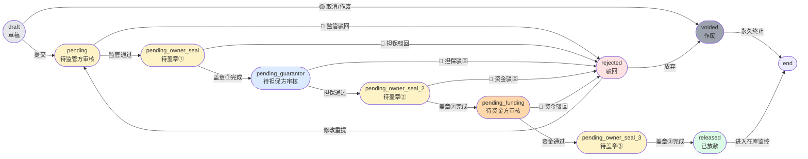

**状态机说明表**：

| 状态值 | 含义 | 进入条件 | 可执行操作 | 离开条件 | 通知 |
|---|---|---|---|---|---|
| `draft` | 草稿 | 操作人保存为草稿 | 编辑/删除/提交 | 提交或删除 | 无 |
| `pending` | 待监管方审核 | 盖章人提交 | 催办/撤回 | 监管通过/驳回 | 站内信 → 监管方 |
| `pending_owner_seal` | 待盖章① | 监管通过 | 去盖章/撤回申请 | 盖章完成/作废 | 站内信 → 货主方 |
| `pending_guarantor` | 待担保方审核 | 盖章①完成 | 催办/撤回盖章 | 担保通过/驳回 | 站内信 → 担保方 |
| `pending_owner_seal_2` | 待盖章② | 担保通过 | 去盖章②/撤回 | 盖章完成 | 站内信 → 货主方 |
| `pending_funding` | 待资金方审核 | 盖章②完成 | 催办 | 资金通过/驳回 | 站内信 → 资金方 |
| `pending_owner_seal_3` | 待盖章③ | 资金通过 | 去盖章③/撤回 | 盖章完成 | 站内信 → 货主方 |
| `released` | 已放款 | 盖章③完成 | 查看凭证/查看清单 | 进入在库监控 | 站内信 → 货主方 |
| `rejected` | 驳回 | 任一审批方驳回 | 修改重提/放弃 | 重提或放弃 | 站内信 → 货主方 |
| `voided` | 作废 | 主动作废/驳回后放弃 | 无 | 永久终止 | 站内信 → 货主方 |

#### 6.5.7 异常处理

| 场景 | 触发时机 | 系统行为 | 用户提示（Toast） | 恢复方式 |
|---|---|---|---|---|
| 申请金额 > 80% 货值 | 提交时校验 | 阻止提交 | 🔴 `超过可用额度 ¥X，最多可融 ¥Y` | 修改金额 |
| 申请金额 < 100 元 | 提交时校验 | 阻止提交 | 🔴 `融资金额不能低于 ¥100` | 提高金额 |
| 关联入库单已发起融资 | 选择入库单时校验 | 阻止选择 | 🟡 `该入库单已发起融资` | 选其他入库单 |
| 操作人提交（无盖章权限） | 提交时校验 | 保存为草稿 | 🟡 `请通知盖章人完成签章` | 切换账号或通知盖章人 |
| 盖章权限不足（sealPermission=false） | 进入盖章页 | 重定向回列表 | 🔴 `您无电子签章权限` | 切换盖章人账号 |
| 印章未放置 | 提交盖章 | 阻止提交 | 🟡 `请先将印章拖到盖章位置` | 拖动印章 |
| 法律声明未勾选 | 提交盖章 | 阻止提交 | 🟡 `请勾选法律声明` | 勾选声明 |
| 网络中断 | 任何 API 调用 | 重试 3 次后失败 | 🔴 `网络异常，请重试` | 点击重试 |
| 重复提交（双击） | 提交时 | 后端去重（基于 bizNo） | 🟡 `请勿重复提交` | 等待 |
| 30 分钟内撤回 | 盖章完成 | 允许撤回 | 🟢 `已撤回盖章，回到上一步` | 无 |
| 30 分钟后撤回 | 盖章完成 | 禁止撤回 | 🔴 `已超过 30 分钟，无法撤回` | 联系审核方 |
| 印章图片加载失败 | 进入盖章页 | 显示占位图 | 🟡 `印章图片加载失败` | 刷新页面 |

#### 6.5.8 关联跳转

| 来源页面 | 触发动作 | 目标页面 | URL 参数 | 携带数据 |
|---|---|---|---|---|
| `/customer/inbound` | "📈 发起融资"按钮 | `/customer/financing` | `?inboundId=xxx` | 预选入库单 |
| `/customer/financing` | 点击列表行 | `/customer/financing-detail` | `?id=xxx` | 完整融资数据 |
| `/customer/financing` | "🔖 去盖章①"按钮 | `/customer/seal-flow` | `?bizNo=xxx&seal=1` | 单据预览 |
| `/customer/financing` | "🔖 去盖章②"按钮 | `/customer/seal-flow` | `?bizNo=xxx&seal=2` | 单据预览 |
| `/customer/financing` | "🔖 去盖章③"按钮 | `/customer/seal-flow` | `?bizNo=xxx&seal=3` | 单据预览 |
| `/customer/financing` | "📄 查看质物清单"按钮 | `/customer/pledge-list` | `?bizNo=xxx` | 5 步签章进度 |
| `/customer/financing` | "✏️ 修改重提"按钮 | `/customer/financing`（创建模式） | `?reEdit=xxx` | 原数据回填 |
| `/customer/financing-detail` | "📞 催办"按钮 | 当前页（不跳转） | - | Toast 提示 |
| `/customer/financing-detail` | "📄 下载凭证"按钮 | `/api/v1/financing/{id}/voucher` | - | PDF 下载 |
| `/dashboard` | "融资待办"卡片 | `/customer/financing` | `?status=pending_xxx` | 预筛选 |

#### 6.5.9 数据权限

| 字段 | 货主方（操作人） | 货主方（盖章人） | 监管方 | 担保方 | 资金方 |
|---|---|---|---|---|---|
| 申请金额 | ✓ 编辑 | ✓ 编辑 | ✓ 查看 | ✓ 查看 | ✓ 查看 |
| 评估货值 | ✓ 查看 | ✓ 查看 | ✓ 查看 | ✓ 查看 | ✓ 查看 |
| 资金成本预估 | ✓ 查看 | ✓ 查看 | ✓ 查看 | ✓ 查看 | ✓ 查看 |
| 盖章图片 | ✓ 查看（自己） | ✓ 查看+操作 | ✓ 查看 | ✓ 查看 | ✓ 查看 |
| 驳回原因 | ✓ 查看 | ✓ 查看 | ✓ 查看（自己） | ✓ 查看（自己） | ✓ 查看（自己） |
| 放款凭证 | ✓ 查看 | ✓ 查看 | - | - | ✓ 查看+上传 |
| 借据号 | - | - | - | - | ✓ 编辑 |

#### 6.5.10 性能要求

| 指标 | 要求 | 备注 |
|---|---|---|
| 列表加载时间 | ≤ 1.5s | 含 20 条数据 |
| 创建表单加载 | ≤ 0.8s | 加载可选入库单列表 |
| 状态变更响应 | ≤ 0.5s | 提交/盖章/审核 |
| 印章图片加载 | ≤ 0.3s | 4 个预设印章 |
| 法律声明勾选 | 即时 | 无延迟 |
| 表单提交响应 | ≤ 1s | 含后端校验 |
| 大文件上传（凭证） | ≤ 3s | 10MB 以内 |

#### 6.5.11 盖章人专属视图（v1.7.3 新增）

> 📌 **业务背景**：客户方账号分两类——**操作人**（陈志强，无盖章权）与**盖章人**（李雪，有盖章权）。两类账号登录后看到的页面、操作权限不同。盖章人登录后**仅展示入库申请中归属于其盖章范围的清单**，其余页面隐藏。

**业务规则（已确认，2026-07-09）**：
- **过滤维度**：`customerCode === 当前盖章人所属企业` ∩ `status ∈ {pending_owner_seal, rejected}`
- **入口**：登录盖章人账号 → 自动跳转 `/customer/inbound`（不显示 dashboard）
- **菜单裁剪**：仅保留「货物管理 → 入库申请」一项，其余菜单（融资/在库/出库/账单/准入）全部隐藏
- **操作列**：仅保留「查看详情」按钮，无新建/编辑/删除/催办
- **详情页布局**：与操作人一致，所有非盖章按钮禁用（灰态+不可点击），下半部分内嵌盖章工作区

**6.5.11.1 入口与菜单**

| 项目 | 说明 |
|---|---|
| **登录后跳转** | `/customer/inbound`（不走 dashboard） |
| **可见菜单** | 仅「货物管理 → 入库申请」一项 |
| **隐藏菜单** | 首页概览 / 准入申请 / 在库货物 / 融资申请 / 质物清单 / 解押·出库 / 月度账单 |
| **Topbar 角色标识** | `货主方 · 盖章人` + `郑州某冷链 · 李雪`（橙色徽标，与操作人区分） |
| **退出登录** | Topbar 右上角，与普通账号一致 |


> 图中红框处：①Topbar 橙色徽标「盖章人」②筛选侧栏仅显示状态（无业务编号/日期）③操作列只有「查看详情」④状态徽标只有「⏳ 待盖章」「🔴 已驳回」

**6.5.11.2 列表过滤规则**

| 字段 | 过滤条件 | 备注 |
|---|---|---|
| customerCode | === `MockData.users.customer_seal.company` 对应的客户编码 | 郑州某冷链 = `JMY` |
| status | ∈ {`pending_owner_seal`, `rejected`} | 复合过滤：仅展示"待盖章"和"已驳回（需重提）"两类 |
| 入库单 sealUser | 默认 = 当前盖章人姓名（李雪） | 预留扩展：未来可能多盖章人轮值 |

**SQL 逻辑示意**：
```sql
SELECT * FROM inbound_applications
WHERE customer_code = 'JMY'
  AND status IN ('pending_owner_seal', 'rejected')
  AND seal_user = '李雪'
ORDER BY updated_at DESC
```

**6.5.11.3 列表字段差异（vs 操作人）**

| 列名 | 操作人看到 | 盖章人看到 | 差异原因 |
|---|---|---|---|
| 融资编号 | 显示 | 显示 | 一致 |
| 关联入库单 | 显示 | 显示 | 一致 |
| 货品 | 显示 | 显示 | 一致 |
| 评估货值 | 显示 | 显示 | 一致 |
| 质押率 | 显示 | 显示 | 一致 |
| 申请金额 | 显示 | 显示 | 一致 |
| 融资期限 | 显示 | 显示 | 一致 |
| 还款方式 | 显示 | 显示 | 一致 |
| 资金成本预估 | 显示 | 显示 | 一致 |
| 状态 | 显示 | 显示 | 一致 |
| 货主方盖章进度 | 显示 | **加粗高亮** | 盖章人需重点关注 |
| 创建时间 | 显示 | 显示 | 一致 |
| 创建人 | 显示 | 显示 | 一致 |
| 创建人角色标签 | - | **新增**：「操作人」「盖章人」徽标 | 让盖章人知道是谁发起的 |
| 操作列 | [查看详情] [去盖章②] [去盖章③] [查看质物清单] [催办] [修改重提] | **仅 [查看详情]** | 盖章人无其他权限 |

**6.5.11.4 详情页布局（盖章人视角）**

详情页 = 完整布局 + 盖章工作区。**所有非盖章按钮禁用**（不可点击，灰态显示）。

**页面分区**（自上而下）：

| 区块 | 内容 | 盖章人状态 |
|---|---|---|
| 顶部状态卡 | 业务编号、当前状态、进度条 | 只读 |
| 单据基本信息 | 客户企业、入库单号、货品、评估货值、申请金额等 | 只读 |
| 质物清单预览 | 货品明细表 | 只读 |
| 审批进度时间轴 | 6 步进度（货主盖章 → 担保审核 → 监管审核 → 仓库入库 → 质物清单出具） | 只读 |
| **盖章工作区** | 印章选择 + 单据预览（拖拽盖章）+ 法律声明 + 确认按钮 | **可操作** |
| 其他附件 | 评估报告、入库照片 | 只读 |
| 历史盖章记录 | 该单据所有盖章记录 | 只读 |
| 底部操作栏 | [撤回] [驳回] [催办] 等 | **全部禁用**（仅当状态匹配时显示盖章区可点击） |

**盖章工作区组件结构**：

```
┌─────────────────────────────────────────────┐
│ 📌 当前盖章人：李雪（财务总监）              │
│                                            │
│ 印章选择：[公司公章▼]  [财务专用章]  [法人章]│
│                                            │
│ ┌─ 单据预览区 ─┐  ┌─ 盖章画布 ─┐          │
│ │ 《质物清单》  │  │ 拖拽印章   │          │
│ │ （缩略图）    │  │ 到此处      │          │
│ └─────────────┘  └─────────────┘          │
│                                            │
│ ☐ 本人确认本签章具有法律效力                │
│                                            │
│ [确认签章并提交]  [取消]                    │
└─────────────────────────────────────────────┘
```

**6.5.11.5 字段规则（盖章工作区）**

| 字段 | UI 组件 | 必填 | 校验规则 | 错误提示 |
|---|---|---|---|---|
| 当前盖章人 | readonly card | - | 自动 = 当前登录用户 | - |
| 印章类型 | select | ✓ | 必须在 `sealScope` 范围内（李雪=3 个） | `该印章不在您的签章权限内` |
| 印章位置 | drag-drop area | ✓ | 必须拖入单据预览区指定位置 | `请先将印章拖到盖章位置` |
| 法律声明勾选 | checkbox | ✓ | 必须勾选 | `请勾选法律声明` |

**6.5.11.6 交互说明**

**操作 1：进入盖章人首页**
1. 用盖章人账号（李雪）登录
2. 系统跳过 dashboard，直接跳转 `/customer/inbound`
3. Topbar 显示橙色徽标「盖章人」+ 「郑州某冷链 · 李雪」
4. 左侧菜单仅显示「货物管理 → 入库申请」

**操作 2：查看待盖章清单**
1. 列表加载 JMY 企业 + 待盖章/已驳回状态的入库单
2. 默认按更新时间倒序
3. 「盖章进度」列加粗高亮显示「⏳ 待盖章」/「🔴 已驳回」
4. 「创建人」列附加角色徽标（操作人/盖章人）

**操作 3：进入详情页盖章**
1. 点击「查看详情」按钮 → 跳转 `/customer/inbound-detail?id=xxx`
2. 详情页加载完整布局
3. 顶部状态卡显示「⏳ 待货主方盖章」橙色徽标
4. 滚到页面下半部分，看到「盖章工作区」
5. 选择印章类型（仅显示 `sealScope` 内的印章）
6. 拖拽印章到单据预览指定位置
7. 勾选法律声明
8. 点击「确认签章并提交」→ 弹二次确认 → 确认 → 系统提交
9. 状态变更：`pending_owner_seal` → `pending_guarantor`（待担保方审核）
10. 系统站内信通知担保方
11. Toast 提示「盖章完成，已推送至担保方审核」

**操作 4：驳回后重新盖章（重提场景）**
1. 担保方/监管方驳回后，状态变为 `rejected`
2. 列表中行变红，显示驳回原因（hover 详情）
3. 盖章人点击「查看详情」进入详情页
4. 顶部状态卡显示「🔴 已驳回：XXX原因」
5. 驳回区域显示驳回方/时间/原因（只读）
6. 盖章工作区仍可操作（重新选择印章+盖章）
7. 点击「确认签章并重新提交」→ 状态重新回到 `pending_owner_seal` → `pending_guarantor`

**6.5.11.7 异常处理**

| 场景 | 触发时机 | 系统行为 | 用户提示 | 恢复方式 |
|---|---|---|---|---|
| 盖章人无 `sealPermission` | 任意盖章动作 | 阻止 | 🔴 `您无电子签章权限` | 联系管理员开通 |
| 印章未在 `sealScope` 内 | 选择印章时 | 阻止 | 🔴 `该印章不在您的签章权限内` | 切换账号 |
| 印章未拖入指定位置 | 提交盖章 | 阻止 | 🟡 `请先将印章拖到盖章位置` | 拖动印章 |
| 法律声明未勾选 | 提交盖章 | 阻止 | 🟡 `请勾选法律声明` | 勾选声明 |
| 当前状态非 `pending_owner_seal/rejected` | 进入详情页 | 不显示盖章区 | 🟡 `当前状态无需盖章` | 查看历史盖章记录 |
| 单据已被他人盖章 | 并发提交 | 后端去重 | 🟡 `该单据已被盖章，请刷新` | 刷新页面 |
| 网络异常 | 盖章提交 | 重试 3 次 | 🔴 `网络异常，请重试` | 点击重试 |
| 印章图片加载失败 | 进入详情页 | 显示占位图 | 🟡 `印章图片加载失败` | 刷新页面 |

**6.5.11.8 数据权限差异表（操作人 vs 盖章人）**

| 字段 / 操作 | 操作人（陈志强） | 盖章人（李雪） | 备注 |
|---|---|---|---|
| 查看本企业入库申请 | ✓ | ✓（仅 JMY） | 盖章人范围更窄 |
| 创建入库申请 | ✓ | ✓ | 一致 |
| 编辑入库申请（草稿） | ✓ | ✓ | 一致 |
| 删除入库申请（草稿） | ✓ | ✗ | 盖章人无删除权 |
| 提交入库申请 | ✓（保存草稿，需盖章人盖章） | ✓（直接进入审核） | 核心差异 |
| 查看入库详情 | ✓ | ✓ | 一致 |
| **执行盖章** | ✗（无 `sealPermission`） | ✓ | 盖章人独占 |
| 编辑非盖章字段（驳回后） | ✓ | ✗（仅盖章人视角） | 修改需操作人 |
| 撤回盖章 | - | ✓（30 分钟内） | 盖章人独占 |
| 查看质物清单 | ✓ | ✓ | 一致 |
| 融资申请 | ✓ | ✗（菜单隐藏） | 盖章人无法融资 |
| 在库监控 | ✓ | ✗（菜单隐藏） | - |
| 解押/出库 | ✓ | ✗（菜单隐藏） | - |
| 月度账单 | ✓ | ✓ | 一致 |

**6.5.11.9 关联跳转**

| 来源页面 | 触发动作 | 目标页面 | 携带参数 |
|---|---|---|---|
| `/login` | 选择「货主方 · 盖章人」账号 | `/customer/inbound` | - |
| `/customer/inbound`（盖章人视角） | 点击「查看详情」 | `/customer/inbound-detail` | `?id=xxx` |
| `/customer/inbound-detail` | 点击「确认签章并提交」 | 当前页（不跳转） | - |
| `/customer/inbound-detail` | 点击「取消」 | `/customer/inbound` | - |
| `/customer/inbound-detail` | 点击「查看历史盖章记录」 | 当前页内嵌抽屉 | - |
| Topbar 右上角 | 点击「退出登录」 | `/login` | - |

### 6.6 货主方-在库监控（/customer/monitoring）

- **页面 ID**：MON_C_001
- **页面用途**：货主方实时查看在库货物、价格预警、追保提示
- **关键字段**：
  - 在库总数 / 在库总货值 / 在贷笔数 / 预警数
  - 价格预警列表（业务编号、货品、价格变化率、阈值、建议操作）
  - 价格趋势（近 30 天）
  - 在库货物列表（业务编号、货品、仓库、在库重量、货值、最新价、变化率）
- **业务规则**：
  - 价格预警阈值：-5% 提醒（黄）/ -10% 熔断（红）
  - 建议操作：补充质押物 / 提前还款
- **跳转逻辑**：
  - 预警卡片"立即补保"按钮 → 触发追保流程
- **交互方式**：
  - 趋势图：30/90/365 天切换
  - 预警卡片：黄色背景（提醒）/ 红色背景（熔断）
- **异常处理**：无在库货物 → 空状态提示；价格抓取失败 → 显示"上次更新时间"

### 6.7 货主方-质物清单（/customer/pledge-list）

- **页面 ID**：PL_C_001
- **页面用途**：查看已生成的质物清单 + 三方电子签章状态
- **关键字段**：
  - 清单编号 / 关联融资（借据号）/ 货品 / 入库日期 / 评估货值 / 质押金额
  - 签章状态：监管方 / 客户 / 担保 三方各自状态
- **业务规则**：
  - 质物清单由系统根据入库单自动生成
  - 需三方电子签章后才能用于融资放款
- **跳转逻辑**：
  - "查看清单" → 弹出完整清单详情
- **交互方式**：
  - 完整清单视图：抬头 + 基础信息 + 货品明细表 + 关键金额 + 三方签章区
  - 操作：下载 PDF / 发送签章
- **异常处理**：签章未完成 → 状态徽标提示

### 6.8 货主方-解押/出库（/customer/outbound）

- **页面 ID**：OUT_C_001
- **页面用途**：货主方创建解押申请 → 系统算应还款（参考） → 客户**线下还款** → **上传还款回执单** → 资金方确认
- **关键字段**：
  - 选择质押业务（下拉）
  - 本次解押重量
  - 应还款金额（自动计算 = 重量 × 入库评估单价 + 利息）
- **业务规则**（**已修复原系统逻辑倒置**）：
  - 旧流程：客户还款 → 申请解押 ❌
  - 新流程：申请解押 → 系统算应还款 → 客户确认 → **线下还款 + 上传回执** → 资金方确认 → 出库 ✅（阴需修正：系统不发起实际扣款）
  - 出库单价按入库时评估单价（非动态价格）
- **跳转逻辑**：
  - 6 步骤进度可视化（创建申请 → 系统计算 → 客户确认 → 线下还款 + 上传回执 → 资金方确认 → 出库指令 → 仓库放行）
- **交互方式**：
  - 实时计算应还款金额（输入重量 → 自动计算）
- **异常处理**：超过剩余可解押重量 → 提示

### 6.9 货主方-月度账单（/customer/bills）

- **页面 ID**：BILL_C_001
- **页面用途**：查看/确认每月账单（监管费 + 担保费 + 仓储费 + 装卸费）
- **关键字段**：
  - 账单周期、账单编号、客户
  - 监管费（货值 × 1.16‰ / 年 × 天数）
  - 担保费（放款金额 × 1.5% / 年 × 天数）
  - 仓储费（自有仓按面积/天）
  - 装卸费（70 元/吨）
  - 合计应付金额
- **业务规则**：
  - 每月 1 日自动生成上月账单
  - 客户确认后才能进入付款流程
- **跳转逻辑**：
  - 确认账单 → 进入付款流程
- **交互方式**：
  - 表格展示 + 底部合计行（蓝色高亮）
  - 操作按钮：导出 PDF / 提出异议 / 确认账单
- **异常处理**：账单异议 → 进入复核流程

### 6.10 监管方-准入审批（/platform/approval-admission）

- **页面 ID**：ADM_P_001
- **页面用途**：监管方审核客户准入申请 + AI 自动尽调分析
- **关键字段**：
  - 企业基本信息
  - 平台尽调分析（工商核验/司法风险/行政处罚/征信评分）
  - 申请材料列表（4 项）
  - 审核意见 + 建议授信额度/期限/质押率
- **业务规则**：
  - 监管方为第一审核节点
  - 审核通过后推送担保方
  - AI 自动生成尽调报告（基于征信接口 + 历史合作记录）
- **跳转逻辑**：
  - 通过 → 推送担保方
  - 驳回 → 通知客户修改
  - 转交他人 → 内部转交
- **交互方式**：
  - AI 尽调展示（蓝色卡片，自动评分 AA/AAA）
  - 建议授信额度可编辑
- **异常处理**：材料不全 → 提示客户补齐

### 6.11 监管方-入库审批（/platform/approval-inbound）

- **页面 ID**：INB_P_001
- **页面用途**：监管方审核入库申请 + 系统自动核算货值
- **关键字段**：
  - 入库基本信息（仓库/车牌/司机）
  - 货值评估（市场价 + 建议评估单价 + 货值）
  - 入库单据（4 项）
- **业务规则**：
  - 评估单价取市场价下浮 5%-10%（系统建议，监管可微调 ±5%）
  - 审批通过后系统自动生成质物清单
- **跳转逻辑**：
  - 通过 → 生成质物清单 → 进入融资申请环节
- **交互方式**：
  - 评估单价可编辑（带提示"建议下浮 8%"）
  - 一键通过
- **异常处理**：货值异常波动 → 风险提示

### 6.12 监管方-在库监控大盘（/platform/monitoring-dashboard）

- **页面 ID**：MON_P_001
- **页面用途**：监管方实时监控全平台在库业务 + 风险预警
- **关键字段**：
  - 5 大核心指标：在库货值 / 在贷余额 / 活跃客户 / 预警数 / 仓库利用率
  - 3 个仓库分布（容量、利用率、库管员）
  - 实时预警（自动盯市结果）
  - 在库业务实时监控表
  - 客户风险敞口分布
- **业务规则**：
  - 预警阈值：-5% 提醒 / -10% 熔断
  - 仓库利用率 > 85% 显示橙色
- **跳转逻辑**：
  - 预警"发起追保"按钮 → 触发追保流程
- **交互方式**：
  - 5 个核心指标卡片
  - 3 个仓库并排展示
  - 预警列表（颜色编码）+ 操作按钮
- **异常处理**：监控数据延迟 → 提示

### 6.13 监管方-融资审核（/platform/approval-financing）

- **页面 ID**：FIN_P_001
- **页面用途**：监管方审核货主方的融资申请（基于已生成的质物清单）
- **关键字段**：
  - 融资编号、客户、货品、评估货值、质押率、申请金额、期限
- **业务规则**：
  - 监管方为融资审核第一节点
  - 审核通过后推送担保方
- **跳转逻辑**：
  - 推送下一节点 → 担保方
- **交互方式**：
  - 列表视图 + 查看详情 + 推送按钮

### 6.14 监管方-解押/出库审批（/platform/approval-outbound）

- **页面 ID**：OUT_P_001
- **页面用途**：监管方确认客户还款后出具出库指令
- **关键字段**：
  - 解押编号、业务编号、货品、解押重量、出库仓库
  - 还款确认状态
- **业务规则**（**已修复逻辑**）：
  - 必须先确认客户已还款，才能出具出库指令
  - 出库指令下发后仓库才能放行
- **跳转逻辑**：
  - "下发出库指令" → 仓库放行 → 回传结果
- **交互方式**：
  - 还款确认徽标（绿色 ✓ 表示已还款）
- **异常处理**：未还款 → 提示先还款

### 6.15 担保方-融资审核（/guarantor/approval-financing）

- **页面 ID**：FIN_G_001
- **页面用途**：担保方核保 + 出具担保函
- **关键字段**：
  - 融资客户、融资金额、担保金额（×120%）、担保期限、担保费率（1.5%/年）、担保费收入
  - 核保材料清单
  - 反担保措施
  - 代偿能力评估
- **业务规则**：
  - 担保金额 = 融资金额 × 120%（覆盖风险）
  - 反担保措施：动产质押 + 第三方担保
  - 出具担保函后推送银行
- **跳转逻辑**：
  - 出函 → 推送银行
- **交互方式**：
  - 核保意见（textarea）
  - 担保函出具（黄色高亮按钮）

### 6.16 资金方-放款审核（/bank/approval-loan）

- **页面 ID**：LOAN_B_001
- **页面用途**：资金方确认放款（受托支付）
- **关键字段**：
  - 放款金额、收款账户、放款执行利率（4.35%）、结息方式
  - 还款方式、担保方式、担保函编号
- **业务规则**：
  - 受托支付：资金可付至客户指定账户或上游采购商
  - 担保方式：动产质押 + 中原担保连带责任
  - 反洗钱及客户身份识别核查
- **跳转逻辑**：
  - 确认放款 → 资金到账 → 通知客户
- **交互方式**：
  - 大金额展示（紫色高亮）
  - 合规确认勾选
  - 强提示"放款后资金通过受托支付"
- **异常处理**：收款方合规性核查失败 → 拦截

---

## 第七部分 字段定义

### 7.1 核心字段
| 字段 | 类型 | 说明 |
|---|---|---|
| bizNo 业务编号 | string | DHZL_<客户简称>_YYYYMMDDXX，如 DHZL_JMY_2025122201 |
| customerCode 客户简称 | string | JMY=郑州某冷链，GL=郑州某冷链物流 |
| loanNo 借据号 | string | LN3019202XXXXXXXXX（民生银行格式） |
| batchNo 批次号/柜号 | string | 25-10B78、ZXT20251129002、MNDU9228587（船公司柜号） |
| productId 货品 SKU | string | <国家>_<品名>_<厂号>，如 MNG_SNJ_3191397 |
| evaluatePrice 评估单价 | number | 元/千克 |
| evaluateValue 评估货值 | number | 元 |
| loanAmount 放款金额 | number | 元 |
| pledgeRatio 质押率 | number | 0.8（80%） |
| remainingDebt 剩余债权 | number | 元 |
| priceChangeRate 价格变化率 | number | 百分比，保留 2 位小数 |
| warningLevel 预警等级 | enum | 提醒 (-5%) / 熔断 (-10%) |

### 7.2 状态枚举
| 状态 | 说明 |
|---|---|
| draft | 草稿 |
| pending | 待审核 |
| reviewing | 审核中 |
| approved | 已通过 |
| rejected | 已驳回 |
| inbound | 已入库 |
| pledged | 已质押 |
| financing | 融资中 |
| released | 已放款 |
| warning | 预警 |
| danger | 熔断 |
| completed | 已完成 |

---

## 第八部分 异常处理

### 8.1 业务异常
| 场景 | 处理 |
|---|---|
| 客户准入材料不全 | 必填字段红色星号提示，文件上传失败提示 |
| 入库货品未选择 | 提示"请选择货品" |
| 融资金额超授信 | 提示"超过可用额度 ¥X" |
| 价格跌破预警线 | 自动触发追保，Toast 通知客户 |
| 还款凭证不合规 | 资金方驳回确认，监管方不出出库指令 |
| 出库量超剩余可解押 | 提示"超出剩余可解押重量" |

### 8.2 系统异常
| 场景 | 处理 |
|---|---|
| 网络中断 | Toast 提示"网络异常，请重试" |
| 登录失败 5 次 | 锁定 30 分钟 |
| 价格抓取失败 | 显示"上次更新时间"+ 手动补录入口 |
| 文件上传 > 20MB | 拒绝上传，提示 |
| OCR 识别失败 | 提示"请手动输入关键字段" |

---

## 第九部分 附录

### 9.1 业务流程图（端到端）

> **对照依据**：甲方提供的《大河业务及系统流程图.drawio》（含 125 个节点，5 角色 5 阶段）
> **角色对照**：货主方 / 监管方 / 仓储方 / 担保方 / 资金方
> **图例**：实线 = 线上流程 · 虚线 = 线下流程 · [BR] = 业务规则

#### 9.1.0 整体业务总览（5 角色 × 5 阶段）

> 💡 **重构说明**：用 `subgraph Phase` 把 5 阶段包裹，让阶段清晰、箭头不跨阶段乱飞。业务逻辑零变更。

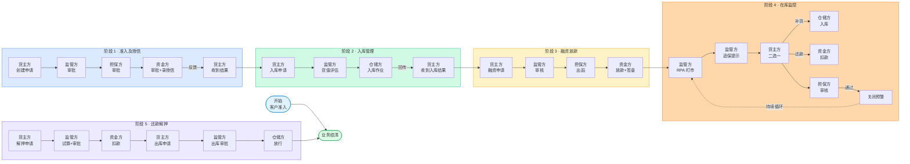

#### 9.1.1 阶段 1：准入及授信管理

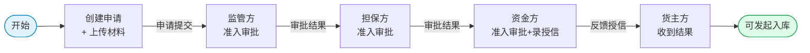

**关键节点说明**：
- 货主方按大河、担保及资金方需求填写企业基本信息、财务报表、风险分析等
- 三方各自进行**准入及授信审批内部流程**
- 资金方审批后**录入授信结果**（授信额度、期限、利率）
- 通过站内信+短信反馈授信结果

---

#### 9.1.2 阶段 2：入库管理

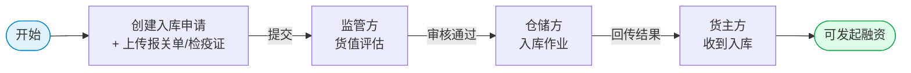

**关键节点说明**：
- 入库方式：新货入库 / 货权转移
- 系统自动建议评估单价（市场价下浮 5%-10%）
- 仓储方通过 PDA / 摄像头生成物流轨迹
- 实物入库（线下）+ 数据回传（线上）必须同步

---

#### 9.1.3 阶段 3：融资及放款管理

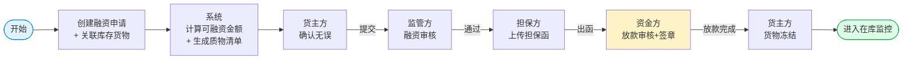

**关键节点说明**：
- 融资额度 = 评估货值 × 80%（质押率）
- 监管方 → 担保方 → 资金方**顺序审批**（不可并行）
- 资金方放款后，系统自动更新货物状态为"已冻结"
- 质物清单需三方电子签章

---

#### 9.1.4 阶段 4：在库监控及追保管理

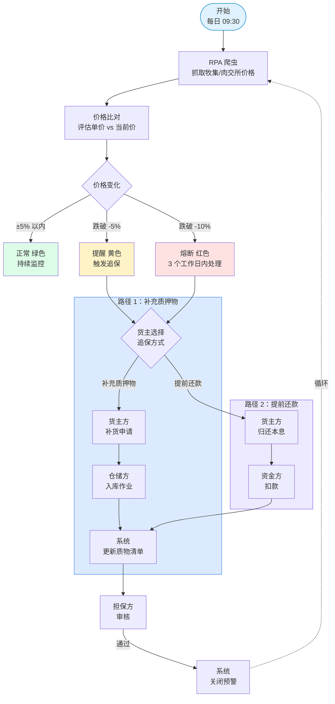

**关键规则**：
- 预警阈值：-5% 提醒（黄）/ -10% 熔断（红）
- 货主可选 2 种追保方式：补充质押物 / 提前还款
- 三方追保审核全部通过后才关闭预警
- 系统持续循环监控

---

#### 9.1.5 阶段 5：还款及解押管理

> 💡 **采用 sequence diagram**：10+ 节点涉及 4 角色时间顺序协作，sequence diagram 表达最清晰，避免 LR 回环箭头。

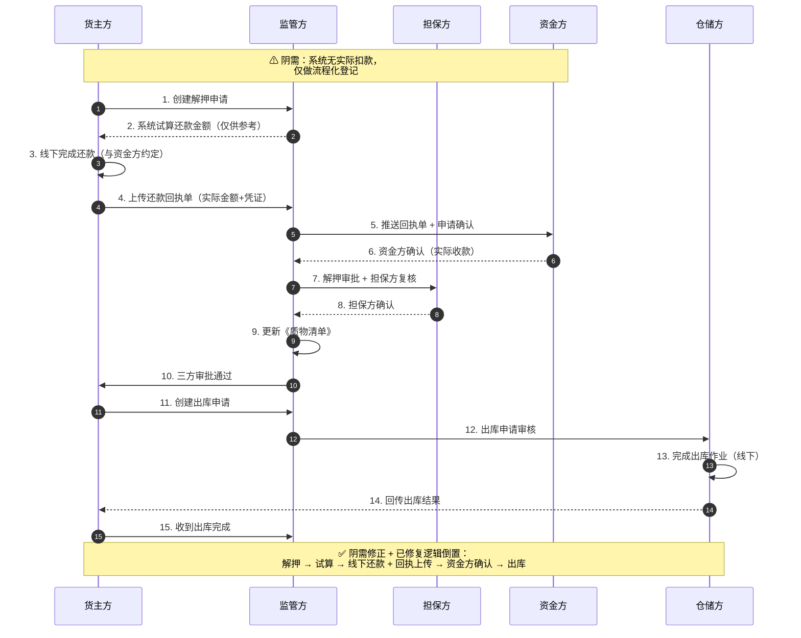

**关键节点说明**：
- 解押流程：**修复了原系统"先还后解"的逻辑倒置**
  - 旧流程：还款 → 解押 ❌
  - 新流程：解押申请 → 试算 → 三方审批 → 还款 → 出库 ✅
- 仓储方完成出库作业后，必须**回传出库结果**才能算完成
- 出库单价 = 入库时评估单价（非动态价格）

---

#### 9.1.6 跨阶段关键约束

| 约束项 | 规则 | 出处 |
|---|---|---|
| 评估单价 | 市场价下浮 5%-10%，入库时确定后不变 | 需求调研报告 |
| 质押率 | 固定 80% | 建设方案 |
| 出库单价 | 按入库评估单价（非动态价格） | 建设方案 |
| 监控阈值 | -5% 提醒 / -10% 熔断 | 需求调研报告 |
| RPA 抓取 | 每日 09:30，牧集/肉交所 | 建设方案 |
| 放款方式 | 受托支付 | 建设方案 |
| 融资期限 | ≤ 4 个月 | 需求调研报告 |
| 签章方式 | 三方电子签章（首期图片盖章） | 用户补充 |

### 9.2 数据字典
- 货品 SKU：见 `shared/js/mockData.js` 的 products 数组
- 仓库：wh_001（物流港二期 自有仓）、wh_002（郑州融万）、wh_003（天津港国际）
- 客户：郑州某冷链、郑州某冷链物流、河南某冷链股份等

### 9.3 配套资源
- **原型链接**：https://dhzl-supply-chain.vercel.app
- **项目源码**：`/Users/fuyu/.mavis/sessions/.../workspace/dhzl-supply-chain/`
- **知识库**：项目 scratchpad

### 9.4 待办（v1.1 完善）
- [ ] PRD 中补充更详细的字段校验规则
- [ ] 补充各页面的"权限字段"清单（哪些字段对哪些角色可见/可编辑）
- [ ] 补充二期"期现货代采模式"的页面级 PRD
- [ ] 补充三期"冻品 B2B 交易平台"的页面级 PRD

---

## 第十部分 详情页规范（v1.1 补充）

> 由于原始资料中未明确描述申请类页面的详情页结构，v1.1 补充统一的详情页规范。当前已为 3 个核心列表页补做了详情页：
> - `/customer/admission-detail` 准入申请详情
> - `/customer/inbound-detail` 入库申请详情
> - `/customer/financing-detail` 融资申请详情

### 10.1 详情页通用结构
| 区块 | 说明 |
|---|---|
| **顶部状态卡** | 页面标题 + 状态徽标 + 编号/日期 + 当前状态文字提示 + 操作按钮（根据状态动态变化）|
| **左侧主信息** | 基础信息（2 列网格）+ 联系人 + 申请材料 + 数据授权 + 资金成本预估（融资页）|
| **右侧时间轴** | 审批进度可视化（5-6 节点）+ 完成度百分比 + 预计反馈时间 |

### 10.2 动态操作按钮（按状态变化）
| 状态 | 操作按钮 |
|---|---|
| **草稿** | 编辑草稿 / 删除 / 提交申请 |
| **待审核** | 撤回申请 / 修改申请 / 联系业务员 / 查看进度 |
| **审核中** | 查看进度 / 催办 / 联系业务员 |
| **已通过** | 发起下一流程（如发起入库 / 发起融资）/ 下载通知书 |
| **已驳回** | 查看驳回原因 / 修改重新提交 / 申诉 |
| **已完成** | 发起下一流程 / 下载凭证 |

### 10.3 跳转规则
- 列表页"查看详情"按钮 → 跳转 `/xxx-detail?id=xxx`
- 详情页"返回列表"按钮 → history.back() 返回原列表
- 详情页内"发起 X 流程"按钮 → 跳转到对应创建页或列表页
- 详情页状态变化（演示用） → 演示页有"切换状态"下拉，方便调试不同状态

### 10.4 资料缺口说明
> v1.0 文档资料中**未明确描述详情页**的结构和字段（仅描述了流程），导致原型初期实现时只做了列表页。v1.1 已主动补做 3 个核心详情页，并形成统一的详情页规范（§10.1-10.3）。后续所有申请类列表页（合同/订单/发票等）都按此规范扩展。

---

## 第十一部分 客户方角色细分（v1.2 补充）

> 业务补充需求：客户方账号需进一步细分，明确**操作人**与**盖章人**的权限边界。

### 11.1 角色细分
| 子角色 | userRole | 权限范围 | 典型岗位 |
|---|---|---|---|
| **操作人** | `operator` | 填写/编辑表单、保存草稿、查看进度、催办 | 业务员 |
| **盖章人** | `sealUser` | 操作人所有权限 + 上传/选择印章、放置印章、完成签章 | 财务/法务/部门负责人 |

### 11.2 用户模型字段
```javascript
{
  id: 'u_cust_002',
  name: '李雪',
  role: 'customer',
  userRole: 'sealUser',       // 'operator' | 'sealUser'
  sealPermission: true,       // 是否有盖章权限
  sealScope: ['company_seal', 'finance_seal', 'legal_seal'], // 可用印章 ID 列表
  ...
}
```

### 11.3 权限矩阵（客户方内部）
| 功能 | 操作人 | 盖章人 |
|---|:---:|:---:|
| 填写准入申请表单 | ✓ | ✓ |
| 保存草稿 | ✓ | ✓ |
| 提交申请 | ⚠ 保存为草稿 | ✓ 触发签章流程 |
| 上传/选择印章 | ✗ | ✓ |
| 在单据上放置印章 | ✗ | ✓ |
| 完成签章提交 | ✗ | ✓ |
| 查看详情/进度 | ✓ | ✓ |
| 发起入库/融资 | ✓ | ✓ |

> **关键规则**：操作人提交申请时，**系统检测其 sealPermission**，若为 false 则保存为草稿并提示"请联系盖章人完成签章"。

---

## 第十二部分 图片签章流程（v1.2 补充）

> 业务补充需求：首期电子签章功能**仅做图片盖章**（PNG/JPG 上传 + 在单据上放置），不做真正电子签章（CA 证书、时间戳等）。

### 12.1 签章入口
- **触发时机**：客户方提交准入申请时（仅盖章人有效）
- **入口位置**：`/customer/admission` → 点击"提交申请"按钮 → 跳转到 `/customer/admission-seal`
- **权限校验**：若当前用户 `sealPermission === false`，不进入签章流程，仅保存为草稿

### 12.2 签章流程 4 步骤
```
① 上传/选择印章图片
   ↓
② 在单据预览上放置印章
   ↓
③ 勾选确认声明（"签章具备法律效力"）
   ↓
④ 点击"确认签章并提交" → 准入申请进入待审核状态
```

### 12.3 印章库（mock）
| 印章 ID | 名称 | 颜色 | 用途 |
|---|---|---|---|
| `company_seal` | 公司公章 | 红色 | 正式合同、单据 |
| `finance_seal` | 财务专用章 | 红色 | 财务单据、账单 |
| `legal_seal` | 法人章 | 蓝色 | 法人代表签字 |
| `contract_seal` | 合同专用章 | 红色 | 合同签署 |

> 演示中印章图片由 Canvas 自动生成（圆形 + 五角星 + 文字），非真实图章，仅供交互演示。

### 12.4 签章页面布局
```
┌──────────────────────────────────────────────────────────┐
│ 🔖 电子签章流程（顶部说明）                                 │
├──────────────────────────────────────────────────────────┤
│  左侧：单据预览（PDF 模拟）           右侧：操作面板       │
│  ┌─────────────────────────┐        ┌──────────────┐    │
│  │ 准入调查报告（伪 PDF）  │        │ 当前盖章人    │    │
│  │                         │        │ ✓ 已实名      │    │
│  │ ...                     │        ├──────────────┤    │
│  │                         │        │ ① 上传印章    │    │
│  │                         │        │  + 选择/上传  │    │
│  │                         │        │  预设印章网格  │    │
│  │       [↑ 将印章拖到此处]│        ├──────────────┤    │
│  │           [已放置印章]   │        │ ③ 确认签章    │    │
│  └─────────────────────────┘        │  ☑ 法律声明    │    │
│                                      │  [取消][确认] │    │
│                                      └──────────────┘    │
└──────────────────────────────────────────────────────────┘
```

### 12.5 印章放置交互
- **方式 1（拖拽）**：从右侧印章卡片拖拽至单据的盖章区域
- **方式 2（点击）**：点击右侧预设印章，直接放置到默认盖章区域
- **方式 3（上传）**：点击"上传印章"按钮 → 选择本地 PNG/JPG → 自动放置

### 12.6 状态流转
| 当前状态 | 操作 | 流转到 |
|---|---|---|
| 操作人提交 | 保存草稿 | `draft` |
| 操作人提交 | 提示"无盖章权限" | `draft`（不跳签章页） |
| 盖章人提交 | 进入签章页 → 完成签章 | `pending`（待审核）|
| 盖章人签章中 | 取消 | `draft`（保存为草稿） |

### 12.7 与审批流程的衔接
签章完成后，准入申请的 5 步流程变为：
```
步骤 1：草稿保存（操作人）
步骤 2：电子签章（盖章人）← 新增节点
步骤 3：监管方审核
步骤 4：担保方审核
步骤 5：资金方录入授信
```

详情页右侧时间轴展示完整 5 节点进度。

### 12.8 后续扩展（v2.0+）
- [ ] 真实电子签章（CA 证书 + 时间戳）
- [ ] 移动端签章（小程序扫码）
- [ ] 印章使用审批（用印登记）
- [ ] 签章审计日志（合规追溯）

---

**文档结束**

> 本 PRD 与原型一一对应，所有业务规则、跳转逻辑、交互方式都已通过原型验证。如有疑问或需要细化某个页面，随时告诉我 ⚡