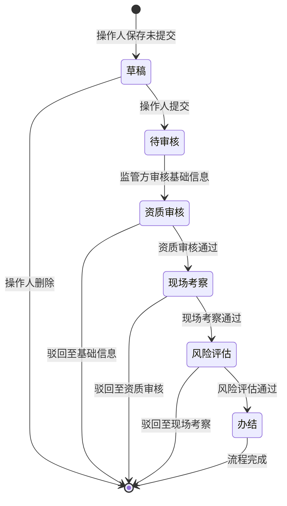
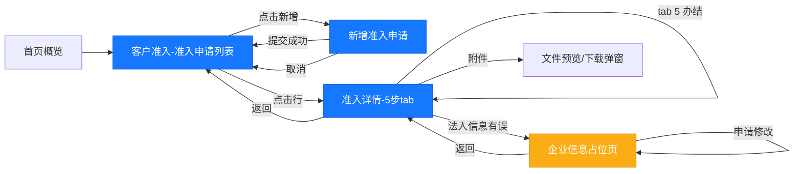
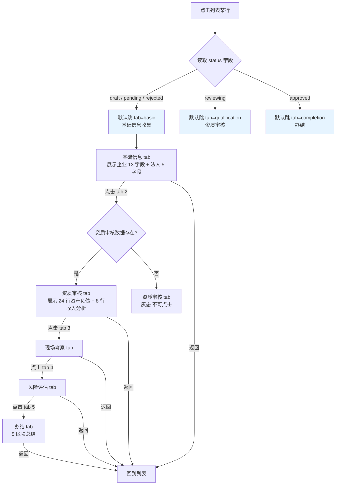

# 客户准入 — 页面流转图

> **模块**: 客户准入（货主方）
> **版本**: v1.7.38
> **角色**: 货主方（customer）— 操作人 / 盖章人
> **业务对象**: 申请准入的企业（货主方自身或上游企业）

---

## 一、8 个核心页面

| # | 页面 | URL | 角色 | 主要交互 |
|---|---|---|---|---|
| 1 | 准入申请列表 | `/customer/admission` | 操作人/盖章人 | 筛选 + 查询 + 新增 + 查看 |
| 2 | 新增准入申请 | `/customer/admission-create` | 操作人 | 填写表单 + 提交 |
| 3 | 准入详情-基础信息 | `?id=&tab=basic` | 操作人/盖章人 | 只读 + 返回 |
| 4 | 准入详情-资质审核 | `?id=&tab=qualification` | 监管方 | 监管方录入（货主方只读）|
| 5 | 准入详情-现场考察 | `?id=&tab=siteInspection` | 监管方 | 监管方录入（货主方只读）|
| 6 | 准入详情-风险评估 | `?id=&tab=riskAssessment` | 监管方 | 监管方录入（货主方只读）|
| 7 | 准入详情-办结 | `?id=&tab=completion` | 操作人/盖章人 | 查看总结 + 后续动作 |
| 8 | 企业信息（占位）| `/customer/enterprise-info` | 操作人/盖章人 | 只读 + 申请修改 |

---

## 二、状态机（5 步审批流程）



---

## 三、页面流转全景图（货主方视角）



---

## 四、详情页 5 步 Tab 状态映射



---

## 五、5 步审批数据所有权

| 步骤 | 数据内容 | 录入方 | 货主方权限 |
|---|---|---|---|
| 1. 基础信息收集 | 企业基本信息 + 法人 + 股东 + 附件 | 货主方 | 只读 |
| 2. 资质审核 | 涉诉分析 + 资产负债 + 收入分析 | 监管方 | 只读 |
| 3. 现场考察 | 现场考核说明 + 附件 | 监管方 | 只读 |
| 4. 风险评估 | 合规/财务分析 + 综合评价 + 结论 | 监管方 | 只读 |
| 5. 办结 | 准入决议 + 后续动作 | 监管方 | 只读 |

---

## 六、列表项 → 详情页 映射规则

```js
function mapStatusToTab(record) {
  if (record.applyResult === '通过' || record.status === 'approved' || record.progress === 5) return 'completion';
  if (record.status === 'reviewing' || record.progress === 2) return 'qualification';
  if (record.status === 'rejected') return 'basic';
  return 'basic';  // draft / pending / progress 1
}
```

| 列表 status | 列表 progress | → 详情默认 tab |
|---|---|---|
| `draft` | 0 | `basic` |
| `pending` | 1 | `basic` |
| `reviewing` | 2 | `qualification` |
| `rejected` | 2 | `basic` |
| `approved` | 5 | `completion` |

---

## 七、7 条列表 mock 数据状态

| ID | 企业 | 状态 | 演示场景 | 详情页默认 tab |
|---|---|---|---|---|
| adm_001 | 郑州某冷链物流 | approved | 完整流程办结 | completion |
| adm_002 | 河南某冷链股份 | reviewing | 卡在第 2 步 | qualification |
| adm_003 | 郑州某冷链贸易 | approved | 中小贸易办结 | completion |
| adm_004 | 郑州某冷链贸易 | draft | 草稿（数据待录入）| basic |
| adm_005 | 郑州某冷链贸易 | draft | 空草稿 | basic |
| adm_006 | 洛阳冷联食品 | rejected | 驳回示例 | basic |
| adm_007 | 青岛海盈国际冷链 | approved | 国际冷链高级别 | completion |
