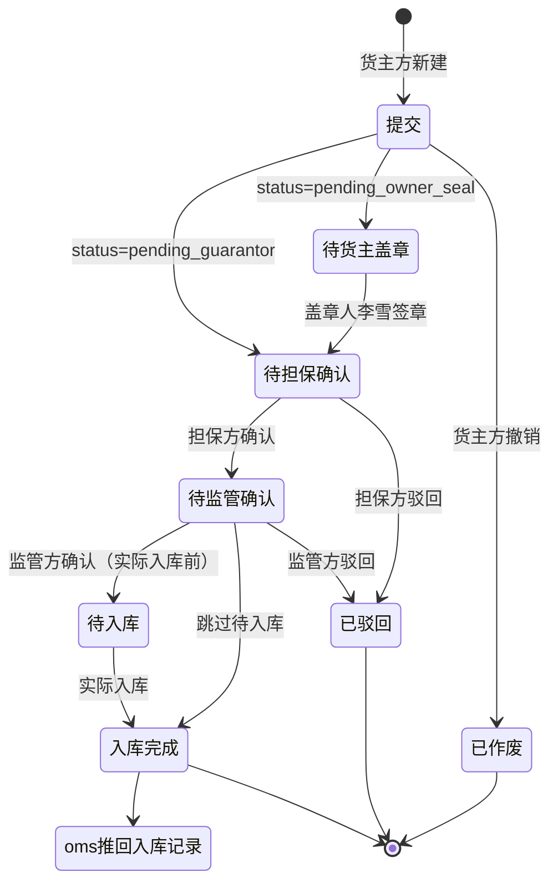

# 入库申请

> 适用版本：v1.7.12（列表）+ v1.7.14（新增）+ v1.7.16（详情）
> 适用角色：货主方（customer）、监管方（platform）、担保方（guarantor）、资金方（bank）
> 页面归口：智慧仓储 / 货物管理 / 入库申请
> 关联页面：入库申请新增 / 入库申请详情 / 入库申请盖章

---

## 流程图

### 主流程（4 步审批）



---

## 功能点说明

| 功能点 | 适用角色 | 说明 |
|---|---|---|
| 入库申请列表 | 货主方、监管方、担保方、资金方 | 查看入库申请记录（9 状态 tab + 11 列（表头字段） + 9 筛选） |
| 新增入库申请 | 货主方（操作人） | 4 段表单：基础信息 + 质物明细 + 附件 + 概要 |
| 入库申请详情 | 货主方、监管方、担保方、资金方 | 4 步审批步骤条 + 货物明细 + 附件 + 完整单据 |
| 入库申请盖章 | 货主方（盖章人） | 货主方专属，登录直接跳转入库申请（v1.7.17 修订） |
| 作废入库申请 | 货主方 | 仅 draft / pending_owner_seal 状态可作废 |
| 驳回入库申请 | 监管方、担保方 | 填写驳回原因，状态变为 rejected |
| 数据导出 | 货主方、监管方、担保方、资金方 | 按当前筛选条件导出 CSV |

---

## 原型

[占位] — 截图见 https://dhzl-supply-chain.pages.dev/customer/inbound

---

## 数据范围

| 角色 | 数据范围说明 |
|---|---|
| 货主方（操作人） | 查看本企业的入库申请 |
| 货主方（盖章人） | 查看本企业 `status=pending_owner_seal` 的入库申请 |
| 监管方 | 查看所有企业的入库申请，可审核 |
| 担保方 | 查看作为担保方的入库申请（只读） |
| 资金方 | 查看作为资金方的入库申请（只读） |

---

## 搜索条件

| 字段名 | 提示语 | 需求说明 |
|--:|---|---|
| 入库申请编号 | 请输入入库申请编号 | 模糊查询（contains） |
| 出质方（货主方） | 请选择 | 单选下拉，选项值：申请方字段去重（此须确认当前登录主体，是否单个出质方可关联？如仅为1V1则默认返回当前出质方信息即可，无其他选项） |
| 质权方（担保方） | 请选择 | 单选下拉，选项值：（以实际平台录入的质权方信息为准，出质方登录态下，仅展示平台设置的已与其关联的质权方数据；登录态为当前选项角色时，如主体无子项则默认返回并选择当前登录人的主体信息） |
| 金融机构 | 请选择 | 单选下拉，选项值：（以实际平台录入的质权方信息为准；出质方登录态下，仅展示平台设置的已与其关联的质权方数据；登录态为当前选项角色时，如主体无子项则默认返回并选择当前登录人的主体信息） |
| 金融产品 | 请选择 | 单选下拉，选项值：（以实际平台录入的质权方信息为准，出质方登录态下，仅展示平台设置的已与其关联的质权方数据；登录态为当前选项角色时，如主体无子项则默认返回并选择当前登录人的主体信息） |
| 货物名称 | 请选择 | 单选下拉，选项值取与当前登录用户关联数据（依据当前登录人权限，展示对应于其关联的货物数据；货主方已质押未解押的货物默认过滤且不可选择；监管方可选择全部数据，质权方+金融机构可选与其关联数据） |
| 入库时间 | 请选择 | 日期范围选择器（起 ~ 止）最长可选日期区间暂无规则，稍后补充 |
| 监管方 | 请选择 | 单选下拉，选项值：（以实际平台录入的监管方信息为准） |
| 货物所在地 | 请选择 | 单选下拉，选项值：（以实际当前登录用户所关联的全部货物所在地进行回显） |
|  |  |  |

> 交互说明：检索条件失去焦点、或者通过回车、查询操作后，即进行数据查询

---

## 列表说明

### 交互说明

- 字段一行展示不全时，字段末尾做 ... 处理，同时鼠标悬停该字段时，展示对应字段的全部信息
- 9 状态 tab + 11 列表格
- 列表做成自适应屏幕宽度
- 简单分页：每页 10 条

### 列表字段说明

| 列名 | 需求说明 |
|---|---|
| 入库申请编号 | 业务编号，格式 `IN_YYYYMMDDXXX`（暂定） |
| 最新入库时间 | 取货物由OMS系统推送的最终入库时间（申请入库完成后状态下） |
| 货物名称 | 建议内置标准行业货品名称（【原产国/产地】+【动物种类】+【部位名称】+【等级/规格】+【冷链状态】+【包装规格】） |
| 计划入库数量 | 暂取：货主方在「质物明细信息」中选择填写的入库数量总和 |
| 计划入库重量 | 暂取：货主方在「质物明细信息」中选择填写的入库重量总和 |
| 出质方 | 货主方完整公司名 |
| 质权方 | 质权方完整公司名 |
| 金融产品 | 金融产品完整名称 |
| 金融机构 | 完整银行机构名称 |
| 监管方 | 完整监管方公司名称 |
| 货物所在地 | 完整地区名称+仓库名称 |

---

## 状态变化说明

| Tab | statusMatch | 业务说明 |
|---|---|---|
| 全部 | （不过滤） | 所有与当前登录人关联的入库信息 |
| 待提交 | `['draft']` | 货主方保存草稿未提交的数据 |
| 待货主盖章 | `['pending_owner_seal', 'pending_owner_seal_2', 'pending_owner_seal_3']` | 货主方操作人提交后，等待盖章人「XX」签章的数据 |
| 待担保确认 | `['pending_guarantor', 'pending_guarantor_seal']` | 担保方确认阶段的数据 |
| 待监管确认 | `['reviewing', 'pending_supervisor']` | 监管方审核阶段的数据 |
| 待入库 | `['inbound', 'pending_inbound']` | 监管方通过，等待实际入库的数据 |
| 已入库 | `['inbound_completed']` | 实际入库完成的数据 |
| 作废 | `['voided', 'cancelled']` | 待定：「货主方及任意各方」撤销或系统取消的数据 |
| 驳回 | `['rejected']` | 担保方/监管方驳回的数据 |

---

## 新增

### 入口

货主方（操作人）在入库申请列表点击「新增入库申请」按钮，跳转 `/pages/customer/inbound-create`

### 原型

[占位] — 截图见 https://dhzl-supply-chain.pages.dev/customer/inbound-create

### 前置校验

- 必须已登录为货主方（customer 角色）
- 货主方操作人提交过未办结的入库申请时，限制提示

### 字段说明（基础信息 6 字段）

| 字段名称 | 字段说明 |
|---|---|
| 出质方 | 必填、文本输入框，默认值「空」 |
| 联系人 | 必填、文本输入框，格式 `姓名 — 电话`，默认值「自动带入当前登录用户真实姓名 +完整手机号码」可修改 |
| 金融产品 | 必填、单选下拉，选项值从 financingProduct 字典取 |
| 监管方 | 必填、文本输入框，默认值「空」（如本期平台有预设库，则加入输入的模糊搜索功能） |
| 质权方 | 必填、文本输入框，默认值「空」（如本期平台有预设库，则加入输入的模糊搜索功能） |
| 联系人邮箱 | 非必填、文本输入框（email 类型），用于系统通知 |

### 质物明细信息（新增）

| 字段名称 | 字段说明 |
|---|---|
| 复选框 | 用于批量删除 |
| 序号 | 自增整数 |
| 货品名称 | 必填、文本输入框（限制52中文内容）举例「美国 冷冻猪肉 梅头肉 精修 带皮 20kg/箱」 |
| 国家 | 必填、文本输入框（内置国家库，支持输入模糊搜索） |
| 厂号 | 必填、单选下拉，（境外生产企业）在华注册编号；在华注册编号由4位大写英文字母+14位数字组成，由系统预设库预设； |
| 入库数量 | 必填、数字输入框，带步进器控件，数字须大于等于1 |
| 数量单位 | 非必填、单选下拉，选项：箱、件、包，默认「箱」 |
| 入库重量 | 必填、数字输入框，带步进器控件，数字须大于等于0.1 |
| 重量单位 | 非必填、单选下拉，选项：千克、吨、默认「千克」 |
| **有效期** | **必填、日期选择器（v1.7.14 新增，影响融资期限合规校验）** |
| 计划入库时间 | 必填、日期选择器 |
| 生产日期 | 必填、日期选择器 |
| 生产批号 | 非必填、文本输入框（限制24个中文字符） |
| 合同号 | 非必填、文本输入框（限制24个中文字符） |
| 提/运单号 | 非必填、文本输入框（限制24个中文字符） |
| 柜号 | 非必填、文本输入框（限制24个中文字符） |
| 货物所在地 | 必填、单选下拉，须满足省/市/区/县及填写；选项：如货仓仅支持国内默认使用GB/T 2260标准即可；是否为全球待定 |
| 操作 | 编辑/删除链接 |

#### 质物明细信息（列表显示）

| 字段名称 | 字段说明 |
|---|---|
| 货物名称 | 完整显示货物名称 |
| 国家 | 完整显示国家名称 |
| 厂号 | 完整显示厂号名称（境外生产企业）在华注册编号 |
| 入库数量 | 显示完整数量 |
| 数量单位 | 显示完整数量单位 |
| 入库重量 | 显示完整重量信息 |
| 重量单位 | 根据录入时用户的选择进行显示（千克/吨） |
| 生产日期 | 显示完整日期（格式2020-01-01） |
| **有效期** | 显示完整日期（格式2020-01-01） |
| 生产批号 | 显示完整生产批号 |
| 合同号 | 显示完整合同号 |
| 提/运单号 | 显示完整提/运单号 |
| 柜号 | 显示完整柜号 |
| 计划入库时间 | 显示完整日期（格式2020-01-01） |
|  |  |

#### 操作按钮（质物明细信息）

| 按钮 | 字段说明 |
|---|---|
| 新增 | 打开「新增货物明细」弹窗 |
| 删除 | 删除勾选的行 |
| 批量导入 | toast 占位（待 Excel 粘贴/上传实现） |
| 行内编辑 | 打开「编辑货物明细」弹窗（复用新增弹窗） |
| 行内删除 | confirm 确认后删除单行 |

### 附件

| 字段名称 | 字段说明 |
|---|---|
| 合同及订单 | 必填、附件上传（支持 jpg/jpeg/png/pdf，单文件 ≤ 100MB） |
| 报关单 | 必填、附件上传（支持格式同上） |
| 检验检疫证明 | 必填、附件上传（支持格式同上） |
| 其他附件 | 非必填、附件上传（支持格式同上） |

> 附件规则：上传时间常驻显示（v1.7.20 规范），格式 `📅 YYYY-MM-DD HH:MM:SS`

### 后置动作

- 业务编号生成：`IN_${Utils.genBizNo().slice(-12)}`（暂时按：IN_落库时间）

### 流转说明

- 提交后状态变为 `pending_owner_seal`（待货主盖章），等待盖章人「真实姓名」签章
- 货主盖章后状态变为 `pending_guarantor`（待担保确认）
- 担保方确认后状态变为 `reviewing`（待监管确认）
- 监管方确认后状态变为 `inbound`（入库中）→ `inbound_completed`（已入库）
- 任一环节可驳回，状态变为 `rejected`，货主方需修改后重新提交

### 校验规则（提交时）

```js
function submitForm() {
  // 1. 校验基础信息 5 个必填
  if (!form.pledgor || !form.contact || !form.financeProduct || !form.supervisor || !form.pledgee) {
    return Utils.toast('请填写所有基础信息必填项', 'error');
  }
  // 2. 校验质物明细至少 1 行
  if (pledgeRows.length === 0) return Utils.toast('请至少添加一条质物明细', 'error');
  // 3. 校验每行有【有效期】
  const noExpiry = pledgeRows.find(r => !r.expiryDate);
  if (noExpiry) return Utils.toast(`第 ${noExpiry.no} 行缺少「有效期」字段`, 'error');
  Utils.toast('入库申请已提交，等待审批', 'success');
  setTimeout(() => goBack(), 1000);
}
```

---

## 入库详情（列表数据）

### 入口

- 货主方/监管方/担保方/资金方：点击列表行进入 `/pages/customer/inbound-detail?id=xxx`

### 原型

[占位] — 截图见 https://dhzl-supply-chain.pages.dev/customer/inbound-detail

### 字段说明

#### 4 步审批步骤条

| 步骤 | 字段说明 |
|---|---|
| 1. 提交 | 货主方操作人创建申请并提交 |
| 2. 担保方确认 | 担保方确认通过 |
| 3. 监管方确认 | 监管方审核通过（可同时实际入库） |
| 4. 入库完成 | 实际入库完成 |

#### 入库货物明细（17 列）

参见「新增 - 质物明细」字段表

#### 附件（4 类）

参见「新增 - 附件」字段表

### 流转说明

- 状态 → 步骤映射：
  - `draft` / `pending_submit` → 第 1 步
  - `pending_owner_seal*` / `pending_guarantor*` → 第 2 步
  - `reviewing` / `pending_supervisor` / `pending_inbound` / `inbound` → 第 3 步
  - `inbound_completed` → 第 4 步
- 驳回/作废状态为终态（`isFinalized=true`）

---

## 盖章

### 入口

货主方盖章人（真实姓名）登录后自动跳转入库申请列表（v1.7.17 修订）

### 前置校验

- 货主方企业必须有盖章权限（盖章人为「李雪」）
- 仅有 `pending_owner_seal` 状态的申请对盖章人可见

### 后置动作

- 盖章后状态从 `pending_owner_seal` 变为 `pending_guarantor`

### 流转说明

- 货主方操作人陈志强提交 → 状态变 `pending_owner_seal` → 盖章人李雪签章 → 状态变 `pending_guarantor` → 担保方确认 → 监管方确认 → 入库完成

---

## 业务规则

### 业务编号规则

格式：`IN_YYYYMMDDXXX`（XXX 为 3 位顺序号）

### 评估货值公式

```
评估货值 = 重量（千克） × 评估单价（元/千克）
期望放款 = 评估货值 × 80%（质押率，v1.7.14 系统默认值）
```

### 附件规则

- 格式：jpg / jpeg / png / pdf
- 单文件 ≤ 100MB
- 多文件支持
- 上传时间常驻显示 `📅 YYYY-MM-DD HH:MM:SS`

### 脱敏规范

- 信用代码：`91XXXXXXXXMAXXXXXXXX`
- 手机：`138 0000 XXXX` / `138-XXXX-XXXX`
- 邮箱：`xxx@example.com`
- 身份证：`410XXXXXXXXXXXXXXX`

### 草稿与作废

- 操作人保存草稿：状态 `draft`，可继续编辑
- 货主方撤销：状态 `voided`（仅 draft / pending_owner_seal 状态可作废）
- 系统取消：状态 `cancelled`

### 驳回

- 担保方驳回：状态 `rejected`，需货主方修改后重新提交
- 监管方驳回：状态 `rejected`，需货主方修改后重新提交
- 驳回时必须填写驳回原因

---

## 版本演进

| 版本 | 改动点 |
|---|---|
| v1.7.3 | 演示给盖章人李雪待盖章的入库申请（in_003） |
| v1.7.12 | 入库申请列表重写：9 状态 tab + 11 列 + 9 筛选 + 3 行布局 |
| v1.7.13 | — |
| v1.7.14 | 入库申请新增升级为独立页：基础信息 + 质物明细（**17 列含新增【有效期】**）+ 附件 + 概要 |
| v1.7.15 | 入库申请概要视图 + 完整单据弹窗 |
| v1.7.16 | 入库申请详情：4 步步骤条（提交/担保/监管/入库） |
| v1.7.17 | 货主方盖章人专属页（直接跳转入库申请，跳过 dashboard） |
| v1.7.20 | 附件上传时间常驻显示规范 |
| v1.7.28.2 | 隐私脱敏规范 |

---

## 相关文件

| 文件 | 行数 | 关键内容 |
|---|---|---|
| `pages/customer/inbound.html` | 509 | 入库申请列表：9 状态 tab + 11 列 + 9 筛选 |
| `pages/customer/inbound-create.html` | 862 | 入库申请新增：4 段表单 |
| `pages/customer/inbound-detail.html` | 360 | 入库申请详情：4 步步骤条 |
| `pages/customer/inbound-seal.html` | ~150 | 货主方盖章人专属页 |
| `shared/js/mockData.js` 段 `inboundList` | 938+ | 入库申请 mock（16 条） |
