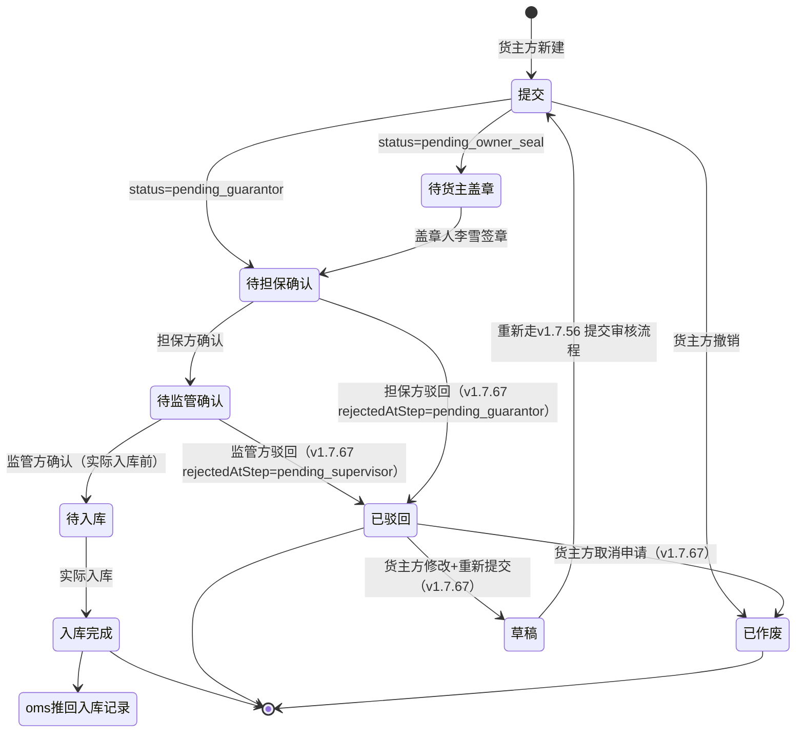

# 入库申请

> 适用版本：v1.7.12（列表）+ v1.7.14（新增）+ v1.7.16（详情）+ v1.7.67（驳回详情页改造）
> 适用角色：货主方（customer）、监管方（platform）、担保方（guarantor）、资金方（bank）
> 页面归口：智慧仓储 / 货物管理 / 入库申请
> 关联页面：入库申请新增 / 入库申请详情 / 入库申请盖章

---

## 流程图

### 主流程（4 步审批）



---

## 功能点说明

| 功能点 | 适用角色 | 说明 |
|---|---|---|
| 入库申请列表 | 货主方、监管方、担保方、资金方 | 查看入库申请记录（9 状态 tab + 11 列（表头字段） + 9 筛选） |
| 新增入库申请 | 货主方（操作人） | 4 段表单：基础信息 + 质物明细 + 附件 + 概要 |
| 入库申请详情 | 货主方、监管方、担保方、资金方 | 4 步审批步骤条 + 货物明细 + 附件 + 完整单据 |
| 入库申请详情（驳回修改） | 货主方（操作人） | v1.7.67 驳回状态下详情页改造：基础信息+货物明细可编辑 + 重新提交 + 取消申请 + 步骤条驳回节点标红 |
| 入库申请盖章 | 货主方（盖章人） | 货主方专属，登录直接跳转入库申请（v1.7.17 修订） |
| 作废入库申请 | 货主方 | 仅 draft / pending_owner_seal 状态可作废；驳回状态可走"取消申请"作废（v1.7.67） |
| 驳回入库申请 | 监管方、担保方 | 填写驳回原因 + 驳回环节（v1.7.67 标识驳回发生在哪一步），状态变为 rejected |
| 重新提交入库申请 | 货主方（操作人） | v1.7.67 驳回状态下：修改字段后提交，状态回 `draft` 重走"提交审核"流程 |
| 数据导出 | 货主方、监管方、担保方、资金方 | 按当前筛选条件导出 CSV |

---

## 原型

[占位] — 截图见 https://dhzl-supply-chain.pages.dev/customer/inbound

---

## 数据范围

| 角色 | 数据范围说明 |
|---|---|
| 货主方（操作人） | 查看本企业的入库申请 |
| 货主方（盖章人） | 查看本企业 `status=pending_owner_seal` 的入库申请 |
| 监管方 | 查看所有企业的入库申请，可审核 |
| 担保方 | 查看作为担保方的入库申请，审核对应价签（只读） |
| 资金方 | 查看作为资金方的入库申请（只读） |

---

## 搜索条件

| 字段名 | 提示语 | 需求说明 |
|--:|---|---|
| 入库申请编号 | 请输入入库申请编号 | 模糊查询（contains） |
| 出质方（货主方） | 请选择 | 单选下拉，选项值：申请方字段去重（此须确认当前登录主体，是否单个出质方可关联？如仅为1V1则默认返回当前出质方信息即可，无其他选项） |
| 质权方（担保方） | 请选择 | 单选下拉，选项值：（以实际平台录入的质权方信息为准，出质方登录态下，仅展示平台设置的已与其关联的质权方数据；登录态为当前选项角色时，如主体无子项则默认返回并选择当前登录人的主体信息） |
| 金融机构 | 请选择 | 单选下拉，选项值：（以实际平台录入的质权方信息为准；出质方登录态下，仅展示平台设置的已与其关联的质权方数据；登录态为当前选项角色时，如主体无子项则默认返回并选择当前登录人的主体信息） |
| 金融产品 | 请选择 | 单选下拉，选项值：（以实际平台录入的质权方信息为准，出质方登录态下，仅展示平台设置的已与其关联的质权方数据；登录态为当前选项角色时，如主体无子项则默认返回并选择当前登录人的主体信息） |
| 货物名称 | 请选择 | 单选下拉，选项值取与当前登录用户关联数据（依据当前登录人权限，展示对应于其关联的货物数据；货主方已质押未解押的货物默认过滤且不可选择；监管方可选择全部数据，质权方+金融机构可选与其关联数据） |
| 入库时间 | 请选择 | 日期范围选择器（起 ~ 止）最长可选日期区间暂无规则，稍后补充 |
| 监管方 | 请选择 | 单选下拉，选项值：（以实际平台录入的监管方信息为准） |
| 货物所在地 | 请选择 | 单选下拉，选项值：（以实际当前登录用户所关联的全部货物所在地进行回显） |
|  |  |  |

> 交互说明：检索条件失去焦点、或者通过回车、查询操作后，即进行数据查询

---

## 列表说明

### 交互说明

- 字段一行展示不全时，字段末尾做 ... 处理，同时鼠标悬停该字段时，展示对应字段的全部信息
- 9 状态 tab + 11 列表格
- 列表做成自适应屏幕宽度
- 简单分页：每页 10 条

### 列表字段说明

| 列名 | 需求说明 |
|---|---|
| 入库申请编号 | 业务编号，格式 `IN_YYYYMMDDXXX`（暂定） |
| 最新入库时间 | 取货物由OMS系统推送的最终入库时间（申请入库完成后状态下） |
| 货物名称 | 建议内置标准行业货品名称（【原产国/产地】+【动物种类】+【部位名称】+【等级/规格】+【冷链状态】+【包装规格】） |
| 计划入库数量 | 暂取：货主方在「质物明细信息」中选择填写的入库数量总和 |
| 计划入库重量 | 暂取：货主方在「质物明细信息」中选择填写的入库重量总和 |
| 出质方 | 货主方完整公司名 |
| 质权方 | 质权方完整公司名 |
| 金融产品 | 金融产品完整名称 |
| 金融机构 | 完整银行机构名称 |
| 监管方 | 完整监管方公司名称 |
| 货物所在地 | 完整地区名称+仓库名称 |

---

## 状态变化说明

| Tab | statusMatch | 业务说明 |
|---|---|---|
| 全部 | （不过滤） | 所有与当前登录人关联的入库信息 |
| 待提交 | `['draft']` | 货主方保存草稿未提交的数据 |
| 待货主盖章 | `['pending_owner_seal', 'pending_owner_seal_2', 'pending_owner_seal_3']` | 货主方操作人提交后，等待盖章人「XX」签章的数据 |
| 待担保确认 | `['pending_guarantor', 'pending_guarantor_seal']` | 担保方确认阶段的数据 |
| 待监管确认 | `['reviewing', 'pending_supervisor']` | 监管方审核阶段的数据 |
| 待入库 | `['inbound', 'pending_inbound']` | 监管方通过，等待实际入库的数据 |
| 已入库 | `['inbound_completed']` | 实际入库完成的数据 |
| 作废 | `['voided', 'cancelled']` | 待定：「货主方及任意各方」撤销或系统取消的数据 |
| 驳回 | `['rejected']` | 担保方/监管方驳回的数据 |

---

## 新增

### 入口

货主方（操作人）在入库申请列表点击「新增入库申请」按钮，跳转 `/pages/customer/inbound-create`

### 原型

[占位] — 截图见 https://dhzl-supply-chain.pages.dev/customer/inbound-create

### 前置校验

- 必须已登录为货主方（customer 角色）
- 货主方操作人提交过未办结的入库申请时，限制提示

### 字段说明（基础信息 6 字段）

| 字段名称 | 字段说明 |
|---|---|
| 出质方 | 必填、文本输入框，默认值「空」 |
| 联系人 | 必填、文本输入框，格式 `姓名 — 电话`，默认值「自动带入当前登录用户真实姓名 +完整手机号码」可修改 |
| 金融产品 | 必填、单选下拉，选项值从 financingProduct 字典取 |
| 监管方 | 必填、文本输入框，默认值「空」（如本期平台有预设库，则加入输入的模糊搜索功能） |
| 质权方 | 必填、文本输入框，默认值「空」（如本期平台有预设库，则加入输入的模糊搜索功能） |
| 联系人邮箱 | 非必填、文本输入框（email 类型），用于系统通知 |

### 质物明细信息（新增）

| 字段名称 | 字段说明 |
|---|---|
| 复选框 | 用于批量选择/删除 |
| 序号 | 自增整数 |
| 货品名称 | 必填、文本输入框支持模糊搜索（限制52中文内容）举例「美国 冷冻猪肉 梅头肉 精修 带皮 20kg/箱」（本期有内置货品名称，最终依据实际数据关系：货品+国家+厂号关联信息） |
| 国家 | 必填、文本输入框（内置国家库，支持输入模糊搜索） |
| 厂号 | 必填、单选下拉，（境外生产企业）在华注册编号；在华注册编号由4位大写英文字母+14位数字组成，由系统预设库预设； |
| 入库数量 | 必填、数字输入框，带步进器控件，数字须大于等于1 |
| 数量单位 | 必填、单选下拉，选项：箱、件、包，默认「箱」 |
| 入库重量 | 必填、数字输入框，带步进器控件，数字须大于等于0.1 |
| 重量单位 | 必填、单选下拉，选项：千克、吨、默认「千克」 |
| **有效期** | **必填，单位控件必选/天/月/年**---输入框 |
| 计划入库时间 | 必填、日期选择器 |
| 生产日期 | 必填、日期选择器 |
| 生产批号 | 非必填、文本输入框（限制24个中文字符） |
| 合同号 | 非必填、文本输入框（限制24个中文字符） |
| 提/运单号 | 非必填、文本输入框（限制24个中文字符） |
| 柜号 | 非必填、文本输入框（限制24个中文字符） |
| 货物所在地 | 必填、单选下拉，须满足省/市/区/县及填写；选项：如货仓仅支持国内默认使用GB/T 2260标准即可；是否为全球待定 |
| 操作 | 编辑/删除链接 |

#### 质物明细信息（列表显示）

| 字段名称 | 字段说明 |
|---|---|
| 货物名称 | 完整显示货物名称 |
| 国家 | 完整显示国家名称 |
| 厂号 | 完整显示厂号名称（境外生产企业）在华注册编号 |
| 入库数量 | 显示完整数量 |
| 数量单位 | 显示完整数量单位 |
| 入库重量 | 显示完整重量信息 |
| 重量单位 | 根据录入时用户的选择进行显示（千克/吨） |
| 生产日期 | 显示完整日期（格式2020-01-01） |
| **有效期** | 显示完整日期（格式2020-01-01） |
| 生产批号 | 显示完整生产批号 |
| 合同号 | 显示完整合同号 |
| 提/运单号 | 显示完整提/运单号 |
| 柜号 | 显示完整柜号 |
| 计划入库时间 | 显示完整日期（格式2020-01-01） |
|  |  |

#### 操作按钮（质物明细信息）

| 按钮 | 字段说明 |
|---|---|
| 新增 | 打开「新增货物明细」弹窗 |
| 删除 | 删除勾选的行 |
| 批量导入 | toast 占位（待 Excel 粘贴/上传实现） |
| 行内编辑 | 打开「编辑货物明细」弹窗（复用新增弹窗） |
| 行内删除 | confirm 确认后删除单行 |

### 附件

| 字段名称 | 字段说明 |
|---|---|
| 合同及订单 | 必填、附件上传（支持 jpg/jpeg/png/pdf，单文件 ≤ 100MB） |
| 报关单 | 必填、附件上传（支持格式同上） |
| 检验检疫证明 | 必填、附件上传（支持格式同上） |
| 其他附件 | 非必填、附件上传（支持格式同上） |

> 附件规则：上传时间常驻显示（v1.7.20 规范），格式 `📅 YYYY-MM-DD HH:MM:SS`

### 后置动作

- 业务编号生成：`IN_${Utils.genBizNo().slice(-12)}`（暂时按：IN_落库时间）

### 流转说明

- 提交后状态变为 `pending_owner_seal`（待货主盖章），等待盖章人「真实姓名」签章
- 货主盖章后状态变为 `pending_guarantor`（待担保确认）
- 担保方确认后状态变为 `reviewing`（待监管确认）
- 监管方确认后状态变为 `inbound`（入库中）→ `inbound_completed`（已入库）
- 任一环节可驳回，状态变为 `rejected`，货主方需修改后重新提交

### 校验规则（提交时）

```js
function submitForm() {
  // 1. 校验基础信息 5 个必填
  if (!form.pledgor || !form.contact || !form.financeProduct || !form.supervisor || !form.pledgee) {
    return Utils.toast('请填写所有基础信息必填项', 'error');
  }
  // 2. 校验质物明细至少 1 行
  if (pledgeRows.length === 0) return Utils.toast('请至少添加一条质物明细', 'error');
  // 3. 校验每行有【有效期】
  const noExpiry = pledgeRows.find(r => !r.expiryDate);
  if (noExpiry) return Utils.toast(`第 ${noExpiry.no} 行缺少「有效期」字段`, 'error');
  Utils.toast('入库申请已提交，等待审批', 'success');
  setTimeout(() => goBack(), 1000);
}
```

---

## 入库详情（列表数据）

### 入口

- 货主方/监管方/担保方：点击列表行进入 `/pages/customer/inbound-detail?id=xxx`

### 原型

[占位] — 截图见 https://dhzl-supply-chain.pages.dev/customer/inbound-detail

### 字段说明

#### 4 步审批步骤条

| 步骤 | 字段说明 |
|---|---|
| 1. 提交（直接发起提交） | 货主方操作人创建入库申请，并直接发起提交 |
| 2. 待提交 | 货主方操作人创建入库申请，仅保存草稿 |
| 3. 待货主盖章 | 货主方操作人创建入库申请，并直接发起提交后，等待货主方「盖章员」盖章 |
| 4. 待担保确认 | 货主方「盖章员」盖章完成后，推送至担保方进行入库申请确认 |
| 5.待监管确认 | 担保方确认入库申请后，推送至监管方确认 |
| 6.待入库 | 货主完成「申请+盖章」且「担保方+监管方」完成审核后进入等待入库状态 |
| 7.已入库 | 我方核对「入库申请单」与三方「OMS系统入库数据」一致时记录最终入库数据 |
| 8.作废 | 货主方「盖章员」在货主方盖章状态机tap下对发起盖章的申请可选择「作废」操作，完成作废操作后数据流转至状态机「作废」将不可在此修改，仅作留存展示 |
| 9.驳回 | 任意审核方点击「驳回」按钮时，审核流程中止，在「驳回」状态机列表中，对应发起人可重新发起审核流程，被激活的驳回数据，将从「驳回」状态中重新流转会最初节点 |

#### 入库货物明细（17 列）

参见「新增 - 质物明细」字段表

#### 附件（4 类）

参见「新增 - 附件」字段表

### 流转说明

- 状态 → 步骤映射：
  - `draft` / `pending_submit` → 第 1 步
  - `pending_owner_seal*` / `pending_guarantor*` → 第 2 步
  - `reviewing` / `pending_supervisor` / `pending_inbound` / `inbound` → 第 3 步
  - `inbound_completed` → 第 4 步
- 驳回/作废状态为终态（`isFinalized=true`）

---

## 盖章

### 入口

货主方盖章人（真实姓名）登录后自动跳转入库申请列表（v1.7.17 修订）

### 前置校验

- 货主方企业必须有盖章权限（盖章人为「李雪」）
- 仅有 `pending_owner_seal` 状态的申请对盖章人可见

### 后置动作

- 盖章后状态从 `pending_owner_seal` 变为 `pending_guarantor`

### 流转说明

- 货主方操作人陈志强提交 → 状态变 `pending_owner_seal` → 盖章人李雪签章 → 状态变 `pending_guarantor` → 担保方确认 → 监管方确认 → 入库完成

---

## 业务规则

### 业务编号规则

格式：`IN_YYYYMMDDXXX`（XXX 为 3 位顺序号）

### 评估货值公式

```
评估货值 = 重量（千克） × 评估单价（元/千克）
期望放款 = 评估货值 × 80%（质押率，v1.7.14 系统默认值）
```

### 附件规则

- 格式：jpg / jpeg / png / pdf
- 单文件 ≤ 100MB
- 多文件支持
- 上传时间常驻显示 `📅 YYYY-MM-DD HH:MM:SS`

### 脱敏规范

- 信用代码：`91XXXXXXXXMAXXXXXXXX`
- 手机：`138 0000 XXXX` / `138-XXXX-XXXX`
- 邮箱：`xxx@example.com`
- 身份证：`410XXXXXXXXXXXXXXX`

### 草稿与作废

- 操作人保存草稿：状态 `draft`，可继续编辑
- 货主方撤销：状态 `voided`（仅 draft / pending_owner_seal 状态可作废）
- 系统取消：状态 `cancelled`

### 驳回

- 担保方驳回：状态 `rejected`，需货主方修改后重新提交
- 监管方驳回：状态 `rejected`，需货主方修改后重新提交
- 驳回时必须填写驳回原因
- **v1.7.67 驳回时必须标注驳回环节**（担保方驳回 / 监管方驳回）— 步骤条上对应节点标红+×+驳回原因 tooltip

### v1.7.67 驳回详情页改造

#### 入口

货主方（操作人）在入库申请列表 → 【驳回】tab → 点击 `IN_YYYYMMDDXXX` 进入详情页

#### 适用角色

- ✅ 货主方操作人（陈志强）— 进入"驳回修改"模式
- ❌ 货主方盖章人（李雪）— 走原有只读模式（盖章人只关心盖章节点）
- ❌ 监管方 / 担保方 / 资金方 — 不操作入库申请，仅查看

#### 触发条件

`status === 'rejected' && userRole !== 'sealUser'` → `isRejectedEditable = true`

#### 页面变化

| 区域 | 正常详情页 | 驳回修改页（v1.7.67） |
|---|---|---|
| 标题 | 入库详情 | **入库申请（驳回修改）** |
| 顶部 header | 仅显示状态 badge | 增加 **驳回原因** badge（红底），鼠标悬停查看完整驳回说明 |
| 基础信息 9 字段 | 纯文本 | **可编辑 input/select**（创建人/创建时间仍只读） |
| 入库货物明细 14 列 | 纯文本 | **可编辑 input**（14 列全可改） |
| 附件 4 类 | 纯文本（下载/查看） | **保持只读**（按 A 决策：附件不编辑） |
| 审批进度步骤条 | 4 步正常流转 | **被驳回节点标红+×+驳回原因 tooltip** |
| 底部操作栏 | "流程已结束：已驳回"+返回列表 | **【返回列表】【取消申请】【重新提交（默认 disabled）】** |

#### 可编辑字段范围

| 区域 | 字段 | 是否可编辑 |
|---|---|---|
| 基础信息 | 出质方 | ✅ |
| 基础信息 | 联系人 | ✅ |
| 基础信息 | 金融产品（下拉） | ✅ |
| 基础信息 | 监管方 | ✅ |
| 基础信息 | 质权方 | ✅ |
| 基础信息 | 申请日期 | ✅ |
| 基础信息 | 创建人 | ❌（只读） |
| 基础信息 | 创建时间 | ❌（只读） |
| 基础信息 | 仓库地点 | ✅ |
| 入库货物明细 | 14 列全字段（货品名称/国家/厂号/数量/单位/重量/单位/计划入库时间/生产日期/生产批号/合同号/提运单号/柜号/货物所在地） | ✅ |
| 附件 | 4 类（合同及订单/报关单/检验检疫证明/其他附件） | ❌（只读） |

#### 步骤条驳回节点标注（v1.7.67）


- 字段 `data.rejectedAtStep` 标识驳回发生在哪一步骤：
  - `pending_guarantor` → 第 2 步"担保方确认"标红×（担保方驳回）
  - `pending_supervisor` → 第 3 步"监管方确认"标红×（监管方驳回）
- 驳回节点视觉：
  - 圆形：红色实心 + 白×（替代原蓝色 √）
  - 右上角小标："驳回" 红色 badge
  - 节点下方："{rejectedBy}驳回 · {rejectTime}"
  - 鼠标悬停节点：tooltip 显示完整驳回原因
- 步骤条下方 banner："⚠ 此申请已被驳回，相关流程已终止"
- 底部红色提示 banner："此申请已被驳回（{rejectedBy}驳回 · {rejectReason}）。您可修改下方字段后**重新提交**（将回到草稿状态重走流程），或**取消申请**彻底作废。"

#### 重新提交流程


1. 字段变更：任意 input/select 触发 `markDirty()`，`_isDirty=true`
2. 按钮启用：`#btnResubmit` 移除 `disabled` + `opacity-50` + `cursor-not-allowed`，加 `hover:bg-blue-700`
3. 点击【重新提交】打开 `resubmitModal`：
   - 显示申请编号
   - 蓝色提示："重新提交后，该申请状态将变为 `草稿`，需重新走完'提交审核'流程"
   - 文本框【重新提交说明】（选填，最多 200 字）
4. 点击【🔄 确认重新提交】：
   - 必填校验：7 个基础字段（出质方/联系人/金融产品/监管方/质权方/申请日期/仓库地点）非空
   - 货物明细至少 1 行
   - 调 `MockData.updateMockInbound(id, fields, 'draft')`
   - 内存修改字段 + `status='draft'` + `currentApprover='customer'` + 记录 `resubmitTime` + 清空 `rejectReason / rejectTime / rejectedAtStep / rejectedBy`
   - toast 成功提示，1.8s 后 `goBack()` 跳回列表
5. 列表显示 `草稿` 状态，可走 v1.7.56 的【提交审核】继续流程

#### 取消申请流程

1. 点击【取消申请】打开 `cancelAppModal`（二次确认）：
   - 显示申请编号
   - 红色提示："⚠ 取消后该申请将彻底作废，无法再恢复"
   - 文本框【取消原因】（必填，最多 200 字）
2. 点击【确认取消申请】：
   - 必填校验：取消原因非空 + ≤ 200 字
   - 调 `MockData.updateMockInbound(id, {voidReason}, 'voided')`
   - 内存修改 + `status='voided'` + 记录 `voidTime` + `voidReason`
   - toast 警告提示，1.5s 后 `goBack()` 跳回列表

#### mockData 字段扩展（v1.7.67）

```js
// in_005 / in_006 rejected 数据新增字段
{
  id: 'in_005',
  status: 'rejected',
  rejectReason: '货值评估下浮比例超出业务规则上限（建议 5%-10%），当前 12% 过高...',
  rejectTime: '2026-07-07 16:45',
  rejectedAtStep: 'pending_guarantor',  // v1.7.67 新增: 驳回环节
  rejectedBy: '担保方',                  // v1.7.67 新增: 驳回操作人
}
```

`MockData.updateMockInbound(id, fields, nextStatus)` 函数（v1.7.67 新增）：

```js
// 合并字段 + 状态机流转
MockData.updateMockInbound = function(id, fields, nextStatus) {
  const target = MockData.inboundList.find(r => r.id === id);
  if (!target) return null;
  Object.assign(target, fields);
  if (Array.isArray(fields.pledgeRows)) target.pledgeRows = fields.pledgeRows;
  if (nextStatus) {
    target.status = nextStatus;
    target.currentApprover = nextStatus === 'draft' ? 'customer' : (nextStatus === 'voided' ? null : 'customer');
    if (nextStatus === 'draft') {
      target.resubmitTime = new Date().toISOString().slice(0, 19).replace('T', ' ');
      target.rejectedReason = null;
      target.rejectTime = null;
      target.rejectReason = null;
      target.rejectedAtStep = null;
      target.rejectedBy = null;
    } else if (nextStatus === 'voided') {
      target.voidTime = new Date().toISOString().slice(0, 19).replace('T', ' ');
      target.voidReason = fields.voidReason || '货主方主动取消';
    }
  }
  return target;
};
```

> ⚠️ mockData 内存修改，刷新后回退（演示型）

#### 角色差异化

| 角色 | 进驳回详情页 | isRejectedEditable | 表现 |
|---|---|---|---|
| 货主方操作人（陈志强） | rejected | **true** | 可编辑表单 + 重新提交 + 取消申请 |
| 货主方盖章人（李雪） | rejected | **false** | 走原 isFinalized 分支（流程已结束 banner + 返回列表） |
| 监管方/担保方/资金方 | rejected | — | 走原 isFinalized 分支（不在货主方详情页） |

#### 异常分支

- **必填校验失败**：toast 警告，提示"出质方为必填项"等，不关闭 modal
- **驳回节点无 `rejectReason`**：步骤条 tooltip 不显示，但驳回节点仍标红
- **重新提交时 MockData.updateMockInbound 返回 null**（id 不存在）：toast 错误提示，不跳回
- **取消申请无原因**：toast 警告"取消原因为必填项"

#### 数据演示覆盖（v1.7.67）

| ID | 驳回环节 | 驳回操作人 | 驳回原因摘要 |
|---|---|---|---|
| in_005 | `pending_guarantor`（第 2 步） | 担保方 | 货值评估下浮比例超出业务规则上限（建议 5%-10%），当前 12% 过高 |
| in_006 | `pending_supervisor`（第 3 步） | 监管方 | 随附单据不完整：缺少《入境货物检验检疫证明》 |

---

## 版本演进

| 版本 | 改动点 |
|---|---|
| v1.7.3 | 演示给盖章人李雪待盖章的入库申请（in_003） |
| v1.7.12 | 入库申请列表重写：9 状态 tab + 11 列 + 9 筛选 + 3 行布局 |
| v1.7.13 | — |
| v1.7.14 | 入库申请新增升级为独立页：基础信息 + 质物明细（**17 列含新增【有效期】**）+ 附件 + 概要 |
| v1.7.15 | 入库申请概要视图 + 完整单据弹窗 |
| v1.7.16 | 入库申请详情：4 步步骤条（提交/担保/监管/入库） |
| v1.7.17 | 货主方盖章人专属页（直接跳转入库申请，跳过 dashboard） |
| v1.7.20 | 附件上传时间常驻显示规范 |
| v1.7.28.2 | 隐私脱敏规范 |
| v1.7.55 | 监管方/担保方入库审批详情页加驳回 modal（必填原因校验） |
| v1.7.56 | 货主方入库详情页加【取消申请】+【提交审核】（draft 状态） |
| v1.7.58 | 4 个融资状态机改名 |
| v1.7.60 | 12 tab 顺序调整 |
| v1.7.66 | 货主方盖章员（李雪）完整接入：3 角色 + 6 条 pending_owner_seal 数据 |
| **v1.7.67** | **货主方驳回详情页改造**：可编辑表单（基础信息 7 字段 + 入库货物明细 14 列）+ 重新提交（默认 disabled，字段变更启用）+ 取消申请（二次确认，必填原因）；步骤条驳回节点标红+×+驳回原因 tooltip；mockData 加 `updateMockInbound(id, fields, nextStatus)` + `rejectedAtStep / rejectedBy` 字段 |

---

## 相关文件

| 文件 | 行数 | 关键内容 |
|---|---|---|
| `pages/customer/inbound.html` | 509 | 入库申请列表：9 状态 tab + 11 列 + 9 筛选 |
| `pages/customer/inbound-create.html` | 862 | 入库申请新增：4 段表单 |
| `pages/customer/inbound-detail.html` | ~800 | 入库申请详情：4 步步骤条（v1.7.67 驳回节点标红）+ 基础信息/货物明细可编辑（驳回状态下）+ 重新提交/取消申请 modal |
| `pages/customer/inbound-seal.html` | ~150 | 货主方盖章人专属页 |
| `shared/js/mockData.js` 段 `inboundList` | 938+ | 入库申请 mock（16 条） |
