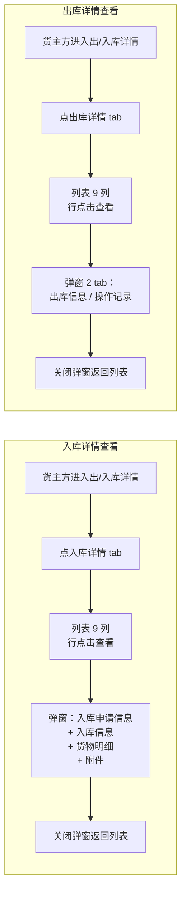

# 出/入库详情

> 适用版本：v1.7.11（按甲方截图重写弹窗）
> 适用角色：货主方（customer）
> 页面归口：智慧仓储 / 货物管理 / 出/入库详情
> 关联页面：入库申请 / 出库申请 / 库存台账

---

## 流程图

### 主流程（按角色视角的 4 步入库 / 4 步出库）



---

## 功能点说明

| 功能点 | 适用角色 | 说明 |
|---|---|---|
| 入库详情 tab | 货主方 | 列表展示入库记录（12 条 mock），行点击查看详情弹窗 |
| 出库详情 tab | 货主方 | 列表展示出库记录（12 条 mock），行点击查看详情弹窗（双 tab） |
| 查看弹窗（入库） | 货主方 | 入库申请信息 9 字段 + 入库信息 8 字段 + 货物明细 13 列 + 附件 3 类 |
| 查看弹窗（出库） | 货主方 | 双 tab 切换：出库信息（同入库结构）/ 操作记录 5 列表格 |
| 数据导出 | 货主方 | 按当前 tab + 筛选条件导出 CSV |

---

## 原型

[占位] — 截图见 https://dhzl-supply-chain.pages.dev/customer/in-out-detail

---

## 数据范围

| 角色 | 数据范围说明 |
|---|---|
| 货主方 | 查看本企业的入库/出库详情记录（出入库申请已完成的业务数据）|

---

## 搜索条件

| 字段名 | 提示语 | 需求说明 |
|--:|---|---|
| 入库单号 / 出库单号 | 请输入单号 | 模糊查询（contains，输入英文/数字/标点）|
| 库点名称 | 请选择 | 单选下拉，选项值：3 个仓库（郑州融万/物流港二期/天津港国际冷链基地）|
| 仓房-货位 | 请选择 | 单选下拉，选项值：当前入库/出库列表中所有去重货位 |
| 入库/出库申请编号 | 请输入申请编号 | 模糊查询（contains）|
| 货物名称 | 请选择 | 单选下拉，选项值：列表中所有去重货品（保乐肩/牛肋条/羔羊肉卷/牛腩/牛肋排/牛腱子/肥牛）|
| 入库/出库时间 | 请选择 | 日期范围选择器（起 ~ 止）|
| 关联合同/订单编号（仅出库）| 请输入合同/订单编号 | 模糊查询（contains）|
| 数据类型 | 请选择 | 单选下拉，选项：手动添加 / 数据同步 / API导入 |

> 交互说明：检索条件失去焦点、或者通过回车、查询操作后，即进行数据查询

---

## 列表说明

### 交互说明

- 9 列字段一行展示不全时，字段末尾做 ... 处理，同时鼠标悬停该字段时，展示对应字段的全部信息
- 入库/出库 2 tab 切换
- 列表做成自适应屏幕宽度
- 简单分页：每页 10 条（v1.7.29 调整为 10/20/50/100 切换）

### 列表字段说明（入库详情 tab）

| 列名 | 需求说明 |
|---|---|
| 入库单号 | 业务编号，格式 `IN_YYYYMMDDXXX`（如 `IN20231010000001`）|
| 入库时间 | 业务时间，格式 `YYYY-MM-DD HH:MM:SS`（如 `2023-10-10 12:33:34`）|
| 货物名称 | 货品名称（如"保乐肩、牛肋条"）|
| 库点名称 | 完整仓库名称（如"郑州融万冷库"）|
| 仓房-货位 | 完整仓房-货位（如"智链监管仓-1号位"）|
| 入库申请编号 | 关联的入库申请业务编号（如 `PREIN20231010000001`）|
| 关联合同/订单编号 | 关联的合同/订单编号（如 `XJDYC-RHSY-202405-003`）|
| 数据类型 | 数据来源类型（手动添加/数据同步/API导入），徽章展示 |
| 操作 | 查看 / 闪电图标（数据刷新）|

### 列表字段说明（出库详情 tab）

| 列名 | 需求说明 |
|---|---|
| 出库单号 | 业务编号，格式 `OUT_YYYYMMDDXXX`（如 `OUT20231010000001`）|
| 出库时间 | 业务时间，格式 `YYYY-MM-DD HH:MM:SS` |
| 货物名称 | 货品名称 |
| 库点名称 | 完整仓库名称 |
| 仓房-货位 | 完整仓房-货位 |
| 出库申请编号 | 关联的出库申请业务编号 |
| 关联合同/订单编号 | 关联的合同/订单编号 |
| 数据类型 | 数据来源类型 |
| 操作 | 查看 / 闪电图标（数据刷新）|

---

## 状态变化说明

> 本页面只读视图，无状态变更能力。
> 状态变更在「入库申请」「出库申请」详情页操作（盖章/审核/驳回/确认入库等）。

---

## 查看弹窗

### 入口

- 货主方在出/入库详情列表点击「查看」按钮

### 原型

[占位] — 截图见 https://dhzl-supply-chain.pages.dev/customer/in-out-detail

### 前置校验

- 必须已登录为货主方（customer 角色）
- 必须有入库/出库详情数据（当前 mock 各 12 条）

### 弹窗 Header

| 元素 | 字段说明 |
|---|---|
| 返回圆按钮 | 蓝色 100 背景 + ← 图标，点击关闭弹窗 |
| 蓝色圆形徽标 | "入"或"出" 字符（区分入库/出库）|
| 业务编号 | 入库编号 / 出库编号（蓝色 font-mono 字体，可复制）|
| 复制按钮 | 复制业务编号到剪贴板 |
| 关闭 × 按钮 | 关闭弹窗 |

### 弹窗 Body（入库详情）

#### 1. 入库申请信息（3 × 3 = 9 字段）

| 字段名称 | 字段说明 |
|---|---|
| 入库申请编号 | 必显示、蓝色可点击（点击 toast 占位「跳转申请详情」），font-mono 字体 |
| 出质方 | 货主方完整公司名（待确认是否脱敏）|
| 联系人 | "姓名 - 电话"格式（电话待确认脱敏）|
| 金融产品 | 完整金融产品名称（如"中原e贷"）|
| 质权方 | 完整质权方公司名 |
| 监管方 | 完整监管方公司名 |
| 申请日期 | 格式 `YYYY-MM-DD` |
| 创建人 | 系统用户姓名 |
| 创建时间 | 格式 `YYYY-MM-DD HH:MM:SS`，font-mono 字体 |

#### 2. 入库信息（5 行 + 备注）

| 字段名称 | 字段说明 |
|---|---|
| 入库单号 | font-mono 字体 |
| 入库时间 | "日期 + 时间"格式 |
| 库点名称 | 完整仓库名称 |
| 仓房&货位 | 完整仓房-货位 |
| 货主名称 | 货主方完整公司名 |
| 毛重总量 | 数字 + "千克"单位 |
| 皮重总量 | 数字 + "千克"单位 |
| 净重总量 | 数字 + "千克"单位（= 毛重 - 皮重，待确认是否系统计算）|
| 备注 | 文本备注（可空）|

#### 3. 货物明细（13 列）

| 列名 | 需求说明 |
|---|---|
| 序号 | 自增 1-N |
| 货品名称 | 货品完整名称 |
| 国家 | 原产国（如"巴西"）|
| 厂号 | 境外生产企业编号（待确认：在华注册编号格式）|
| 入库数量 | 计划入库数量（数字，右对齐）|
| 数量单位 | 默认"箱" |
| 入库重量 | 计划入库重量（数字，右对齐）|
| 重量单位 | 默认"千克" |
| 计划入库时间 | 日期格式 |
| 生产日期 | 日期格式 |
| 生产批号 | 文本 |
| **实收数量** | 实际入库数量（蓝色字体，加粗，右对齐）|
| **实收重量** | 实际入库重量（蓝色字体，加粗，右对齐）|

> 关键说明："实收" vs "计划" 字段差异 —— 实收由仓库方实际过磅后填写，计划由货主方申请时填写

#### 4. 附件（3 类）

| 单据类型 | 字段说明 |
|---|---|
| 入库单 | 蓝色徽章，文件名 + 上传时间标签（v1.7.20 规范 `📅 YYYY-MM-DD HH:MM:SS`）|
| 磅单明细 | 琥珀色徽章，文件名 + 上传时间标签 |
| 入库作业留痕 | 绿色徽章，**多文件**（质检.png / 称重.png / 卸货.png）每个文件独立带上传时间标签 |
| 操作 | "查看" + "下载" 链接（待对接）|

### 弹窗 Body（出库详情，2 子 tab）

#### Tab 1：出库信息

- 出库申请信息（9 字段，结构同入库）
- 出库信息（结构同入库，字段名换为"出库"前缀）
- 货物明细（13 列，结构同入库，"入库数量/重量"换为"出库数量/重量"）
- 附件（3 类，结构同入库）

#### Tab 2：操作记录

5 列表格：

| 列名 | 需求说明 |
|---|---|
| 操作类型 | "新建"/"编辑"/"删除"等，徽章展示 |
| 操作人 | 系统用户姓名 |
| 所属公司 | 完整公司名 |
| 操作内容 | 详细操作描述（如"编辑出库信息, 出库数量, 变更前'1000'，变更后'2000'"）|
| 操作时间 | 格式 `YYYY-MM-DD HH:MM:SS` |

> 当前 mock 仅有 3 条出库记录（i=0, 3, 5）包含 operations 数组；其他出库记录的"操作记录" tab 显示「📭 暂无操作记录」

### 后置动作

- 关闭弹窗：返回列表（弹窗销毁）
- 复制单号：调用 `navigator.clipboard.writeText()` 复制到剪贴板
- 点击"入库申请编号"：toast「跳转申请详情（待对接）」

### 校验规则

- 弹窗打开时：如果找不到对应记录，fallback 到第一条数据
- 多文件附件（multiFile=true）：渲染时按 files 数组逐个文件渲染，每个文件带独立上传时间标签

---

## 业务规则

### 业务编号规则

- 入库：`IN_YYYYMMDDXXX`（如 `IN20231010000001`）
- 出库：`OUT_YYYYMMDDXXX`（如 `OUT20231010000001`）
- 入库申请：`PREIN_YYYYMMDDXXX` / `IN2026XXXXXXXX`
- 出库申请：`OUT2026XXXXXXXX`

### 净重公式

```
净重 = 毛重 - 皮重
（待确认：是否系统自动计算，还是手动录入）
```

### 附件规则

- 格式：jpg / jpeg / png / pdf（待确认）
- 单文件 ≤ 100MB（待确认）
- 多文件支持（如"入库作业留痕"含 3 个子文件）
- 上传时间常驻显示 `📅 YYYY-MM-DD HH:MM:SS`（v1.7.20 规范）

### 数据来源

- 手动添加：货主方/仓库方手动录入
- 数据同步：上游 OMS 系统推送（与状态说明「入库完成 → oms推回入库记录」对应）
- API 导入：与第三方系统对接导入

### 操作记录生成规则

- 新建：业务首次创建时自动记录（操作人 + 时间 + 业务编号）
- 编辑：每次信息修改记录（操作人 + 时间 + 变更字段 + 变更前/后值）
- 删除/作废：业务终止时记录
- 待确认：操作记录是否需要保留「撤销/还原」操作历史？

### 脱敏规范

- 信用代码：`91XXXXXXXXMAXXXXXXXX`
- 手机：`138 0000 XXXX` / `138-XXXX-XXXX`
- 邮箱：`xxx@example.com`
- 身份证：`410XXXXXXXXXXXXXXX`

> ⚠️ 当前 mock 数据中联系人电话 `133238288889` 未脱敏，需要脱敏处理

---

## 待确认事项

⚠️ **以下业务规则我没法从资料中确认，请你逐项确认**：

1. **入库/出库详情是否需要"权限控制"？** 货主方/监管方/担保方/资金方看到的内容是否一致？是否某些字段需要按角色脱敏或隐藏？
2. **净重 = 毛重 - 皮重** 是系统自动算，还是仓库方手动录入？当前 mock 三个值都是 3000/500/2500，看起来是预设的。
3. **实收数量/实收重量** 的录入时机：仓库方过磅时？入库申请审核通过时？入库完成时？
4. **附件的"查看/下载"链接** 是否对接后端？当前是 toast 占位。
5. **入库申请编号的"可点击"链接** 跳转到哪个页面？应该跳 `customer/inbound-detail?id=xxx` 吗？
6. **操作记录 tab** 中是否需要支持"按操作类型筛选"或"按时间范围筛选"？当前 mock 仅有 3 条带 operations 数据的记录。
7. **关联合同/订单编号** 字段是否需要支持点击跳转到合同/订单详情？
8. **数据导出** CSV 时是否包含弹窗的明细字段？还是只导出列表字段？
9. **货主方名称** 在出/入库详情中显示的是"河南军牧原国际贸易有限公司"——这是甲方真名还是 demo 数据？需不需要脱敏成"郑州某冷链贸易有限公司"？
10. **联系人电话 `133238288889`** 11 位但格式异常（正常 11 位手机是 1[3-9] 开头 10 位数字），需脱敏。

---

## 版本演进

| 版本 | 改动点 |
|---|---|
| v1.7.11 | 按甲方截图重写弹窗（1 个 section 入库 / 2 tab 出库）；附件上传时间改为 hover tooltip（v1.7.20 后改为常驻）|
| v1.7.20 | 附件上传时间常驻显示规范（v1.7.11 当时是 hover tooltip，v1.7.20 改为常驻）|
| v1.7.29 | 与列表页同步：调整分页 10/20/50/100（仅列表页，弹窗不分页）|

---

## 相关文件

| 文件 | 行数 | 关键内容 |
|---|---|---|
| `pages/customer/in-out-detail.html` | 700+ | 出/入库详情列表 + 9 列表头 + 查看弹窗 |
| `shared/js/mockData.js` 段 `inOutDetails` | 2264 | 入库 12 条 + 出库 12 条（含 3 条带 operations 操作记录）|
