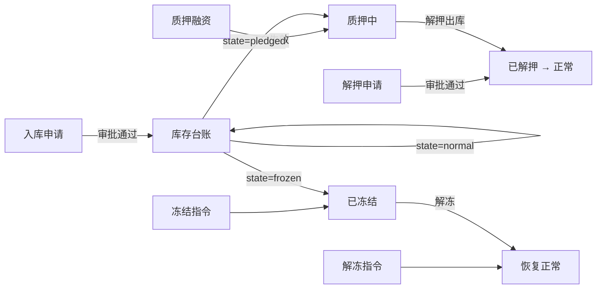

# 库存台账

> 适用版本：v1.7.18
> 适用角色：货主方（customer）
> 页面归口：智慧仓储 / 库存管理 / 库存台账
> 关联页面：库存明细详情 `/pages/customer/inventory-detail.html`

---

## 流程图

---

## 功能点说明

| 功能点 | 适用角色 | 说明 |
|---|---|---|
| 库存台账列表 | 货主方、监管方、担保方、资金方 | 按货品聚合的库存汇总，支持筛选 + 状态切换 + 数据导出 |
| 状态切换（4 tab） | 货主方、监管方、担保方、资金方 | 全部 / 正常 / 质押中 / 已冻结，按 state 字段过滤 |
| 数据导出 | 货主方、监管方、担保方、资金方 | 按当前筛选条件导出 CSV（含 BOM，Excel 兼容）无筛选默认导出全部 |
| 库存明细详情 | 货主方、监管方、担保方、资金方 | 行点击进入，含 4 tab（入库/出库/质押/解押事件流） |

---

## 原型

[占位] — 截图见 https://dhzl-supply-chain.pages.dev/customer/inventory-ledger

---

## 数据范围

| 角色 | 数据范围说明 |
|---|---|
| 货主方 | 查看本企业所有库存台账 |
| 监管方 | 查看所有企业的库存台账（只读） |
| 担保方 | 查看本机构作为担保方的所有库存台账（只读） |
| 资金方 | 查看本机构作为资金方的所有库存台账（只读） |

---

## 搜索条件

| 字段名 | 提示语 | 需求说明 |
|---|---|---|
| 金融机构 | 请选择 | 单选下拉，选项值：中原银行、工商银行、中融信托·冷链金融部、招商银行 |
| 仓库名称 | 请选择 | 单选下拉，选项值动态从 `inventoryLedger.warehouseName` 去重 |
| 仓房-货位 | 请选择 | 单选下拉，选项值动态从 `inventoryLedger.location` 去重 |
| 货物名称 | 请选择 | 单选下拉，选项值动态从 `inventoryLedger.productFullName` 去重 |

> 4 个筛选可任意组合（AND 逻辑），当前搜索条件以 tag 形式展示在筛选区上方，可单个删除（× 按钮）或一键「清除全部」。

---

## 列表说明

### 交互说明

- 字段一行展示不全时，字段末尾做 ... 处理，同时鼠标悬停该字段时，展示对应字段的全部信息
- 页码：库存台账分页（默认单页10条，单页展示）
- 操作按钮列：行点击进入「库存明细详情」页面
- 列表做成自适应屏幕宽度
- 数字列使用等宽字体，右对齐

### 列表字段说明

| 列名 | 需求说明 |
|---|---|
| 库点名称 | 仓库名（显示完整库房名称，如表格左右间距不足时，可收缩为3个汉字显示，示例“郑州融..”鼠标hover状态下tips气泡显示完整名称） |
| 仓房-货位 | 格式：`{区}-{仓}-{货位号}` |
| 货物名称 | 格式：`{国家}-{品类}-{部位}` |
| 库存数量 | 千分位整数，单位：箱 |
| 库存重量 | 4 位小数，单位：吨（显示用 toFixed(4)） |
| 库存货值（元） | 千分位浮点，单位：元 |
| 质押数量 | 0 时显示 `—`，非 0 时紫色高亮 |
| 质押重量 | 0 时显示 `—`，非 0 时紫色高亮 |
| 质押货值（元） | 0 时显示 `—`，非 0 时紫色高亮 |
| 冻结数量 | 0 时显示 `—`，非 0 时灰色加粗 |
| 冻结重量 | 0 时显示 `—`，非 0 时灰色加粗 |
| 数量单位 | 固定「箱」（此处根据业务要求以及货品规格可能有所调整，暂定为「箱」） |
| 重量单位 | 固定「千克」（国际单位Kg） |

---

## 状态切换

### 全部（表格中所显示数据）

**入口**：默认 展示当前角色用户可查询的全部数据，无过滤

**字段说明**：参见上方「列表字段说明」

---

## 数据口径说明（顶部数据算式规则）

- **总库存** = 所有未解押货物的毛重合计（特别计算说明：货主方的的库存台账「总库存」计算方式为「总库存=已入库+已质押」==其他除货主方外的角色「总库存」的计算方式=质押且未解押的货物总和）
- **预估总货值** = Σ(库存货值) = Σ(总库存数量 × 单件评估价)（此处依据的总库存数据，与上方取值逻辑保持一致）
- **当前质押总量** = 与当前角色方关联被冻结（质押）货物总数量
- **质押预估总货值** = 在押状态下的评估货值（与上方各角色取值逻辑统一⬆️）

---

## 业务规则

### 状态优先级
- 一笔库存可能同时存在质押 + 冻结
- 状态优先级 = frozen > pledged > normal
- mock 数据中一条记录只有一种状态（v1.7.18 简化版）

### 字段单位
- 数量单位固定「箱」（v1.7.18 简化）
- 重量单位固定「千克」（v1.7.18 简化）

### 脱敏规范
- 信用代码：`91XXXXXXXXMAXXXXXXXX`（首期考虑是否增加脱敏操作日志、校验安全流程或事件提醒功能，如不添加，点击脱敏内容前端直接显示完整信息即可）
- 手机：`138 0000 XXXX`（同上）
- 邮箱：`xxx@example.com`（同上）

### 导出规则
- 文件名：`库存台账_{state}_{YYYY-MM-DD}.csv`
- 含 BOM `\uFEFF` 解决 Excel 中文乱码
- 引号/逗号/换行字段值自动 `"` 包裹

---

## 相关文件

| 文件 | 行数 | 关键内容 |
|---|---|---|
| `pages/customer/inventory-ledger.html` | 279 | 4 stats + 13 列 + 4 状态 |
| `pages/customer/inventory-detail.html` | ~600 | 4 tab（入库/出库/质押/解押事件流） |
| `shared/js/mockData.js` 段 `inventoryLedger` | 2122+ | 50 条自动生成 mock |
| `shared/js/mockData.js` 段 `inventoryRecords` | 2179+ | 详情页 4 tab 数据 |
