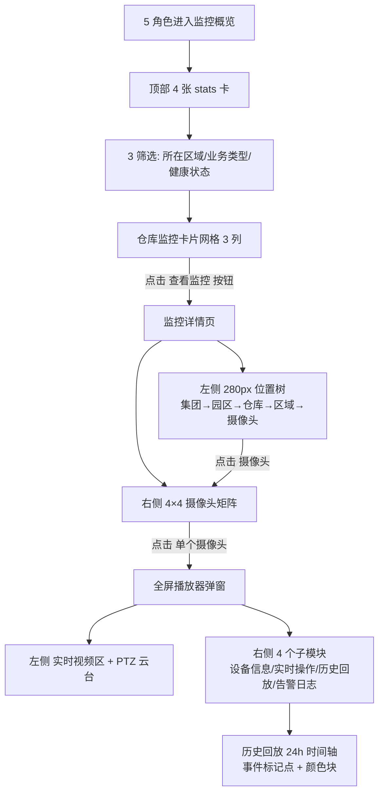

# 监控概览

> 适用版本：v1.7.13（一级监控概览 + 二级监控详情 + 三级摄像头点位全屏）
> 适用角色：货主方（customer）/ 监管方（platform）/ 担保方（guarantor）/ 资金方（bank）/ 仓储方（warehouse）
> 页面归口：智慧仓储 / 视频监控 / 监控概览
> 关联页面：监控详情（按位置树 + 摄像头矩阵）/ 摄像头点位全屏播放器（弹窗）

---

## 流程图

### 监控总览 → 监控详情 → 摄像头点位（5 角色差异化）



---

## 功能点说明

| 功能点 | 适用角色 | 说明 |
|---|---|---|
| 监控概览（卡片网格）| 5 角色（仅自己相关）| 8 个仓库监控卡片 + 健康度 + 当前库存 |
| 监控概览筛选 | 5 角色 | 所在区域 / 业务类型（冷链/煤炭）/ 健康状态 |
| 监控详情（位置树 + 摄像头矩阵）| 5 角色 | 5 级位置树（按集团/园区/仓库/区域/摄像头）+ 4×4 摄像头矩阵 |
| 摄像头点位全屏弹窗 | 5 角色 | 实时视频 + PTZ + 设备信息 + 实时操作 + 历史回放 + 告警日志 |
| 历史回放（24h 时间轴）| 5 角色 | 事件标记点 + 颜色块（点击跳转）|
| 异常摄像头 tab | 5 角色 | 监控详情右侧默认显示**仅异常**摄像头（掉线/失联/遮挡）|

---

## 原型

[占位] — 截图见 https://dhzl-supply-chain.pages.dev/customer/video

---

## 数据范围

| 角色 | 数据范围说明 |
|---|---|
| 货主方 | 5 角色都看（仅自己相关）—— 货主方仅看**关联货物的库点**监控（按 warehouse 与货主方的入库/出库关系过滤）|
| 监管方 | 看全部 8 个仓库监控（监管身份天然拥有全局监控权）|
| 担保方 | 5 角色都看（仅自己相关）—— 担保方仅看**担保池涉及的库点**监控 |
| 资金方 | 5 角色都看（仅自己相关）—— 资金方仅看**在贷货物对应的库点**监控 |
| 仓储方 | 5 角色都看（仅自己相关）—— 仓储方仅看**自己负责的库点**监控 |

> 数据范围规则（v1.7.34 确认）：`5 角色都看（仅自己相关）` = 角色不同能看到的仓库范围不同（具体逻辑见上表）

---

## 搜索条件（监控概览筛选）

| 字段名 | 提示语 | 需求说明 |
|--:|---|---|
| 所在区域 | 请选择 | 单选下拉，选项值：监控点位的 region 去重（河南省郑州市 / 天津市东疆保税港区 / 山西省吕梁市汾阳市 / 山西省吕梁市 / 宁夏宁东基地 / 宁夏银川 / 河南省新密市）|
| 业务类型 | 请选择 | 单选下拉，选项：冷链 / 煤炭 |
| 健康状态 | 请选择 | 单选下拉，选项：正常（健康率≥80%）/ 异常（健康率<80%）/ 掉线（健康率=0%）

> 健康状态计算规则（v1.7.34 确认）：
> - `健康率 = onlineCameras / totalCameras × 100%`
> - 阈值：**≥ 80% 正常（绿色）** / **< 80% 异常（黄色）** / **= 0% 掉线（红色）**
> - mockData 中 `healthRate` 字段仅作示例值，前端按公式实时计算

---

## 列表说明（监控概览卡片网格）

### 交互说明

- 8 个仓库卡片以 3 列网格展示
- 卡片左侧**色边**表示健康度（绿/黄/红），不依赖文字
- 卡片右上角健康度 badge（"正常"绿色 / "异常"黄色 / "掉线"红色）
- 卡片右下角"查看监控"按钮 → 跳转监控详情
- 鼠标悬停卡片 → 阴影加深 + 轻微 Y 轴位移
- 卡片自带 min-h-[200px]，高度统一

### 卡片字段说明（8 字段）

| 字段 | 需求说明 |
|---|---|
| 色边 | 健康度色（绿/黄/红），卡片左侧 4px 边框 |
| 仓库图标 | 蓝色方形容器（48×48）|
| 仓库名称 | 完整仓库名（如"物流港二期大河智链监管库"）|
| 健康度 badge | "正常"/"异常"/"掉线" 文字 + 对应颜色 |
| 在线数 | 绿色（online 摄像头数）|
| 掉线数 | 红色（offline 摄像头数）|
| 在线率 | "onlineCameras/totalCameras"（如 13/13 = 100%）|
| 核心企业 | 仓库主要服务的企业（mock 中是"郑州某冷链贸易有限公司"）|

> 注：仓库信息额外补充字段（与监控无关的"所在区域/当前库存"等）放在 hover 弹层或详情查看按钮中，避免主卡信息过载。

---

## 状态变化说明

### 监控概览状态机

监控概览本身**不设状态机 tab**（卡片直接展示当前快照），但健康状态自动按阈值着色：

| 健康率区间 | 颜色 | 含义 |
|---|---|---|
| `100%` | 🟢 绿色（emerald-500）| 正常 |
| `1% - 99%` | 🟡 黄色（amber-500）| 异常（部分摄像头掉线/失联）|
| `0%` | 🔴 红色（rose-500）| 掉线（全部摄像头失联）|

### 监控详情状态机

> v1.7.34 确认：**只保留"异常" tab**（其他状态隐藏）

监控详情页右侧"摄像头矩阵"上方 1 个 tab：

| Tab | 业务说明 |
|---|---|
| **异常** | 仅显示 `status ≠ online` 的摄像头（即掉线/失联/遮挡）|

> **原因**：正常摄像头占绝大多数（如 37 个中 34 个正常），默认显示"异常"让用户聚焦在需要处理的摄像头上。

### 摄像头状态机

| 状态 | 含义 | 视觉表现 |
|---|---|---|
| `online` | 在线 | 绿色圆点 + "在线" 徽章 |
| `offline` | 掉线（设备≥30min 无心跳）| 红色圆点 + "掉线" 徽章 |
| `signal_lost` | 失联（视频画面黑屏但设备在线）| 橙色圆点 + "失联" 徽章 |
| `occluded` | 遮挡（镜头被遮）| 黄色圆点 + "遮挡" 徽章 |

> 异常 tab 默认显示 status ∈ {offline, signal_lost, occluded} 的所有摄像头。

---

## 监控详情（v1.7.13）

### 入口

货主方/监管方/担保方/资金方/仓储方在监控概览卡片点"查看监控"按钮

### 原型

[占位] — 截图见 https://dhzl-supply-chain.pages.dev/customer/video-detail

### 前置校验

- 必须已登录且能访问该仓库（角色权限过滤）
- 选中位置树节点后右侧摄像头矩阵自动更新

### 字段说明（位置树 5 级）

| 层级 | 字段说明 |
|---|---|
| 集团（group）| 顶级分组（如"冷链监管库"/"煤炭洗煤厂"）|
| 园区（park）| 二级园区（如"郑州冷链园区"/"宁东基地"）|
| 仓库（site）| 三级仓库（关联 monitorSites）|
| 区域（zone）| 四级物理区域（关联 cameraZones）|
| 摄像头（camera）| 五级点位（关联 cameras，**只展示异常**）|

### 字段说明（摄像头矩阵卡片 8 字段）

| 字段 | 需求说明 |
|---|---|
| 缩略图 | 仿真监控画面（带时间戳水印 + 扫描线叠加）|
| 状态 badge | 在线/失联/掉线/遮挡 圆点 + 文字 |
| 摄像头名称 | 如"1号抓拍相机1"|
| PTZ 标签 | PTZ / 4K 灰色徽章（标识云台与分辨率）|
| 区域名 | 该摄像头所属物理区域（如"卸货月台"）|
| 最后心跳 | 格式 `YYYY-MM-DD HH:MM:SS` |
| 操作 | 查看 / 回放 / 配置（待对接）|
| 异常诊断 | offline 信号时显示"断网/光模块故障"等诊断文案 |

---

## 摄像头点位全屏弹窗（v1.7.13）

### 入口

监控详情摄像头卡片点"查看"按钮

### 字段说明（弹窗 4 子模块）

#### 模块 1：实时视频区

- 仿真实时画面（占位符，根据 type/zoneId 区分"卸货台/库内/周界/机房"）
- PTZ 云台控制（八方向按钮 + 缩放/聚焦/光圈）
- 时间戳水印（实时显示当前时间）
- 状态标识（在线红/绿圆点 + 摄像头名）

#### 模块 2：设备信息（5 字段）

| 字段 | 字段说明 |
|---|---|
| 摄像头 ID | 唯一编号（如 `cam_001`）|
| 所属仓库 | 仓库名（siteId → siteName 反查）|
| 所属区域 | 区域名（zoneId → name 反查）|
| 类型 | loading/indoor/perimeter/machine |
| 分辨率 | 1080p / 4K |

#### 模块 3：实时操作（5 操作）

| 操作 | 字段说明 |
|---|---|
| 截图 | toast「截图已保存到本地（待对接）」|
| 录制 | toast「开始录制（待对接）」|
| 对讲 | toast「开启对讲（待对接）」|
| 监听 | toast「开启监听（待对接）」|
| 巡检 | toast「发起巡检工单（待对接）」|

#### 模块 4：历史回放（24h 时间轴）

- 24 小时时间轴横轴（00:00 ~ 24:00）
- **事件标记点**：圆点表示事件位置（掉线/失联/遮挡/录制定位）
- **颜色块**：彩色条带表示录像连续性（绿=正常/红=异常/灰=无录像）
- **可点击跳转**：点击颜色块/标记点 → 时间轴跳转到该时刻 + 播放
- 下方时间码显示 + 播放/暂停/快进控制条

#### 模块 5：告警日志（mock 5 条）

| 字段 | 字段说明 |
|---|---|
| 时间 | 告警发生时间 |
| 类型 | 掉线/失联/遮挡/录制定位 |
| 内容 | 告警详细描述 |
| 状态 | 已处理 / 待处理 |

---

## 业务规则

### 健康率计算公式

```
健康率 = onlineCameras / totalCameras × 100%
```

| 区间 | 颜色 | 含义 |
|---|---|---|
| `100%` | 🟢 | 正常 |
| `1% - 99%` | 🟡 | 异常 |
| `0%` | 🔴 | 掉线 |

> v1.7.34 确认：前端**实时计算**（不使用 mockData.healthRate 字段）

### 摄像头状态规则

- `online` - 设备正常在线，心跳正常
- `offline` - 设备**≥ 30 分钟无心跳**
- `signal_lost` - 设备在线但**视频画面黑屏**（可能是视频线问题）
- `occluded` - **镜头被物理遮挡**（人为/物体）

### 数据来源

- 设备心跳：每 30 秒上报一次
- 视频流：海康/大华/萤石 RTSP/WebRTC 拉流
- NVR 录像：云端或本地 NVR

> v1.7.34 占位：所有"待对接"按钮的 toast 提示

### 异常 tab 排序

异常摄像头按**严重度**排序：
1. `offline`（最严重 - 完全看不到）
2. `signal_lost`（次严重 - 设备在线但画面没）
3. `occluded`（一般 - 镜头被挡）

> v1.7.34 确认

### 5 角色权限规则

| 角色 | 监控可见范围 |
|---|---|
| 货主方 | 关联货物的库点（按 warehouse ↔ inbound/outbound 关系过滤）|
| 监管方 | 全部 8 个仓库 |
| 担保方 | 担保池涉及的库点（按 warehouse ↔ pledgeList 关系过滤）|
| 资金方 | 在贷货物对应的库点（按 warehouse ↔ financingList 关系过滤）|
| 仓储方 | 自己负责的库点（按仓库管理员对应关系）|

> v1.7.34 确认（5 角色都看，仅自己相关）

### 当前库存(吨) 字段说明

- mockData 中 `currentStockTons` 字段有负数（ms_004=-1106.57, ms_008=-237）和 0 值
- v1.7.34 确认：**本期不解释**，直接显示原数据 + 负数标红
- 待客户确认实际含义后再补正（"出库流水与入库流水不对账" 等业务解释）

---

## 状态变化说明（监控异常处理流程）

| 异常类型 | 自动检测 | 自动通知 | 人工处理 |
|---|---|---|---|
| 摄像头掉线 | NVR 30min 无心跳 | 站内信通知仓储方管理员 | 维修电源/网线 |
| 视频失联 | 流媒体黑帧检测 | 站内信通知 | 排查视频线/编码器 |
| 镜头遮挡 | AI 视觉识别 | 站内信通知 | 派单清理镜头 |
| 全网掉线（健康率 0%）| 心跳/流同时异常 | 邮件 + 短信（v2.0）| 紧急维修 |

> v1.7.34 占位：所有"自动通知"功能本期不实现，仅有 mock 数据

---

## 待确认事项（v1.7.34 仍有 5 项需用户最终确认）

⚠️ 以下问题我没法从资料中确认，**请用户最终拍板**：

1. **监控概览的"当前库存(吨)"字段**
   - 当前 mock 含负数（-1106.57、-237）和 0 值
   - v1.7.34 选择"待客户确认后补正"——本期不解释
   - **确认问题**：负数是否需要特别提示"异常待查"？或仅展示原数据 + 标红？
   - **建议**：保留标红但不加备注，**等客户反馈时再说**

2. **异常摄像头排序规则**
   - v1.7.34 默认按严重度排序（offline > signal_lost > occluded）
   - 实际业务**是否需要按"最后心跳时间"排序**（越久越靠前）？
   - **建议**：保持按严重度（业务语义清晰）

3. **"查看监控"按钮的角色权限映射**
   - v1.7.34 规则：5 角色都看自己相关
   - 货主方/担保方/资金方的"关联库点"**计算逻辑**：
     - 货主方 = 入库/出库历史中出现的 warehouse
     - 担保方 = 担保池中的 pledge.warehouseId
     - 资金方 = 在贷融资的 finance.warehouseId
   - **建议**：使用 mockData 中的 `linkedWarehouses` 字段（待加）

4. **位置树分组规则**
   - 当前 mockData `monitorGroups` 已有"冷链监管库/煤炭洗煤厂"两个顶层 group
   - 每个 group 下 1-2 个 park，每个 park 下 1-2 个 site
   - **确认问题**：实际业务**是否要加"集团"层级**（如"大河智链集团"）？
   - **建议**：5 级（集团→园区→仓库→区域→摄像头）保持不变

5. **历史回放数据来源**
   - v1.7.34 占位：颜色块 + 标记点
   - **确认问题**：实际 NVR 录像查询接口是否已对接？
   - **建议**：本期占位，NVR 对接二期

---

## 版本演进

| 版本 | 改动点 |
|---|---|
| v1.7.13 | 新建【视频监控】一级 +【监控详情】二级（位置树 5 级 + 摄像头矩阵 4 列 + 全屏播放器弹窗）|
| v1.7.13.1 | 监控菜单简化：只保留"监控概览"（详情从卡片跳转）|
| v1.7.34 | 健康率计算公式（v1.7.13 用 mock 字段，v1.7.34 改前端实时算）+ 监控详情只保留"异常" tab + 历史回放带事件标记点 + 5 角色权限规则 |

---

## 相关文件

| 文件 | 行数 | 关键内容 |
|---|---|---|
| `pages/customer/video.html` | ~400 | 监控概览：4 stats + 3 筛选 + 8 仓库卡片网格 |
| `pages/customer/video-detail.html` | ~500 | 监控详情：5 级位置树 + 摄像头矩阵 + 全屏弹窗 |
| `shared/js/mockData.js` 段 `monitorSites` | 403 | 8 个仓库监控点 |
| `shared/js/mockData.js` 段 `cameraZones` | 455 | 16 个物理区域 |
| `shared/js/mockData.js` 段 `cameras` | 477 | 37 个摄像头点位（覆盖 4 种状态）|
| `shared/js/mockData.js` 段 `monitorGroups` | 523 | 5 级位置树（2 集团 → 2 园区 → 8 仓库）|
