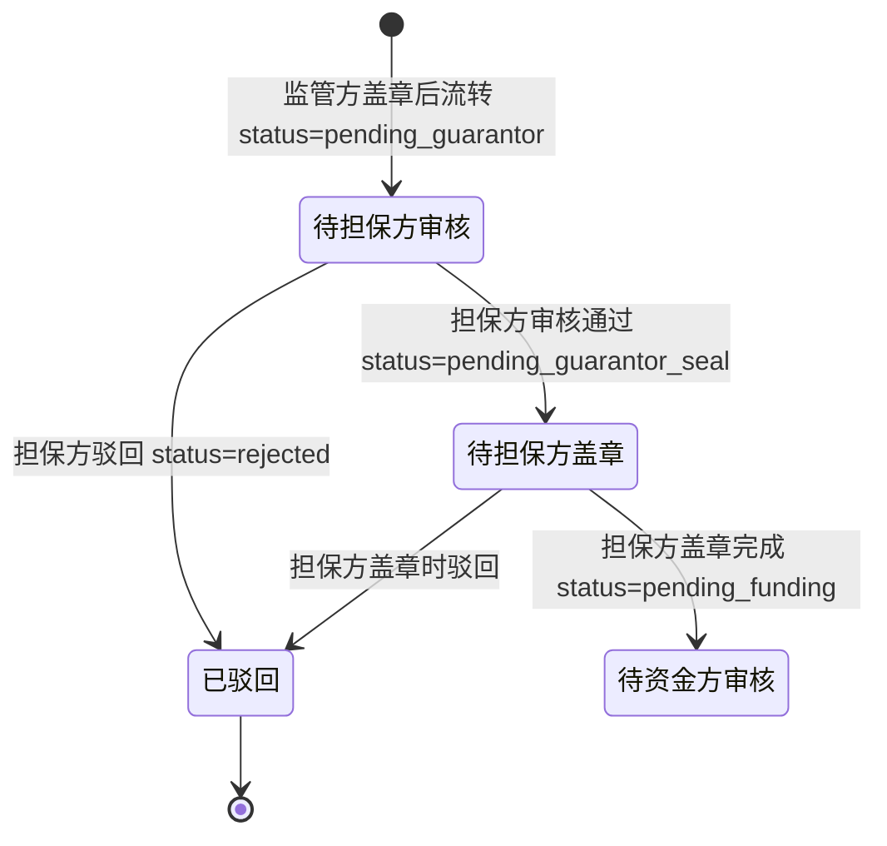
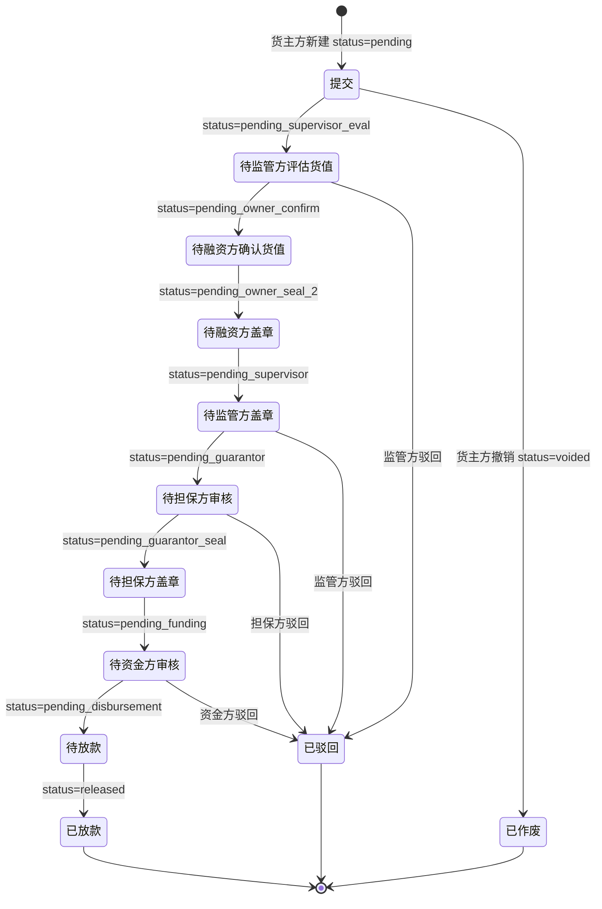

# 融资审核（担保方）

> 适用版本：v1.7.51（担保方融资审核接入）+ v1.7.55（驳回 modal 必填说明校验）+ v1.7.8（出具担保函弹窗）
> 适用角色：担保方（guarantor）
> 页面归口：供应链金融 / 融资管理 / 融资审核工作台
> 关联页面：融资审核列表 / 出具担保函弹窗 / 融资申请详情（v1.7.76+ 占位）
> URL 列表：`/pages/guarantor/approval-financing.html`（列表）
> URL 详情：`/pages/guarantor/approval-financing-detail.html`（v1.7.76+ 待开发）

---

## 流程图

### 担保方视角（3 级审核中的第 2 步）



> 担保方在 8 步流程中负责**第 6 步（审核核保）+ 第 7 步（盖章）**两个节点（v1.7.78 拆分）
> 核心动作：**出具担保函**（v1.7.8 占位弹窗，v1.7.76+ 计划转为独立详情页）

### 8 步审批全景



> 注：担保方在 8 步中负责**第 6 步（审核核保）+ 第 7 步（盖章③）**两个节点
> 担保方盖章③是融资流程中**第三次盖章**（货主方盖章① → 监管方盖章② → 担保方盖章③）

---

## 功能点说明

| 功能点 | 适用角色 | 状态分支 | 说明 |
|---|---|---|---|
| 融资审核列表查看 | 担保方 | 全部 | 12 状态 tab + 20 列 + 8 筛选器，查看作为担保方的融资申请 |
| 出具担保函 | 担保方 | **pending_guarantor** | 弹窗含核保材料/反担保措施/代偿能力评估/担保金额/担保费 |
| 担保方盖章③ | 担保方 | **pending_guarantor_seal** | v1.7.76+ 计划（v1.7 流程只占位） |
| 驳回融资申请 | 担保方 | **pending_guarantor** | 填写驳回原因（必填 10-200 字），状态变 rejected |
| 基础信息查看 | 担保方 | 全部 | 12 字段，纯文本 |
| 8 步审批进度查看 | 担保方 | 全部 | 步骤条 + 每步完成时间 + 经办人 |
| 附件查看/下载 | 担保方 | 全部 | 4 类，鼠标悬停查看上传时间 |
| 数据导出 | 担保方 | 全部 | 按当前筛选 + 当前 tab 导出 CSV（18 列） |

---

## 功能 × 状态 可操作性矩阵（v1.7.90 锁定）

> **图例**：✅ 可操作（可点按钮 + 触发流程）｜📖 只读查看（看不到但不能操作）｜❌ 不可见/不可操作
> **视角**：担保方（guarantor）+ 担保方盖章员（guarantor_seal）

| 功能 \ 状态 | pending | pending_supervisor_eval | pending_owner_confirm | pending_owner_seal_2 | pending_supervisor | pending_guarantor | pending_guarantor_seal | pending_funding | pending_disbursement | released | rejected | voided |
|---|:-:|:-:|:-:|:-:|:-:|:-:|:-:|:-:|:-:|:-:|:-:|:-:|
| 列表查看（按 guarantor 字段过滤）| 📖 | 📖 | 📖 | 📖 | 📖 | 📖 | 📖 | 📖 | 📖 | 📖 | 📖 | 📖 |
| 出具担保函（担保方）| ❌ | ❌ | ❌ | ❌ | ❌ | ✅ | ❌ | ❌ | ❌ | ❌ | ❌ | ❌ |
| 担保方盖章③（v1.7.76+ 计划，盖章员）| ❌ | ❌ | ❌ | ❌ | ❌ | ❌ | ✅ | ❌ | ❌ | ❌ | ❌ | ❌ |
| 驳回（担保方）| ❌ | ❌ | ❌ | ❌ | ❌ | ✅ | ✅ | ❌ | ❌ | ❌ | ❌ | ❌ |
| 数据导出（4 角色通用）| 📖 | 📖 | 📖 | 📖 | 📖 | 📖 | 📖 | 📖 | 📖 | 📖 | 📖 | 📖 |

> **关键约束**（v1.7.78 锁定）：
> - 担保方**最多操作 2 个节点** — 出具担保函（普通担保方）+ 盖章③（盖章员）
> - 担保放大系数 1.2（担保金额 = 融资金额 × 1.2），担保费率 1.5%/年
> - 核保材料 4 项（营业执照/财报/征信报告/质押物清单）
> - 担保方按 guarantor 字段匹配，**只看到作为本机构担保方的融资记录**

---

## 原型

[占位] — 截图见 https://dhzl-supply-chain.pages.dev/guarantor/approval-financing

---

## 数据范围

| 角色 | 数据范围说明 |
|---|---|
| 担保方 | 查看作为担保方的融资申请（按 guarantor 字段匹配 currentCompany） |
| 货主方 | 仅看本企业，参考「融资申请-货主方」文档 |
| 监管方 | 全部数据，参考「融资审核-监管方」文档 |
| 资金方 | 仅看本企业作为资金方的，参考后续文档 |

---

## 搜索条件（8 字段）

与货主方/监管方融资申请列表共享（financingList.js 通用组件渲染）：

| 字段名 | 类型 | 提示语 | 需求说明 |
|--:|---|---|---|
| 融资申请编号 | 文本 | 请输入融资申请编号 | 模糊查询 |
| 融资方 | 下拉单选 | 全部 | 选项值：financingList.applicant 去重 |
| 金融机构 | 下拉单选 | 全部 | 选项值：financingList.bank 去重 |
| 金融产品 | 下拉单选 | 全部 | 选项值：financingList.productName 去重 |
| 担保方 | 下拉单选 | 全部 | 选项值：financingList.guarantor 去重 |
| 监管方 | 下拉单选 | 全部 | 选项值：financingList.supervisor 去重 |
| 货押资产编号 | 文本 | 请输入货押资产编号 | 模糊查询 |
| 融资期限 | 日期范围 | 融资期限 | 起息日 [startDate, endDate] 区间匹配 |

---

## 列表说明

### 担保方专属渲染

- 默认 tab：**待担保方审核列表**（v1.7.51 锁定）
- 状态列：担保方操作节点用 `(您)` 后缀标识
  - `pending_guarantor` → ⏳ 待担保方审核中（您）
  - `pending_guarantor_seal` → ⏳ 待担保方盖章中（您）
- 操作列：根据 status 动态显示按钮
  - `pending_guarantor` → 详情 / **出具担保函**
  - `pending_guarantor_seal` → 详情 / **担保方盖章**（v1.7.76+ 占位）
  - 其他状态 → 详情（只读）

### 列表字段说明（20 列）

与货主方/监管方融资申请列表共享（financingList.js 通用组件渲染），完整字段参见「融资申请-货主方」文档 § 列表字段说明。

---

## 状态变化说明

### 担保方可见的状态 tab

| Tab | statusMatch | 担保方可操作 |
|---|---|---|
| 全部 | （不过滤） | 查看 |
| 待监管方评估货值 | `['pending_supervisor_eval']` | 只读 |
| 待融资方确认货值 | `['pending_owner_confirm']` | 只读 |
| 待融资方盖章 | `['pending_owner_seal_2']` | 只读 |
| 待监管方盖章 | `['pending_supervisor']` | 只读 |
| **待担保方审核** | `['pending_guarantor']` | **出具担保函 / 驳回** |
| **待担保方盖章** | `['pending_guarantor_seal']` | **盖章③（v1.7.76+ 占位）** |
| 待资金方审核 | `['pending_funding']` | 只读 |
| 待放款 | `['pending_disbursement']` | 只读 |
| 已放款 | `['released']` | 只读 |
| 驳回 | `['rejected']` | 只读 |
| 作废 | `['voided']` | 只读 |

### 担保方操作权限（v1.7.78 锁定）

| 状态 | 出具担保函 | 盖章 | 驳回 | 查看 |
|---|---|---|---|---|
| pending_guarantor | ✅ | ❌ | ✅ | ✅ |
| pending_guarantor_seal | ❌ | ✅（v1.7.76+） | ✅ | ✅ |
| 其他状态 | ❌ | ❌ | ❌ | ✅ |

> 担保方在每个融资申请中**最多操作 2 次**（出具担保函 + 盖章），其他状态全部只读

---

## 出具担保函（v1.7.8 关键弹窗--此部分为新增需求--未最终确认前请忽略）

### 入口

- 列表操作列点击「出具担保函」按钮（pending_guarantor 状态）
- 弹窗形式（v1.7.8） / 独立详情页（v1.7.76+ 计划）

### 原型

[占位] — 截图见 https://dhzl-supply-chain.pages.dev/guarantor/approval-financing

### 弹窗字段说明

#### 待核保内容（6 字段 - 自动带入）

| 字段 | 字段说明 | 计算规则 |
|---|---|---|
| 融资客户 | 自动带入（financingList.applicant） | - |
| 融资金额 | 自动带入（元，num-focus 蓝色加粗） | `financingList.applyAmount` |
| **担保金额** | 自动计算（元，琥珀色加粗） | `applyAmount × 1.2`（担保放大系数 1.2） |
| 担保期限 | 自动带入（天） | `financingList.duration` |
| **担保费率** | 固定值（1.5%/年） | 业务默认值（v1.7.8 锁定） |
| **担保费收入** | 自动计算（元，num-focus） | `applyAmount × 0.015 / 365 × duration` |

> 担保方核心业务：担保金额 = 融资金额 × 1.2（覆盖本息），担保费收入 = 担保金额 × 1.5% / 365 × 期限

#### 核保材料清单（4 项）

| 材料 | 状态 |
|---|---|
| 营业执照 | ✓ 已上传 |
| 财报 | ✓ 已上传 |
| 征信报告 | ✓ 已上传 |
| 质押物清单 | ✓ 已上传（系统自动从融资申请附件带入） |

#### 反担保措施

- 动产质押 + 第三方担保（v1.7.8 固定值）
- v1.7.76+ 计划：可选项（连带责任担保 / 一般担保 / 物保+保证）

#### 代偿能力评估

- 良好（v1.7.8 固定值）
- v1.7.76+ 计划：系统根据融资客户历史数据自动评估（优 / 良 / 中 / 差）

#### 核保意见（必填）

| 字段 | 字段说明 |
|---|---|
| 核保意见 | 必填、textarea（3 行），示例「核保通过，同意为该笔融资出具担保函。融资客户资质良好，质押物充足，反担保措施到位。」 |

### 底部按钮

| 按钮 | 触发动作 |
|---|---|
| 取消 | 关闭弹窗（不保存） |
| **出具担保函并推送银行** | toast「担保函已出具，已推送银行」+ 状态变 `pending_guarantor_seal`（待担保方盖章） |

### 后置动作

- 状态变 `pending_guarantor_seal`（待担保方盖章）
- 生成担保函 PDF（系统自动）
- 推送至资金方（v1.7.8 占位 toast 提示）

### 校验规则（提交时）

```js
function issueGuaranteeSubmit() {
  // 1. 校验核保意见非空
  if (!核保意见.value.trim()) return Utils.toast('请填写核保意见', 'warning');
  // 2. 校验核保意见长度（v1.7.55 必填校验，10-200 字）
  if (核保意见.value.trim().length < 10) return Utils.toast('核保意见至少 10 个字符', 'warning');
  // 3. 提交
  Utils.toast('担保函已出具，已推送银行', 'success');
  setTimeout(() => location.reload(), 1000);
}
```

---

## 担保方盖章（v1.7.76+ 计划）

### 入口

- 列表操作列点击「担保方盖章」按钮（pending_guarantor_seal 状态）
- v1.7 当前为占位（alert「即将对 XX 进行担保方盖章（待完善审批内容）」）

### 计划流程（v1.7.76+ 待实现）

1. 担保方点击「担保方盖章」按钮
2. 弹窗显示待盖章文件清单（担保函 - 系统在出具担保函后自动生成）
3. 担保方在 PDF 文件上电子签章
4. 系统自动校验签章合规性
5. 签章完成后状态变 `pending_funding`（待资金方审核）

> v1.7.78 状态机：担保方盖章③是融资流程中**第三次盖章**（货主方盖章① → 监管方盖章② → 担保方盖章③）
> 印章格式：担保方公司公章（圆形，绿色，区别于货主方红色 / 监管方蓝色）

---

## 驳回融资申请

### 入口

- 弹窗底部「驳回」按钮（pending_guarantor / pending_guarantor_seal 状态）
- 列表操作列（v1.7.78 占位，未实现）

### 弹窗字段

| 字段 | 必填 | 说明 |
|---|---|---|
| 驳回原因 | ✅ | 10-200 字（v1.7.55 必填校验） |
| 驳回方 | 自动 | 担保方公司名 |
| 驳回时间 | 自动 | 当前时间 |

### 限制

- 担保方只能驳回 `pending_guarantor` / `pending_guarantor_seal` 状态
- 驳回后货主方可在「驳回」tab 查看 + 重新提交
- 重新提交后回到 `pending` 状态，重新走 8 步流程

---

## 校验规则（页面初始化）

```js
// 担保方视角：按 guarantor 字段匹配
if (role === 'guarantor') {
  filtered = financingList.filter(f => f.guarantor === currentCompany);
}
// 默认 tab：待担保方审核
const defaultTab = 'pending_guarantor';
// 只在 pending_guarantor 显示「出具担保函」按钮
const showIssue = rec.status === 'pending_guarantor';
// 只在 pending_guarantor_seal 显示「担保方盖章」按钮（v1.7.76+ 占位）
const showSeal = rec.status === 'pending_guarantor_seal';
```

---

## 性能与体验

- 列表 20 列 + 12 tab，**首屏渲染 < 500ms**
- 列表行可点击（v1.7.77）：点击行进入详情页，按钮 stopPropagation 防冒泡
- 担保函弹窗 700px 宽，含 6 字段 + 4 核保材料 + 1 文本域 + 2 按钮
- 状态颜色：待办=蓝/橙；完成=绿；驳回=红；作废=灰

---

## 担保方与监管方/资金方的关键差异

| 维度 | 监管方 | 担保方 | 资金方 |
|---|---|---|---|
| 3 级审核位置 | 第 1 步 | 第 2 步 | 第 3 步 |
| 默认 tab | 待监管方评估货值 | 待担保方审核 | 待资金方审核 |
| 操作节点数 | 2 个（评估货值 + 盖章②） | 2 个（出具担保函 + 盖章③） | 1 个（资方审核） |
| 核心动作 | 录入评估单价（元/千克） | 出具担保函（核保） | 录入起息日 + 放款金额 |
| 顶栏统计卡 | 无 | 无 | 无（v1.7.86 移除 4 个统计卡）|
| 后续动作 | 货主方盖章① | 货主方盖章②（v1.7.76+） | 货主方盖章③ → 待放款 |
| 详情页 | v1.7.75 已实现 | v1.7.76+ 占位 | v1.7.76+ 占位 |
| 印章颜色 | 蓝色（圆形） | 绿色（圆形，v1.7.76+） | - |

> 担保方独有的业务特点：
> ① **担保放大系数 1.2**（担保金额 = 融资金额 × 1.2，覆盖本息）
> ② **担保费率 1.5%/年**（业务默认值）
> ③ **核保材料 4 项**（营业执照/财报/征信报告/质押物清单）
> ④ **反担保措施**（动产质押 + 第三方担保）

---

## 后续优化（v1.7.x 二期）

- [ ] 担保方详情页独立化（v1.7.76+）
- [ ] 担保方盖章③实际弹窗（v1.7.76+）
- [ ] 反担保措施可选项（连带责任 / 一般担保 / 物保+保证）
- [ ] 代偿能力评估系统自动化（基于历史数据）
- [ ] 担保函模板管理（不同金融机构不同模板）
- [ ] 担保费自动催收（到期前 7 天提醒）
