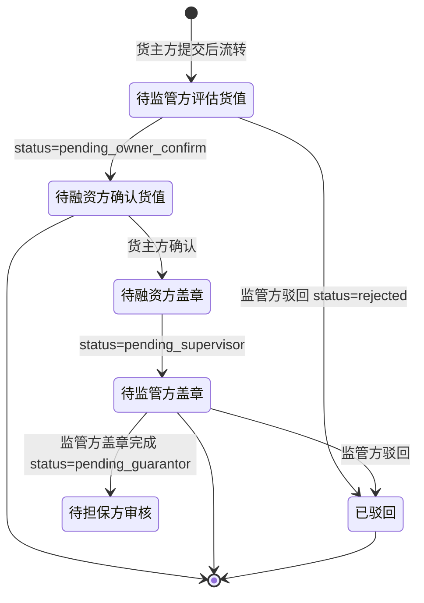
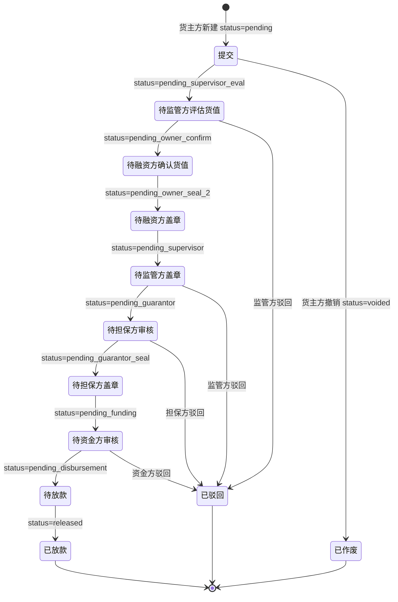

# 融资审核（监管方）

> 适用版本：v1.7.51（监管方融资审核接入）+ v1.7.55（驳回 modal 必填说明校验）+ v1.7.75（评估融资货值子页）
> 适用角色：监管方（platform）
> 页面归口：供应链金融 / 融资管理 / 融资审核工作台
> 关联页面：融资审核列表 / 评估融资货值 / 融资申请详情（货主方）
> URL 列表：`/pages/platform/approval-financing.html`（列表）
> URL 详情：`/pages/platform/approval-financing-detail.html?id={financingId}`（v1.7.75 评估货值页）

---

## 流程图

### 监管方视角（3 步审批全流程中的 2 个节点）



> 监管方主要参与**2 个节点**：
> ① 待监管方评估货值（pending_supervisor_eval）- 录入评估单价
> ② 待监管方盖章（pending_supervisor）- 在《质物清单+反担保合同》上盖章

### 8 步审批全景



> 注：监管方在 8 步中负责**第 2 步（评估货值）+ 第 5 步（盖章②）**两个节点

---

## 功能点说明

| 功能点 | 适用角色 | 状态分支 | 说明 |
|---|---|---|---|
| 融资审核列表查看 | 监管方 | 全部 | 12 状态 tab + 20 列 + 8 筛选器，查看全量融资申请（不限企业） |
| 评估融资货值 | 监管方 | **pending_supervisor_eval** | 录入评估单价（元/千克），重算质押货值 + 拟融资金额 |
| 监管方盖章② | 监管方 | **pending_supervisor** | 在《质物清单 + 质押反担保合同》上电子签章 |
| 驳回融资申请 | 监管方 | **pending_supervisor_eval / pending_supervisor** | 填写驳回原因（必填 10-200 字），状态变 rejected |
| 基础信息查看 | 监管方 | 全部 | 12 字段，纯文本 |
| 质押物清单查看 | 监管方 | pending_supervisor_eval（评估时可编辑） | 16 列（前 12 只读 + 后 4 可编辑） |
| 8 步审批进度查看 | 监管方 | 全部 | 步骤条 + 每步完成时间 + 经办人 |
| 附件查看/下载 | 监管方 | 全部 | 4 类，鼠标悬停查看上传时间 |
| 数据导出 | 监管方 | 全部 | 按当前筛选 + 当前 tab 导出 CSV（18 列） |

---

## 功能 × 状态 可操作性矩阵（v1.7.90 锁定）

> **图例**：✅ 可操作（可点按钮 + 触发流程）｜📖 只读查看（看得到但不能操作）｜❌ 不可见/不可操作
> **视角**：监管方（platform）

| 功能 \ 状态 | pending | pending_supervisor_eval | pending_owner_confirm | pending_owner_seal_2 | pending_supervisor | pending_guarantor | pending_guarantor_seal | pending_funding | pending_disbursement | released | rejected | voided |
|---|:-:|:-:|:-:|:-:|:-:|:-:|:-:|:-:|:-:|:-:|:-:|:-:|
| 列表查看（4 角色通用）| 📖 | 📖 | 📖 | 📖 | 📖 | 📖 | 📖 | 📖 | 📖 | 📖 | 📖 | 📖 |
| 评估融资货值（监管方专属）| ❌ | ✅ | ❌ | ❌ | ❌ | ❌ | ❌ | ❌ | ❌ | ❌ | ❌ | ❌ |
| 监管方盖章②（v1.7.79 计划）| ❌ | ❌ | ❌ | ❌ | ✅ | ❌ | ❌ | ❌ | ❌ | ❌ | ❌ | ❌ |
| 驳回（监管方）| ❌ | ✅ | ❌ | ❌ | ✅ | ❌ | ❌ | ❌ | ❌ | ❌ | ❌ | ❌ |
| 数据导出（4 角色通用）| 📖 | 📖 | 📖 | 📖 | 📖 | 📖 | 📖 | 📖 | 📖 | 📖 | 📖 | 📖 |

> **关键约束**（v1.7.78 锁定）：
> - 监管方**最多操作 2 个节点** — 评估货值 + 盖章②（v1.7.79 计划）
> - 评估货值时**只能编辑「本次质押数量」和「评估单价」**（v1.7.75 关键设计）
> - 其他状态全部只读（评估/盖章/驳回外的状态）
> - 监管方按 role=platform **看全量融资记录**（不限企业）

---

## 原型

[占位] — 截图见 https://dhzl-supply-chain.pages.dev/platform/approval-financing

---

## 数据范围

| 角色 | 数据范围说明 |
|---|---|
| 监管方 | 查看所有企业的融资申请，可审核货值 + 盖章（按 role=platform 不限企业） |
| 货主方 | 仅看本企业，参考「融资申请-货主方」文档 |
| 担保方 | 仅看本企业作为担保方的，参考后续文档 |
| 资金方 | 仅看本企业作为资金方的，参考后续文档 |

---

## 搜索条件（8 字段）

| 字段名 | 类型 | 提示语 | 需求说明 |
|--:|---|---|---|
| 融资申请编号 | 文本 | 请输入融资申请编号 | 模糊查询（suggest 抽屉显示申请方+编号） |
| 融资方 | 下拉单选 | 全部 | 选项值：financingList.applicant 去重 |
| 金融机构 | 下拉单选 | 全部 | 选项值：financingList.bank 去重 |
| 金融产品 | 下拉单选 | 全部 | 选项值：financingList.productName 去重 |
| 担保方 | 下拉单选 | 全部 | 选项值：financingList.guarantor 去重 |
| 监管方 | 下拉单选 | 全部 | 选项值：financingList.supervisor 去重 |
| 货押资产编号 | 文本 | 请输入货押资产编号 | 模糊查询（pledgeAssetNo 字段） |
| 融资期限 | 日期范围 | 融资期限 | 起息日 [startDate, endDate] 区间匹配 |

> 排序：与货主方融资申请列表一致（金融从业者使用习惯）

---

## 列表说明

### 监管方专属渲染

- 默认 tab：**待监管方评估货值列表**（v1.7.78 锁定）
- 状态列：监管方操作节点用 `(您)` 后缀标识
  - `pending_supervisor_eval` → ⏳ 待监管方评估货值中（您）
  - `pending_supervisor` → ⏳ 待监管方盖章中（您）
- 操作列：根据 status 动态显示按钮
  - `pending_supervisor_eval` → 详情 / **待监管方评估货值**（链接到评估详情页）
  - `pending_supervisor` → 详情 / **待监管方盖章**（占位弹窗）
  - 其他状态 → 详情（只读）

### 列表字段说明（20 列）

与货主方融资申请列表共享（financingList.js 通用组件渲染）：

| 列名 | 需求说明 |
|---|---|
| 融资申请编号 | 业务编号，格式 `FN_YYYYMMDDXXX` |
| 融资方 | 货主方完整公司名 |
| 金融机构 | 完整银行机构名称 |
| 金融产品 | 金融产品完整名称 |
| 担保方 | 担保方完整公司名 |
| 监管方 | 完整监管方公司名称 |
| 拟融资金额（元） | 货主方申请金额 |
| 放款金额（元） | 资金方实际放款金额 |
| 融资利率 | 百分比格式 |
| 融资起息日 | 资金方审核通过后填写 |
| 融资到期日 | 起息日 + duration 天 |
| 货押资产编号 | 关联质押物 |
| 质押数量 | 货物总件数 |
| 数量单位 | 件/箱/包 |
| 质押重量 | 货物总重量 |
| 重量单位 | 千克/吨 |
| 评估单价（元/千克） | **监管方评估录入**（v1.7.75 关键） |
| 质押货值（元） | 评估单价 × 质押数量 |
| 状态 | 12 种状态 + `(您)` 后缀 |
| 操作 | 详情 / 待监管方评估货值 / 待监管方盖章 |

---

## 状态变化说明

### 监管方可见的状态 tab

| Tab | statusMatch | 监管方可操作 |
|---|---|---|
| 全部 | （不过滤） | 查看 |
| **待监管方评估货值** | `['pending_supervisor_eval']` | **评估货值（录入评估单价）** |
| 待融资方确认货值 | `['pending_owner_confirm']` | 只读（等货主方确认） |
| 待融资方盖章 | `['pending_owner_seal_2']` | 只读（等货主方盖章） |
| **待监管方盖章** | `['pending_supervisor']` | **盖章②** |
| 待担保方审核 | `['pending_guarantor']` | 只读 |
| 待担保方盖章 | `['pending_guarantor_seal']` | 只读 |
| 待资金方审核 | `['pending_funding']` | 只读 |
| 待放款 | `['pending_disbursement']` | 只读 |
| 已放款 | `['released']` | 只读 |
| 驳回 | `['rejected']` | 只读 |
| 作废 | `['voided']` | 只读 |

### 监管方操作权限（v1.7.78 锁定）

| 状态 | 评估货值 | 盖章 | 驳回 | 查看 |
|---|---|---|---|---|
| pending_supervisor_eval | ✅ | ❌ | ✅ | ✅ |
| pending_supervisor | ❌ | ✅ | ✅ | ✅ |
| 其他状态 | ❌ | ❌ | ❌ | ✅ |

> 监管方在每个融资申请中**最多操作 2 次**（评估货值 + 盖章），其他状态全部只读

---

## 评估融资货值（v1.7.75 重点）

### 入口

- 列表操作列点击「待监管方评估货值」按钮
- 或列表行点击进入详情页（v1.7.77）
- URL：`/pages/platform/approval-financing-detail.html?id={fnId}`

### 原型

[占位] — 截图见 https://dhzl-supply-chain.pages.dev/platform/approval-financing-detail

### 前置校验

- 必须是 `pending_supervisor_eval` 状态
- 必须已登录为监管方（platform 角色）

### 字段说明（4 行基本信息 + 16 列质押物表）

#### 基础信息（只读，4 字段）

| 字段名称 | 字段说明 |
|---|---|
| 融资方 | 只读（紫虚线框），显示货主方公司名 |
| 拟融资金额（元） | 只读，依据质押物货值自动计算（默认质押率 80%） |
| 金融产品 | 只读 |
| 监管方 | 只读，自动带入当前监管方公司名 |
| 担保方 | 只读 |
| 融资利率 | 只读 |

#### 质押物清单（16 列 - v1.7.75 关键设计）

**前 12 列（紫虚线框，只读）**：

| 列名 | 来源 |
|---|---|
| 仓库 | inboundList.warehouse |
| 货位 | inboundList.position |
| 入库单号 | inboundList.bizNo |
| 入库时间 | inboundList.inboundTime |
| 货物名称 | inboundList.products[].name |
| 产品编号 | inboundList.products[].id |
| 入库数量 | inboundList.products[].pieces |
| 可质押数量 | 系统计算（入库数量 - 已质押数量） |
| 数量单位 | inboundList.qtyUnit |
| 入库重量 | inboundList.products[].weight |
| 可质押重量 | 系统计算 |
| 重量单位 | inboundList.weightUnit |

**后 4 列（绿底，可编辑）**：

| 列名 | 可编辑 | 系统联动 |
|---|---|---|
| **本次质押数量** | ✅ 数字输入框 | - |
| **本次质押重量** | ❌ | 系统计算（=本次质押数量 × 入库重量/入库数量） |
| **评估单价（元/千克）** | ✅ 数字输入框（保留 2 位小数） | - |
| **质押货值（元）** | ❌ | 系统计算（=本次质押数量 × 评估单价） |

> 关键设计：监管方在评估货值时**只能编辑「本次质押数量」和「评估单价」**，其他字段全部系统联动
> 这是 v1.7.75 最重要的改动，确保监管方不修改基础入库信息

### 评估后重算逻辑

```js
// 修改评估单价 → 自动重算该行质押货值 + 总质押货值 + 整体统计
function onUnitPriceChange(idx, value) {
  const v = parseFloat(value) || 0;
  evalForm.rows[idx].unitPrice = v;
  evalForm.rows[idx].pledgeValue = v * evalForm.rows[idx].thisPledgeQty;
  refresh();
}

// 修改本次质押数量 → 自动重算本次质押重量 + 该行质押货值
function onThisPledgeQtyChange(idx, value) {
  const v = parseInt(value) || 0;
  const row = evalForm.rows[idx];
  row.thisPledgeQty = v;
  // 本次质押重量 = 本次质押数量 × (入库重量 / 入库数量)
  const perPieceWeight = row.inboundQty > 0 ? row.inboundWeight / row.inboundQty : 0;
  row.thisPledgeWeight = v * perPieceWeight;
  row.pledgeValue = row.unitPrice * v;
  refresh();
}

// 整体统计
function fmtPledgeCount() { return evalForm.rows.reduce((s, r) => s + r.thisPledgeQty, 0); }
function fmtPledgeWeight() { return evalForm.rows.reduce((s, r) => s + r.thisPledgeWeight, 0); }
function fmtPledgeValue() { return evalForm.rows.reduce((s, r) => s + r.pledgeValue, 0); }
```

### 附件

- 不可编辑，只读展示货主方上传的 4 类附件
- 鼠标悬停查看上传时间

### 确认情况（v1.7.55 必填校验）

| 字段 | 必填 | 说明 |
|---|---|---|
| 通过/驳回 | ✅ | 单选（通过 / 驳回），默认空 |
| 驳回说明 | 条件必填 | 当选择"驳回"时必填（10-200 字） |

### 底部按钮

| 按钮 | 显示条件 | 触发动作 |
|---|---|---|
| 取消 | 全部 | 返回列表（toast「已保存草稿」） |
| 通过 | isMyTurn=true | 状态变 `pending_owner_confirm`（待融资方确认货值） |
| 驳回 | isMyTurn=true | 状态变 `rejected`（驳回） |
| 返回列表 | 全部 | 列表页 |

### 后置动作

- 通过：状态变 `pending_owner_confirm`，记录评估人+评估时间，生成评估报告 PDF
- 驳回：状态变 `rejected`，记录驳回方（监管方）+ 驳回原因，货主方可在「驳回」tab 查看

### 校验规则（提交时）

```js
function submitEvaluate() {
  // 1. 校验必须选择通过/驳回
  if (!evalForm.confirm) return Utils.toast('请选择通过/驳回', 'warning');
  // 2. 校验驳回说明（条件必填）
  if (evalForm.confirm === 'reject' && !evalForm.rejectReason.trim()) {
    return Utils.toast('驳回说明为必填项', 'warning');
  }
  if (evalForm.confirm === 'reject' && evalForm.rejectReason.trim().length < 10) {
    return Utils.toast('驳回说明至少 10 个字符', 'warning');
  }
  // 3. 校验每个评估单价必须 > 0（通过时）
  if (evalForm.confirm === 'pass') {
    const invalid = evalForm.rows.find(r => !r.unitPrice || r.unitPrice <= 0);
    if (invalid) return Utils.toast(`第 ${invalid.no} 行评估单价必须 > 0`, 'warning');
  }
  // 4. 提交
  const passText = evalForm.confirm === 'pass' ? '已通过评估：' : '已驳回评估：';
  Utils.toast(`${passText}评估货值 ${Utils.fmtMoney(pledgeValue)} 元`, 'success');
  setTimeout(() => location.href = Utils.nav('/platform/approval-financing'), 1000);
}
```

---

## 监管方盖章（v1.7 占位）

### 入口

- 列表操作列点击「待监管方盖章」按钮（pending_supervisor 状态）
- 当前为占位弹窗（v1.7.78 暂未实现，v1.7.79 计划）

### 计划流程（v1.7.79 待实现）

1. 监管方点击「待监管方盖章」按钮
2. 弹窗显示待盖章文件清单（质物清单 + 质押反担保合同 - 系统在货主方盖章①后自动生成）
3. 监管方在 PDF 文件上电子签章
4. 系统自动校验签章合规性
5. 签章完成后状态变 `pending_guarantor`（待担保方审核）

> v1.7.78 状态机：监管方盖章②是融资流程中**第二次盖章**（货主方盖章①后 → 监管方盖章② → 担保方盖章③）
> 印章格式：监管方公司公章（圆形，蓝色，区别于货主方红色）

---

## 驳回融资申请

### 入口

- 评估融资货值详情页底部「驳回」按钮（isMyTurn=true 时显示）
- 列表操作列（v1.7.78 占位，未实现）

### 弹窗字段

| 字段 | 必填 | 说明 |
|---|---|---|
| 驳回原因 | ✅ | 10-200 字（v1.7.55 必填校验） |
| 驳回方 | 自动 | 监管方公司名 |
| 驳回时间 | 自动 | 当前时间 |

### 限制

- 监管方只能驳回 `pending_supervisor_eval` / `pending_supervisor` 状态
- 驳回后货主方可在「驳回」tab 查看 + 重新提交
- 重新提交后回到 `pending` 状态，重新走 8 步流程

---

## 校验规则（页面初始化）

```js
// 监管方视角：可看全部数据
if (role === 'platform') {
  filtered = financingList; // 不过滤
}
// 默认 tab：待监管方评估货值
const defaultTab = 'pending_supervisor_eval';
// 只在 defaultTab 显示「待监管方评估货值」按钮
const showEvaluate = rec.status === 'pending_supervisor_eval';
// 只在 pending_supervisor 显示「待监管方盖章」按钮
const showAudit = rec.status === 'pending_supervisor';
```

---

## 性能与体验

- 列表 20 列 + 12 tab，**首屏渲染 < 500ms**
- 列表行可点击（v1.7.77）：点击行进入详情页，按钮 stopPropagation 防冒泡
- 评估货值详情页 16 列质押物表，**后 4 列可编辑实时联动**（输入即重算）
- 状态颜色：待办=蓝/橙；完成=绿；驳回=红；作废=灰

---

## 3 角色融资审核对比（速查）

> 完整角色文档：
> - 货主方：[融资申请-货主方-7_17-设计文档.md](./融资申请-货主方-7_17-设计文档.md)
> - 担保方：[融资审核-担保方-7_17-设计文档.md](./融资审核-担保方-7_17-设计文档.md)
> - 资金方：[融资审核-资金方-7_17-设计文档.md](./融资审核-资金方-7_17-设计文档.md)

### 操作节点对比

| 维度 | 监管方（本篇）| 担保方 | 资金方 |
|---|---|---|---|
| 3 级审核位置 | **第 1 步** | 第 2 步 | 第 3 步（最后）|
| 默认 tab | 待监管方评估货值 | 待担保方审核 | 待资金方审核 |
| 操作节点 | 2 个：评估货值 + 盖章② | 2 个：出具担保函 + 盖章③ | 2 个：资方审核 + 放款登记 |
| 核心字段 | 评估单价（元/千克）| 担保金额=融资额×1.2 / 担保费 1.5%/年 | 起息日 / 放款金额 / 放款凭证 |
| 顶栏统计卡 | 无 | 无 | 无（v1.7.86 移除 4 个统计卡）|
| 流程后续 | 货主方盖章① | 货主方盖章②（v1.7.76+）| 货主方盖章③ → 待放款（线下） |
| 印章颜色 | 蓝色（圆形）| 绿色（圆形，v1.7.76+）| - |
| 详情页 | v1.7.75 已实现 | v1.7.76+ 占位 | v1.7.76+ 占位 |
| 驳回可操作状态 | pending_supervisor_eval / pending_supervisor | pending_guarantor / pending_guarantor_seal | pending_funding / pending_disbursement |

### 状态机对应操作

```
pending_supervisor_eval → 监管方【评估货值】（本篇第 2 步关键）
                        ↓
pending_owner_confirm   → 货主方【确认货值】（货主方文档）
                        ↓
pending_owner_seal_2    → 货主方盖章员【盖章①】（货主方文档）
                        ↓
pending_supervisor      → 监管方【盖章②】（本篇计划 v1.7.79）
                        ↓
pending_guarantor       → 担保方【出具担保函】（担保方文档）
                        ↓
pending_guarantor_seal  → 担保方【盖章③】（担保方文档，v1.7.76+）
                        ↓
pending_funding         → 资金方【资方审核】（资金方文档）
                        ↓
pending_disbursement    → 资金方【放款登记·线下打款+凭证】（资金方文档）
                        ↓
released                → 流程结束
```

### 3 角色数据范围差异

| 角色 | 过滤字段 | 过滤逻辑 |
|---|---|---|
| 货主方 | applicant | f.applicant === currentCompany |
| 监管方 | （无）| financingList（全部）|
| 担保方 | guarantor | f.guarantor === currentCompany |
| 资金方 | bank | f.bank === currentCompany |

### 3 角色独有业务特点

**监管方独有**：
- 评估货值时**只能编辑「本次质押数量」和「评估单价」**（v1.7.75 关键设计）
- 拟融资金额 = 质押货值 × 80%（默认质押率）
- 详情页 v1.7.75 已实现（16 列质押物表）

**担保方独有**：
- **担保放大系数 1.2**（担保金额 = 融资金额 × 1.2，覆盖本息）
- **担保费率 1.5%/年**（业务默认值）
- 核保材料 4 项（营业执照/财报/征信报告/质押物清单）
- 反担保措施（动产质押 + 第三方担保）

**资金方独有**：
- **线下打款 + 系统登记凭证**（v1.7.86 关键规则，无线上扣款分支）
- **放款金额 ≠ 拟融资金额**（系统试算 ≠ 实际放款）
- **贷后盯市**（已放款后进入盯市管理）

---

- [ ] 监管方盖章②实际弹窗（v1.7.79 计划）
- [ ] 评估单价历史价格曲线（参考历史同类货物的评估单价）
- [ ] 批量评估（多选 + 批量录入评估单价）
- [ ] 评估报告自动生成（PDF + 水印）
- [ ] 监管方驳回理由模板（5 个常用模板，1 键选择）
