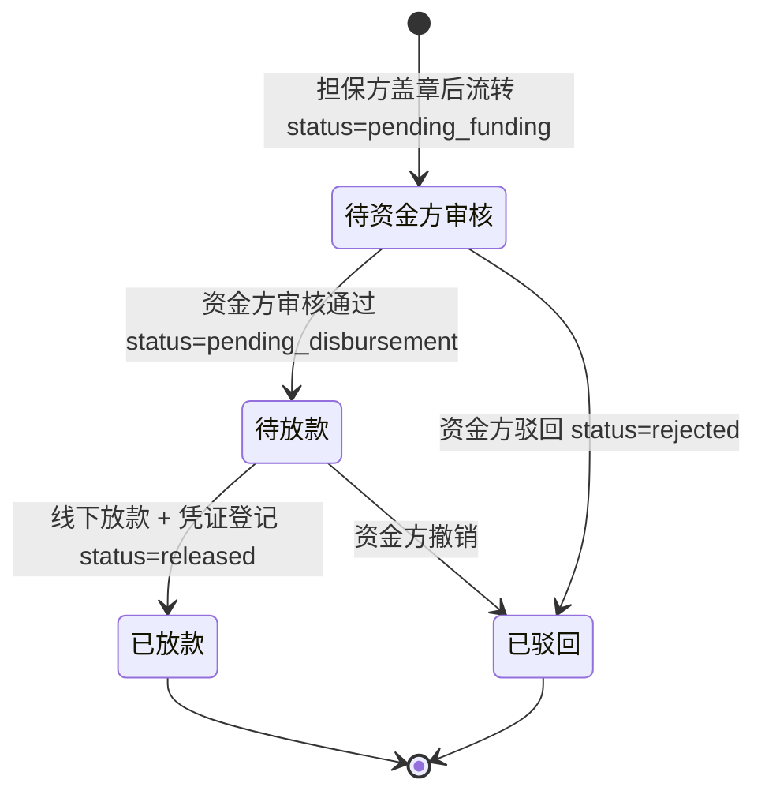
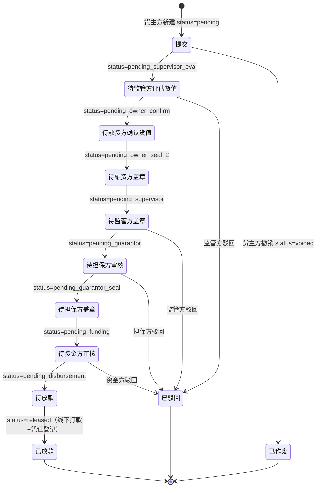
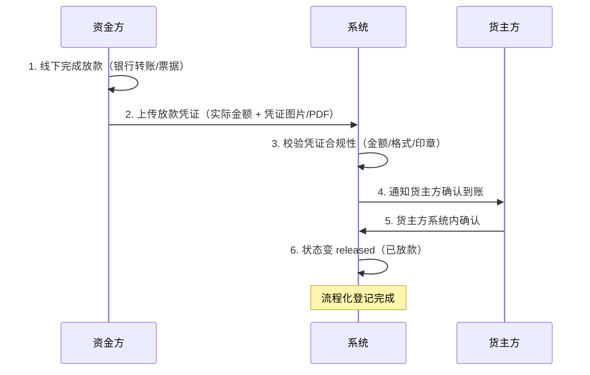

# 融资审核（资金方）

> 适用版本：v1.7.51（资金方融资审核接入）+ v1.7.55（驳回 modal 必填说明校验）
> 适用角色：资金方（bank）
> 页面归口：供应链金融 / 融资管理 / 融资审核工作台
> 关联页面：融资审核列表 / 资方审核弹窗（v1.7 占位）/ 放款凭证登记
> URL 列表：`/pages/bank/approval-financing.html`（列表）
> URL 详情：`/pages/bank/approval-financing-detail.html`（v1.7.76+ 待开发）

---

## 流程图

### 资金方视角（3 级审核中的第 3 步 + 放款）



> 资金方在 8 步流程中负责**第 8 步（资方审核）+ 放款环节**两个节点
> 核心动作：**资方审核**（录入起息日/放款金额）→ **线下放款 + 凭证登记**（v1.7.86 锁定为线下+凭证）

### 8 步审批全景



> 注：资金方在 8 步中负责**最后一步（资方审核）+ 放款环节**
> v1.7.86 关键规则：**资金流转都是线下完成 + 系统流程化登记**，不存在"银行扣款/扣款失败/补足余额"等线上分支

---

## 功能点说明

| 功能点 | 适用角色 | 状态分支 | 说明 |
|---|---|---|---|
| 融资审核列表查看 | 资金方 | 全部 | 12 状态 tab + 20 列 + 8 筛选器，查看作为资金方的融资申请 |
| 资方审核 | 资金方 | **pending_funding** | 录入起息日 + 放款金额（≤ 拟融资金额），状态变 pending_disbursement |
| 放款凭证登记 | 资金方 | **pending_disbursement** | 线下打款 + 上传打款凭证（银行回单/PDF）→ 状态变 released |
| 驳回融资申请 | 资金方 | **pending_funding / pending_disbursement** | 填写驳回原因（必填 10-200 字），状态变 rejected |
| 基础信息查看 | 资金方 | 全部 | 12 字段，纯文本 |
| 8 步审批进度查看 | 资金方 | 全部 | 步骤条 + 每步完成时间 + 经办人 |
| 附件查看/下载 | 资金方 | 全部 | 4 类，鼠标悬停查看上传时间 |
| 数据导出 | 资金方 | 全部 | 按当前筛选 + 当前 tab 导出 CSV（18 列） |

---

## 原型

[占位] — 截图见 https://dhzl-supply-chain.pages.dev/bank/approval-financing

---

## 数据范围

| 角色 | 数据范围说明 |
|---|---|
| 资金方 | 查看作为资金方的融资申请（按 bank 字段匹配 currentCompany） |
| 货主方 | 仅看本企业，参考「融资申请-货主方」文档 |
| 监管方 | 全部数据，参考「融资审核-监管方」文档 |
| 担保方 | 按 guarantor 字段匹配，参考「融资审核-担保方」文档 |

---

## 搜索条件（8 字段）

与货主方/监管方/担保方融资申请列表共享（financingList.js 通用组件渲染）：

| 字段名 | 类型 | 提示语 | 需求说明 |
|--:|---|---|---|
| 融资申请编号 | 文本 | 请输入融资申请编号 | 模糊查询 |
| 融资方 | 下拉单选 | 全部 | 选项值：financingList.applicant 去重 |
| 金融机构 | 下拉单选 | 全部 | 选项值：financingList.bank 去重 |
| 金融产品 | 下拉单选 | 全部 | 选项值：financingList.productName 去重 |
| 担保方 | 下拉单选 | 全部 | 选项值：financingList.guarantor 去重 |
| 监管方 | 下拉单选 | 全部 | 选项值：financingList.supervisor 去重 |
| 货押资产编号 | 文本 | 请输入货押资产编号 | 模糊查询 |
| 融资期限 | 日期范围 | 融资期限 | 起息日 [startDate, endDate] 区间匹配 |

---

## 列表说明

### 资金方专属渲染

- 默认 tab：**待资金方审核列表**（v1.7.51 锁定）
- 状态列：资金方操作节点用 `(您)` 后缀标识
  - `pending_funding` → ⏳ 资方审核中（您）
  - `pending_disbursement` → ⏳ 待放款中（您）
- 操作列：根据 status 动态显示按钮
  - `pending_funding` → 详情 / **资方审核**
  - `pending_disbursement` → 详情 / **放款登记**
  - 其他状态 → 详情（只读）

### 列表字段说明（20 列）

与货主方/监管方/担保方融资申请列表共享（financingList.js 通用组件渲染），完整字段参见「融资申请-货主方」文档 § 列表字段说明。

---

## 状态变化说明

### 资金方可见的状态 tab

| Tab | statusMatch | 资金方可操作 |
|---|---|---|
| 全部 | （不过滤） | 查看 |
| 待监管方评估货值 | `['pending_supervisor_eval']` | 只读 |
| 待融资方确认货值 | `['pending_owner_confirm']` | 只读 |
| 待融资方盖章 | `['pending_owner_seal_2']` | 只读 |
| 待监管方盖章 | `['pending_supervisor']` | 只读 |
| 待担保方审核 | `['pending_guarantor']` | 只读 |
| 待担保方盖章 | `['pending_guarantor_seal']` | 只读 |
| **待资金方审核** | `['pending_funding']` | **资方审核** |
| **待放款** | `['pending_disbursement']` | **放款登记** |
| 已放款 | `['released']` | 只读 |
| 驳回 | `['rejected']` | 只读 |
| 作废 | `['voided']` | 只读 |

### 资金方操作权限（v1.7.78 锁定）

| 状态 | 资方审核 | 放款登记 | 驳回 | 查看 |
|---|---|---|---|---|
| pending_funding | ✅ | ❌ | ✅ | ✅ |
| pending_disbursement | ❌ | ✅ | ✅ | ✅ |
| 其他状态 | ❌ | ❌ | ❌ | ✅ |

> 资金方在每个融资申请中**最多操作 2 次**（资方审核 + 放款登记），其他状态全部只读

---

## 资方审核（v1.7 占位）

### 入口

- 列表操作列点击「资方审核」按钮（pending_funding 状态）
- v1.7 当前为占位（alert「即将对 XX 进行资方审核（待完善审批内容）」）

### 计划流程（v1.7.76+ 待实现）

1. 资金方点击「资方审核」按钮
2. 弹窗/详情页显示待审核内容
3. 资金方录入关键字段：
   - 起息日（必填，日期选择器）
   - 融资到期日（自动计算 = 起息日 + duration 天）
   - 放款金额（必填，≤ 拟融资金额）
   - 利率（必填，可调整）
4. 资金方通过/驳回
5. 通过后状态变 `pending_disbursement`（待放款）

### 关键字段

| 字段 | 字段说明 | 校验 |
|---|---|---|
| 起息日 | 必填、日期选择器 | 不能早于当前日期 |
| 融资到期日 | 自动计算（= 起息日 + duration） | 不可改 |
| 放款金额 | 必填、数字输入框 | 必须 ≤ 拟融资金额 |
| 利率 | 必填、百分比 | 默认值取金融产品配置 |
| 通过/驳回 | 必填、单选 | 驳回时驳回说明必填 10-200 字 |

---

## 放款凭证登记（v1.7.86 关键规则）

### 入口

- 列表操作列点击「放款登记」按钮（pending_disbursement 状态）
- 独立详情页（v1.7.76+ 计划）

### 业务规则（v1.7.86 锁定）

> **当前系统无实际线上扣款/打款能力**，所有"资金流转"都是**线下完成 + 系统流程化登记**
> 适用场景：资金方 → 货主方（放款）
> **流程规范**：
> 1. 实际资金操作**线下完成**（银行转账/票据/其他方式）
> 2. 发起方**上传凭证**（实际金额 + 凭证图片/PDF）
> 3. 收款方**系统内确认**
> 4. **不存在**"银行扣款/扣款失败/补足余额/账户异常"等线上假设分支
> 5. **系统试算金额 ≠ 实际还款金额**（试算仅作参考）

### 流程图



### 字段说明

| 字段 | 字段说明 | 校验 |
|---|---|---|
| 实际放款金额 | 必填、数字输入框（**实际打款金额，可能 ≠ 拟融资金额**）| 不能为空，> 0 |
| 放款凭证 | 必填、附件上传（支持 jpg/jpeg/png/pdf）| 单文件 ≤ 100MB |
| 实际起息日 | 必填、日期选择器（**实际放款日**）| 不能早于资方审核时的起息日 |
| 放款备注 | 非必填、textarea | 200 字内 |
| 货主方确认 | 自动 | 货主方在「已放款」tab 系统内确认到账 |

### 校验规则（提交时）

```js
function disbursementSubmit() {
  // 1. 校验实际放款金额
  if (!实际放款金额.value) return Utils.toast('请填写实际放款金额', 'warning');
  if (实际放款金额.value <= 0) return Utils.toast('实际放款金额必须 > 0', 'warning');
  // 2. 校验放款凭证
  if (!放款凭证.files || 放款凭证.files.length === 0) return Utils.toast('请上传放款凭证', 'warning');
  // 3. 校验实际起息日
  if (!实际起息日.value) return Utils.toast('请填写实际起息日', 'warning');
  // 4. 提交
  Utils.toast('放款凭证已登记，已通知货主方确认', 'success');
  setTimeout(() => location.reload(), 1000);
}
```

### 后置动作

- 状态变 `released`（已放款）
- 通知货主方系统内确认到账
- 计入"本月放款额"统计卡
- 触发贷后盯市（盯市管理 - 资金方后续操作）

---

## 驳回融资申请

### 入口

- 资方审核 / 放款登记页底部「驳回」按钮
- 列表操作列（v1.7.78 占位，未实现）

### 弹窗字段

| 字段 | 必填 | 说明 |
|---|---|---|
| 驳回原因 | ✅ | 10-200 字（v1.7.55 必填校验） |
| 驳回方 | 自动 | 资金方公司名 |
| 驳回时间 | 自动 | 当前时间 |

### 限制

- 资金方只能驳回 `pending_funding` / `pending_disbursement` 状态
- 驳回后货主方可在「驳回」tab 查看 + 重新提交
- 重新提交后回到 `pending` 状态，重新走 8 步流程

---

## 校验规则（页面初始化）

```js
// 资金方视角：按 bank 字段匹配
if (role === 'bank') {
  filtered = financingList.filter(f => f.bank === currentCompany);
}
// 默认 tab：待资金方审核
const defaultTab = 'pending_funding';
// 只在 pending_funding 显示「资方审核」按钮
const showApprove = rec.status === 'pending_funding';
// 只在 pending_disbursement 显示「放款登记」按钮
const showDisburse = rec.status === 'pending_disbursement';
// 顶栏无统计卡（资金方独有, v1.7.86 删除）
```

---

## 性能与体验

- 列表 20 列 + 12 tab，**首屏渲染 < 500ms**
- 列表行可点击（v1.7.77）：点击行进入详情页，按钮 stopPropagation 防冒泡
- 放款凭证弹窗支持 jpg/jpeg/png/pdf，单文件 ≤ 100MB
- 状态颜色：待办=蓝/橙；完成=绿；驳回=红；作废=灰

---

## 资金方与监管方/担保方的关键差异

| 维度 | 监管方 | 担保方 | 资金方 |
|---|---|---|---|
| 3 级审核位置 | 第 1 步 | 第 2 步 | 第 3 步（最后一步）|
| 默认 tab | 待监管方评估货值 | 待担保方审核 | 待资金方审核 |
| 操作节点数 | 2 个（评估货值 + 盖章②） | 2 个（出具担保函 + 盖章③） | 2 个（资方审核 + 放款登记） |
| 核心动作 | 录入评估单价（元/千克） | 出具担保函（核保） | 录入起息日 + 放款金额 + 凭证 |
| 顶栏统计卡 | 无 | 无 | 无（v1.7.86 移除 4 个统计卡）|
| 后续动作 | 货主方盖章① | 货主方盖章②（v1.7.76+） | 货主方盖章③ → 待放款（线下） |
| 详情页 | v1.7.75 已实现 | v1.7.76+ 占位 | v1.7.76+ 占位 |
| 资金流转 | 无 | 无 | **线下打款 + 系统登记凭证**（v1.7.86 锁定）|
| 印章颜色 | 蓝色（圆形） | 绿色（圆形，v1.7.76+） | - |

> 资金方独有的业务特点：
> ① **线下打款 + 系统登记凭证**（v1.7.86 关键规则，无线上扣款分支）
> ② **放款金额 ≠ 拟融资金额**（系统试算 ≠ 实际放款）
> ③ **贷后盯市**（已放款后进入盯市管理）

> v1.7.86 变更：移除了原来的顶栏 4 个统计卡（在贷余额/本月放款额/不良率/本月待审），改为纯列表页

---

## 后续优化（v1.7.x 二期）

- [ ] 资金方详情页独立化（v1.7.76+）
- [ ] 资方审核实际弹窗（v1.7.76+）
- [ ] 放款凭证 OCR 自动识别（提取金额/日期/收款方）
- [ ] 贷后盯市预警（押品价格波动超阈值自动通知）
- [ ] 多资金方接入（一家融资可对应多家银行联合放款）
- [ ] 还款计划生成（按月/按季还息，到期还本）
