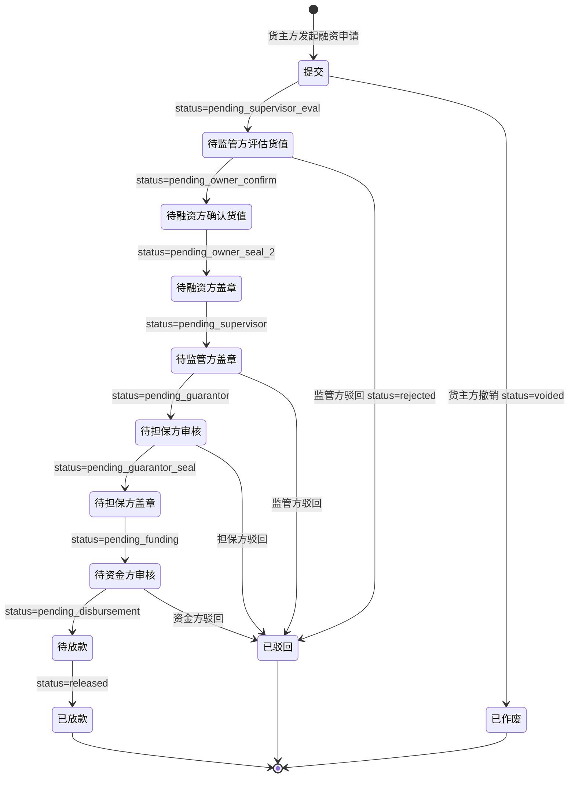
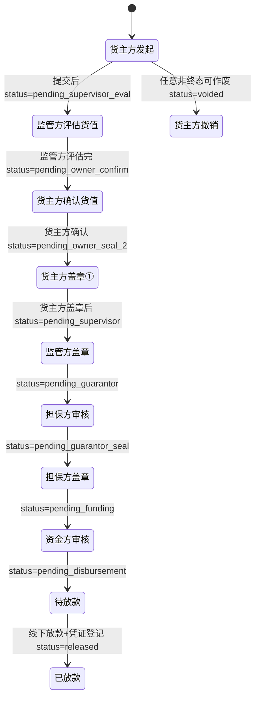

# 融资申请（货主方）

> 适用版本：v1.7.74（新增子页）+ v1.7.75（融资货值评估）+ v1.7.78（融资状态机 8 步定稿）
> 适用角色：货主方（customer）、货主方盖章员（customer_seal）
> 页面归口：供应链金融 / 融资管理 / 融资申请
> 关联页面：新增融资申请 / 融资申请详情 / 评估融资货值（监管方）
> URL 列表：`/pages/customer/financing.html`（列表）
> URL 新增：`/pages/customer/financing-create.html`（v1.7.74 从原 modal 拆出子页）
> URL 详情：`/pages/customer/financing-detail.html?id={financingId}`

---

## 流程图

### v1.7 状态机（8 步审批全流程）



### 货主方视角（3 次盖章节点）



> 货主方**参与 2 个节点**：① 确认监管方评估的货值 ② 在《质物清单 + 质押反担保合同》上盖章

---

## 功能点说明

| 功能点 | 适用角色 | 状态分支 | 说明 |
|---|---|---|---|
| 融资申请列表查看 | 货主方、监管方、担保方、资金方 | 全部 | 12 状态 tab + 20 列 + 8 筛选器，按"金融从业者使用习惯"排序 |
| 新增融资申请 | 货主方（操作人） | 草稿态 | 12 字段表单 + 质押物多选 + 金融产品联动 + 附件上传（v1.7.74 子页化） |
| 融资申请详情 | 4 角色 | 全部 | 基础信息 + 质押物表 + 附件 + 完整单据 + 8 步审批步骤条 |
| 货主方确认货值 | 货主方 | pending_owner_confirm | 复核监管方评估的质押货值，可调整后确认 |
| 货主方盖章① | 货主方盖章员 | pending_owner_seal_2 | 在《质物清单 + 质押反担保合同》上电子签章，签章后系统自动关闭此节点 |
| 撤销融资申请 | 货主方 | draft / pending_supervisor_eval / pending_owner_confirm | 仅非终态可作废（v1.7.78 限制：进入盖章节点后不可作废） |
| 驳回融资申请 | 监管方 / 担保方 / 资金方 | pending_supervisor_eval / pending_supervisor / pending_guarantor / pending_funding | 填写驳回原因，状态变为 rejected |
| 数据导出 | 4 角色 | 全部 | 按当前筛选 + 当前 tab 导出 CSV（18 列） |
| 评估融资货值 | 监管方 | pending_supervisor_eval | 录入评估单价（元/千克），重算质押货值 + 拟融资金额 |

---

## 原型

[占位] — 截图见 https://dhzl-supply-chain.pages.dev/customer/financing

---

## 数据范围

| 角色 | 数据范围说明 |
|---|---|
| 货主方（操作人） | 查看本企业的融资申请（按 applicant 字段匹配） |
| 货主方（盖章员） | 查看本企业 status=pending_owner_seal_2 的融资申请（v1.7.77 锁定） |
| 监管方 | 查看所有企业的融资申请，可审核货值 + 盖章 |
| 担保方 | 查看作为担保方的融资申请（按 guarantor 字段匹配） |
| 资金方 | 查看作为资金方的融资申请（按 bank 字段匹配） |

---

## 搜索条件（8 字段）

| 字段名 | 类型 | 提示语 | 需求说明 |
|--:|---|---|---|
| 融资申请编号 | 文本 | 请输入融资申请编号 | 模糊查询（contains，suggest 抽屉显示申请方+编号） |
| 融资方 | 下拉单选 | 全部 | 选项值：financingList.applicant 去重 |
| 金融机构 | 下拉单选 | 全部 | 选项值：financingList.bank 去重 |
| 金融产品 | 下拉单选 | 全部 | 选项值：financingList.productName 去重 |
| 担保方 | 下拉单选 | 全部 | 选项值：financingList.guarantor 去重 |
| 监管方 | 下拉单选 | 全部 | 选项值：financingList.supervisor 去重 |
| 货押资产编号 | 文本 | 请输入货押资产编号 | 模糊查询（pledgeAssetNo 字段） |
| 融资期限 | 日期范围 | 融资期限 | 起息日 [startDate, endDate] 区间匹配 |

> 交互说明：检索条件失去焦点、或者通过回车、查询操作后，即进行数据查询
> 排序（v1.7.82 通用组件）：按"金融从业者使用习惯"：业务编号 → 客户 → 资方 → 产品 → 担保 → 监管 → 资产 → 时间

---

## 列表说明

### 交互说明

- 字段一行展示不全时，字段末尾做 ... 处理，同时鼠标悬停该字段时，展示对应字段的全部信息
- 12 状态 tab + 20 列表格
- 列表做成自适应屏幕宽度
- 简单分页：每页 10 条（v1.7.82 加 Components.pagination）
- 行可点击（v1.7.77）：点击行进入详情页
- 状态列：待办=⏳ 蓝/橙文字；完成=✓ 绿色；驳回=🔴 红色；作废=⚫ 灰色

### 列表字段说明（20 列）

| 列名 | 需求说明 |
|---|---|
| 融资申请编号 | 业务编号，格式 `FN_YYYYMMDDXXX` |
| 融资方 | 货主方完整公司名 |
| 金融机构 | 完整银行机构名称（如"中融信托·冷链金融部"） |
| 金融产品 | 金融产品完整名称（含期限/行业） |
| 担保方 | 担保方完整公司名 |
| 监管方 | 完整监管方公司名称 |
| 拟融资金额（元） | 货主方申请金额，**依据质押货值自动计算**（默认质押率 80%） |
| 放款金额（元） | 资金方实际放款金额（>0 时绿色高亮） |
| 融资利率 | 百分比格式（0.023 → 2.30%） |
| 融资起息日 | 资金方审核通过后填写 |
| 融资到期日 | 起息日 + duration 天 |
| 货押资产编号 | 关联质押物，格式 `PLEDGE_YYYYMMDDXXX` |
| 质押数量 | 货物总件数 |
| 数量单位 | 件/箱/包（v1.7.85 后保留原值） |
| 质押重量 | 货物总重量（千克/吨） |
| 重量单位 | 千克/吨 |
| 评估单价（元/千克） | 监管方评估录入（保留 2 位小数） |
| 质押货值（元） | 评估单价 × 质押数量（系统计算） |
| 状态 | 12 种状态机对应文字 + 颜色 |
| 操作 | 详情（必选） / 盖章①②③（按状态动态显示） |

---

## 状态变化说明

### 12 状态 tab 映射

| Tab | statusMatch | 业务说明 |
|---|---|---|
| 全部 | （不过滤） | 所有与当前登录人关联的融资记录 |
| 待监管方评估货值 | `['pending_supervisor_eval']` | 货主方提交后，等待监管方录入评估单价 |
| 待融资方确认货值 | `['pending_owner_confirm']` | 监管方评估完成，等待货主方确认 |
| 待融资方盖章 | `['pending_owner_seal_2']` | 货主方确认后，等待盖章员「XX」签章 |
| 待监管方盖章 | `['pending_supervisor']` | 货主方盖章后，等待监管方在《质物清单+反担保合同》上签章 |
| 待担保方审核 | `['pending_guarantor']` | 监管方盖章后，担保方审核 |
| 待担保方盖章 | `['pending_guarantor_seal']` | 担保方审核通过后，担保方盖章 |
| 待资金方审核 | `['pending_funding']` | 担保方盖章后，资金方审核 |
| 待放款 | `['pending_disbursement']` | 资金方审核通过后，等待线下放款 + 凭证登记 |
| 已放款 | `['released']` | 实际放款完成 |
| 驳回 | `['rejected']` | 监管方 / 担保方 / 资金方任一环节驳回 |
| 作废 | `['voided']` | 货主方主动撤销（仅非盖章节点前可作废） |

### 状态机操作权限（v1.7.78 锁定）

| 状态 | 货主方 | 监管方 | 担保方 | 资金方 | 盖章员 |
|---|---|---|---|---|---|
| pending | 编辑 / 提交 / 作废 | 只读 | 只读 | 只读 | 只读 |
| pending_supervisor_eval | 只读 / **确认货值** | 评估货值 / 驳回 | 只读 | 只读 | 只读 |
| pending_owner_confirm | **确认货值** | 只读 | 只读 | 只读 | 只读 |
| pending_owner_seal_2 | 只读 | 只读 | 只读 | 只读 | **盖章①** |
| pending_supervisor | 只读 | **盖章②** | 只读 | 只读 | 只读 |
| pending_guarantor | 只读 | 只读 | **审核** | 只读 | 只读 |
| pending_guarantor_seal | 只读 | 只读 | **盖章** | 只读 | 只读 |
| pending_funding | 只读 | 只读 | 只读 | **审核** | 只读 |
| pending_disbursement | 等待 | 等待 | 等待 | **线下放款+凭证** | 等待 |
| released | 只读 | 只读 | 只读 | 只读 | 只读 |
| rejected | 只读 / 重新提交 | 只读 | 只读 | 只读 | 只读 |
| voided | 只读 | 只读 | 只读 | 只读 | 只读 |

> v1.7.78 关键规则：盖章节点（pending_owner_seal_2 / pending_supervisor / pending_funding）后**不可作废**，必须走完流程或驳回

---

## 新增融资申请

### 入口

货主方（操作人）在融资申请列表点击「新增融资申请」按钮，跳转 `/pages/customer/financing-create.html`（v1.7.74 从 modal 拆出子页）

### 原型

[占位] — 截图见 https://dhzl-supply-chain.pages.dev/customer/financing-create

### 前置校验

- 必须已登录为货主方（customer 角色）
- 必须有可质押货物（status=inbound / inbound_completed，且 availablePieces > 0）
- 不能同时有超过 3 笔未办结的融资申请（v1.7 业务约束，建议提示）

### 字段说明

#### 融资信息（3 字段）

| 字段名称 | 字段说明 |
|---|---|
| 融资方 | 必填、文本输入框（disabled），默认值「自动带入当前登录货主方公司名」不可修改 |
| 拟融资金额（元） | 必填、数字显示框（disabled 蓝底），**依据所选质押物价值自动计算**（默认质押率 80%） |
| 金融产品 | 必填、单选下拉，选项值从 `MockData.financeProducts` 取（仅 active=true），onchange 联动监管方/担保方 |

#### 关联信息（3 字段）

| 字段名称 | 字段说明 |
|---|---|
| 监管方 | 必填、文本输入框（disabled），**由金融产品决定**（MockData.financeProducts[].supervisor） |
| 担保方 | 必填、文本输入框（disabled），**由金融产品决定**（MockData.financeProducts[].guarantor） |
| 融资利率 | 必填、数字显示框（disabled 蓝底），**由金融产品决定**（MockData.financeProducts[].interestRate） |

> 金融产品选择后，监管方/担保方/融资利率 3 个字段自动联动带入（不可修改）

#### 质押物清单（v1.7.75 重点）

| 字段名称 | 字段说明 |
|---|---|
| 复选框 | 用于批量选择质押 |
| 货物名称 | 不可改、自动带入（来自已入库的 inboundList） |
| 厂号 | 不可改、自动带入 |
| 国家 | 不可改、自动带入 |
| 数量单位 | 不可改、自动带入（件/箱/包） |
| 重量单位 | 不可改、自动带入（千克/吨） |
| 可质押数量 | 不可改、自动计算（inboundList.availablePieces） |
| 可质押重量 | 不可改、自动计算（inboundList.availableWeight） |
| 计划质押数量 | 必填、数字输入框（带步进器），不可超过可质押数量 |
| 操作 | 移除链接 |

> 货主方操作人在此步骤只选择"质押哪些货物 + 质押多少数量"，**评估单价由监管方在后续环节录入**（v1.7.75 关键改动）

#### 附件

| 字段名称 | 字段说明 |
|---|---|
| 融资申请书 | 必填、附件上传（支持 jpg/jpeg/png/pdf，单文件 ≤ 100MB） |
| 质押物清单 | 非必填、附件上传（系统会在盖章节点自动生成） |
| 质押反担保合同 | 非必填、附件上传（系统会在盖章节点自动生成） |
| 其他附件 | 非必填、附件上传（支持格式同上） |

#### 还款账户

| 字段名称 | 字段说明 |
|---|---|
| 还款账户 | 必填、单选下拉，选项值从 `MockData.customerAccounts` 取（按当前货主方过滤） |
| 开户行 | 自动带入、不可改 |
| 账户名称 | 自动带入、不可改 |

### 后置动作

- 业务编号生成：`FN_${Utils.genBizNo().slice(-12)}`（格式 `FN_YYYYMMDDXXX`）
- 状态机初始化为 `pending_supervisor_eval`（待监管方评估货值）
- 货主方确认货值后状态变 `pending_owner_confirm`
- 进入盖章节点后货主方不能再修改任何字段

### 流转说明

| 步骤 | 触发动作 | 状态变化 | 经办角色 |
|---|---|---|---|
| 1 | 货主方提交融资申请 | pending → pending_supervisor_eval | 货主方（操作人） |
| 2 | 监管方评估货值（录入评估单价） | pending_supervisor_eval → pending_owner_confirm | 监管方 |
| 3 | 货主方确认货值 | pending_owner_confirm → pending_owner_seal_2 | 货主方（操作人） |
| 4 | 货主方盖章① | pending_owner_seal_2 → pending_supervisor | 货主方（盖章员） |
| 5 | 监管方盖章② | pending_supervisor → pending_guarantor | 监管方 |
| 6 | 担保方审核 | pending_guarantor → pending_guarantor_seal | 担保方 |
| 7 | 担保方盖章 | pending_guarantor_seal → pending_funding | 担保方 |
| 8 | 资金方审核 | pending_funding → pending_disbursement | 资金方 |
| 9 | 线下放款+凭证登记 | pending_disbursement → released | 资金方 |

> v1.7 关键规则：3 次盖章必须按顺序完成（盖章① → 盖章② → 盖章③），不能在盖章② 后跳过盖章③

### 校验规则（提交时）

```js
function submitForm() {
  // 1. 校验金融产品
  if (!form.finProduct) return Utils.toast('请选择金融产品', 'error');
  // 2. 校验至少选择 1 个质押物
  if (selectedPledgeItems.length === 0) return Utils.toast('请至少选择 1 个质押物', 'error');
  // 3. 校验每个质押物数量不超过可质押数量
  const overQty = selectedPledgeItems.find(p => p.thisPledgeQty > p.availablePieces);
  if (overQty) return Utils.toast(`${overQty.name} 质押数量超过可质押数量`, 'error');
  // 4. 校验还款账户
  if (!form.repayAccount) return Utils.toast('请选择还款账户', 'error');
  // 5. 校验融资申请书附件
  if (!form.attachApplication) return Utils.toast('请上传融资申请书', 'error');
  Utils.toast('融资申请已提交，等待监管方评估货值', 'success');
  setTimeout(() => location.href = Utils.nav('/customer/financing'), 1000);
}
```

---

## 融资申请详情

### 入口

- 货主方/监管方/担保方/资金方：点击列表行进入 `/pages/customer/financing-detail.html?id=xxx`

### 原型

[占位] — 截图见 https://dhzl-supply-chain.pages.dev/customer/financing-detail

### 字段说明

#### 8 步审批步骤条

| 步骤 | 状态 | 字段说明 |
|---|---|---|
| 1. 提交 | pending | 货主方操作人创建融资申请并提交 |
| 2. 待监管方评估货值 | pending_supervisor_eval | 监管方录入评估单价 |
| 3. 待融资方确认货值 | pending_owner_confirm | 货主方复核评估货值 |
| 4. 待融资方盖章 | pending_owner_seal_2 | 货主方盖章员签章 |
| 5. 待监管方盖章 | pending_supervisor | 监管方在《质物清单+反担保合同》上签章 |
| 6. 待担保方审核+盖章 | pending_guarantor / pending_guarantor_seal | 担保方审核通过 + 盖章 |
| 7. 待资金方审核 | pending_funding | 资金方审核 |
| 8. 已放款 | released | 线下放款 + 凭证登记完成 |

#### 基础信息（6 字段）

参见「新增融资申请 - 融资信息」字段表

#### 质押物清单（v1.7.75 监管方视角 16 列）

| 列名 | 需求说明 |
|---|---|
| 仓库 | 不可改 |
| 货位 | 不可改 |
| 入库单号 | 不可改 |
| 入库时间 | 不可改 |
| 货物名称 | 不可改 |
| 产品编号 | 不可改 |
| 入库数量 | 不可改 |
| 可质押数量 | 不可改（系统计算，库存-已质押） |
| 数量单位 | 不可改 |
| 入库重量 | 不可改 |
| 可质押重量 | 不可改（系统计算） |
| 重量单位 | 不可改 |
| **本次质押数量** | **可编辑（绿底，仅监管方评估时）** |
| **本次质押重量** | **系统计算（=本次质押数量 × 入库重量/入库数量）** |
| **评估单价（元/千克）** | **可编辑（仅监管方评估时）** |
| **质押货值（元）** | **系统计算（=本次质押数量 × 评估单价）** |

> 监管方评估时：后 4 列可编辑（绿底），其他 12 列紫虚线只读
> 货主方视角：后 4 列也只读（需等监管方评估）
> 进入盖章节点后：所有列只读

#### 附件（4 类）

参见「新增融资申请 - 附件」字段表

#### 完整单据弹窗

| 单据 | 说明 |
|---|---|
| 融资申请书 | 系统自动生成（货主方提交的附件） |
| 质物清单 | 系统在盖章①后自动生成 PDF |
| 质押反担保合同 | 系统在盖章①后自动生成 PDF |
| 担保函 | 担保方在担保盖章后生成 |
| 放款凭证 | 资金方在放款后上传（线下+凭证登记） |

---

## 盖章（v1.7 重要节点）

### 入口

货主方盖章员（真实姓名）登录后，列表自动筛选 status=pending_owner_seal_2 的融资申请

### 前置校验

- 货主方企业必须有盖章权限（盖章人为「李雪」）
- 印章需在系统内完成 CA 认证

### 盖章流程

1. 盖章员点击列表「盖章①」按钮
2. 弹窗显示待盖章文件清单（质物清单 + 质押反担保合同）
3. 盖章员在 PDF 文件上电子签章
4. 系统自动校验签章合规性
5. 签章完成后状态变 `pending_supervisor`（待监管方盖章）
6. 不可撤销

### 印章格式

- 印章：货主方公司公章（圆形，红色）
- 位置：PDF 文件右下角
- 签署人：货主方盖章员（真实姓名）
- 签署时间：YYYY-MM-DD HH:MM:SS
- CA 证书号：系统自动追加

---

## 撤销与驳回

### 撤销（货主方）

- **入口**：融资申请详情页底部「作废」按钮（仅货主方操作人可见）
- **限制**：仅 `pending` / `pending_supervisor_eval` / `pending_owner_confirm` 状态可作废（v1.7.78 锁定）
- **弹窗**：填写撤销原因（必填，10-200 字）
- **后置动作**：状态变 `voided`，所有后续节点不再可见

### 驳回（监管方/担保方/资金方）

- **入口**：融资申请详情页底部「驳回」按钮
- **适用状态**：
  - 监管方：pending_supervisor_eval / pending_supervisor
  - 担保方：pending_guarantor
  - 资金方：pending_funding
- **弹窗**：填写驳回原因（必填，10-200 字）
- **后置动作**：状态变 `rejected`，填写驳回方 + 驳回原因
- **后续**：货主方可在「驳回」tab 查看，可选择"重新提交"（回到 pending 状态）

---

## 校验规则（页面初始化）

```js
// 货主方视角：只能看本企业数据
if (role === 'customer' || role === 'customer_seal') {
  filtered = financingList.filter(f => f.applicant === currentCompany);
}
// 监管方：可看全部
if (role === 'platform') {
  filtered = financingList; // 不过滤
}
// 担保方：按 guarantor 字段匹配
if (role === 'guarantor') {
  filtered = financingList.filter(f => f.guarantor === currentCompany);
}
// 资金方：按 bank 字段匹配
if (role === 'bank') {
  filtered = financingList.filter(f => f.bank === currentCompany);
}
```

---

## 性能与体验

- 列表 20 列 + 12 tab，**首屏渲染 < 500ms**（financingList.js 通用组件 + 虚拟滚动未启用，v1.7 数据量 < 100 条）
- 筛选实时刷新（v1.7.82 通用组件 onChange 触发）
- 列表行可点击（v1.7.77）：点击行进入详情页，按钮 stopPropagation 防冒泡
- 状态颜色：待办=蓝/橙；完成=绿；驳回=红；作废=灰

---

## 后续优化（v1.7.x 二期）

- [ ] 质押物可质押数量预警（剩余可质押 < 30% 时标红）
- [ ] 利率计算器（输入金额/期限/利率 → 自动算利息）
- [ ] 融资进度时间线（按状态切换显示每一步的"完成时间 + 经办人"）
- [ ] 批量作废（多选 + 批量撤销）
- [ ] 担保方/资金方视角的字段权限差异化（v1.7 暂未实现）
