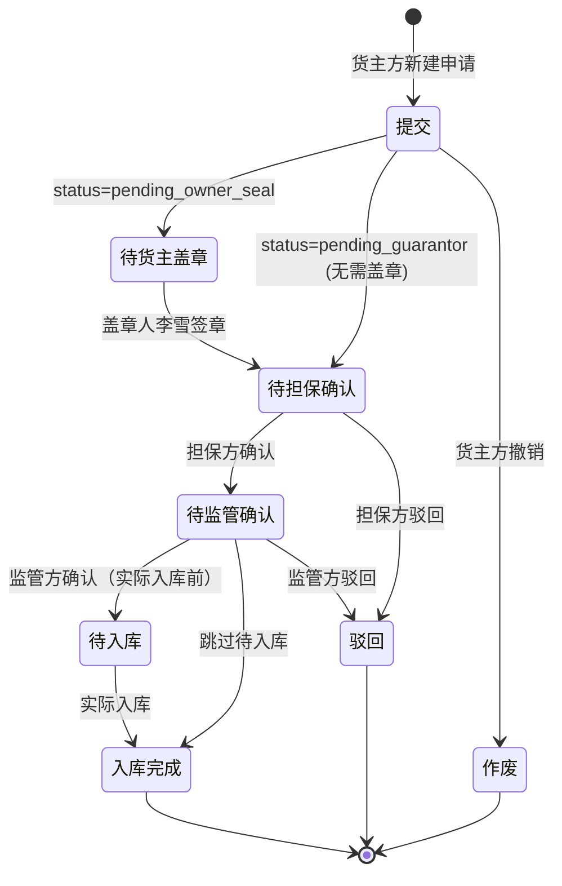

# 货主方【库存台账】与【入库申请】字段规则文档

> 适用版本：v1.7.28.5（v1.7.12 ~ v1.7.18 + v1.7.28.5 增量）
> 适用角色：货主方（customer / 货主）
> 页面归口：智慧仓储 / 库存管理 + 货物管理
> 数据脱敏：手机/身份证/银行卡/信用代码/邮箱按 v1.7.28.2 规范全部 X 替换

---

## 一、页面架构总览

| 页面 | 路径 | 版本 | 功能 |
|---|---|---|---|
| 库存台账 | `/pages/customer/inventory-ledger.html` | v1.7.18 | 按货品聚合的库存汇总（4 stats + 13 列 + 4 状态） |
| 库存台账详情 | `/pages/customer/inventory-detail.html` | v1.7.18.1 | 行点击进入，含 4 tab（入库/出库/质押/解押） |
| 入库申请列表 | `/pages/customer/inbound.html` | v1.7.12 | 9 状态 tab + 11 列 + 9 筛选 + 分页 |
| 入库申请新增 | `/pages/customer/inbound-create.html` | v1.7.14 | 4 段表单（基础信息+质物明细+附件+概要） |
| 入库申请详情 | `/pages/customer/inbound-detail.html` | v1.7.16 | 基础信息卡 + 4 步审批步骤条 + 货物明细 + 附件 |
| 入库申请盖章 | `/pages/customer/inmission-seal.html` | v1.7.17 | 货主方盖章人专属页 |

### 角色链路
```
货主方（customer）→ 智慧仓储 → 库存管理 / 货物管理
  ├── 库存管理 → 库存台账
  └── 货物管理 → 入库申请 / 在库货物 / 出入库详情
```

---

## 二、库存台账（v1.7.18）

### 2.1 顶部 4 张 Stats 卡（汇总指标）

| 指标 | 字段名 | 计算公式 | 格式 | UI 颜色 |
|---|---|---|---|---|
| 总库存（吨） | `totalWeight` | Σ(库存重量) | `toFixed(4)` 吨 | red-700（gradient） |
| 预估总货值（元） | `totalValue` | Σ(库存货值) | `toFixed(4)` 元 | amber-700 |
| 质押总量（吨） | `pledgeWeight` | Σ(质押重量) | `toFixed(4)` 吨 | blue-700 |
| 质押预估总货值（元） | `pledgeValue` | Σ(质押货值) | `toFixed(4)` 元 | violet-700 |

> **数据口径说明**：
> - 总库存 = 所有未解押货物的毛重合计
> - 预估总货值 = Σ(库存货值) = Σ(库存数量 × 单件评估价)
> - 质押总量 = 在押状态下的货物重量
> - 质押预估总货值 = 在押状态下的评估货值

### 2.2 4 个筛选（级联下拉）

| 字段 | 必填 | 数据源 | 默认值 | UI 控件 |
|---|---|---|---|---|
| 金融机构 | 否 | 字典：中原银行/工商银行/中融信托·冷链金融部/招商银行 | 中原银行（演示预设） | `<select>` |
| 仓库名称 | 否 | 从 `inventoryLedger.warehouseName` 动态去重 | 空 | `<select>` |
| 仓房-货位 | 否 | 从 `inventoryLedger.location` 动态去重 | 空 | `<select>` |
| 货物名称 | 否 | 从 `inventoryLedger.productFullName` 动态去重 | 空 | `<select>` |

**联动规则**：
- 4 个筛选 + 1 个状态可任意组合（AND 逻辑）
- 当前筛选条件显示在「当前搜索：」tag 行，可单个删除（× 按钮）或「清除全部」一键还原
- 筛选改变后自动 `refresh()` 重渲染

### 2.3 4 个状态机 Tab

| Tab ID | 标签 | 颜色徽章 | 数据过滤 |
|---|---|---|---|
| `all` | 全部 | — | 不过滤 |
| `normal` | 正常 | 绿色 `emerald-100/700` | `state === 'normal'` |
| `pledged` | 质押中 | 紫色 `violet-100/700` | `state === 'pledged'` |
| `frozen` | 已冻结 | 灰色 `slate-600/white` | `state === 'frozen'` |

**状态定义**（`inventoryLedger[i].state`）：
- `normal`：库存正常，无质押无冻结
- `pledged`：存在质押（`pledgePieces > 0`）
- `frozen`：存在冻结（`frozenPieces > 0`）

> 业务规则：一笔库存可能同时存在质押 + 冻结，状态优先级 = frozen > pledged > normal（但 v1.7.18 mock 数据中一条记录只有一种状态）

### 2.4 13 列库存汇总表

| # | 列名 | 字段 | 类型 | 对齐 | 业务规则 / 备注 |
|---|---|---|---|---|---|
| 1 | 库点名称 | `warehouseName` | string | left | + 状态徽章 |
| 2 | 仓房-货位 | `location` | string | left | 格式：`冻品一区-A 仓-01 货位` |
| 3 | 货物名称 | `productFullName` | string | left | 格式：`{国家}-{品类}-{部位}` |
| 4 | 库存数量 | `stockPieces` | int | right | `Utils.fmtNum` 千分位 |
| 5 | 库存重量 | `stockWeight` | float | right | `toFixed(4)` 4 位小数 |
| 6 | 库存货值（元） | `stockValue` | float | right | `Utils.fmtMoney` |
| 7 | 质押数量 | `pledgePieces` | int | right | 0 → 显示 `—`（灰色） |
| 8 | 质押重量 | `pledgeWeight` | float | right | 0 → 显示 `—` |
| 9 | 质押货值（元） | `pledgeValue` | float | right | 0 → 显示 `—`，非 0 → 紫色高亮 |
| 10 | 冻结数量 | `frozenPieces` | int | right | 0 → 显示 `—` |
| 11 | 冻结重量 | `frozenWeight` | float | right | 0 → 显示 `—`，非 0 → 灰色加粗 |
| 12 | 数量单位 | `piecesUnit` | string | left | 固定「箱」 |
| 13 | 重量单位 | `weightUnit` | string | left | 固定「千克」 |

**单元格渲染规则**：
- 数字列使用 `num-focus` 类（等宽字体 + 数字清晰）
- 质押/冻结值为 0 时显示 `—`（不显示 0）
- 质押非 0 时数字为紫色 (`text-violet-700`)
- 冻结非 0 时数字为灰色加粗 (`text-slate-700 font-medium`)

**行点击行为**：`onclick="goInventoryDetail(id)"` → 跳 `/pages/customer/inventory-detail?id=inv_xxx`

### 2.5 数据导出
- 按钮：「数据导出」右侧
- 文件名格式：`库存台账_{state}_{YYYY-MM-DD}.csv`
- 13 列同表头
- BOM 前缀 `\uFEFF` 解决 Excel 中文乱码
- 包含引号/逗号/换行的字段值自动加 `"` 包裹

### 2.6 Mock 数据生成规则（v1.7.18）

```js
// inventoryLedger 自动生成 50 条
// 维度：仓库 × 国家 × 品类 × 部位 × 货位 → 笛卡尔积分布
// 质押：i % 5 < 2 → 质押 80%（前 40% 部分质押）
// 冻结：i % 5 === 0 → 冻结 5%
// 状态：i % 5 === 0 → frozen / i % 4 === 0 → pledged / else → normal
```

---

## 三、入库申请列表（v1.7.12）

### 3.1 9 个状态机 Tab

| Tab ID | 标签 | statusMatch 数组 |
|---|---|---|
| `all` | 全部 | （不过滤） |
| `pending_submit` | 待提交 | `['draft']` |
| `pending_owner_seal` | 待货主盖章 | `['pending_owner_seal', 'pending_owner_seal_2', 'pending_owner_seal_3']` |
| `pending_guarantor_confirm` | 待担保确认 | `['pending_guarantor', 'pending_guarantor_seal']` |
| `pending_supervisor_confirm` | 待监管确认 | `['reviewing', 'pending_supervisor']` |
| `pending_inbound` | 待入库 | `['inbound', 'pending_inbound']` |
| `inbound` | 已入库 | `['inbound_completed']` |
| `voided` | 作废 | `['voided', 'cancelled']` |
| `rejected` | 驳回 | `['rejected']` |

**Tab 计数逻辑**：每个 tab 的数字 = 筛选后的数据中匹配 `statusMatch` 的条数

### 3.2 9 个筛选（3 行 × 3 列 + 末行 State1 + 操作）

| 字段 | 控件 | 字典值 | 模糊匹配 |
|---|---|---|---|
| 入库申请编号 | `<input>` | — | 是（contains） |
| 出质方 | `<select>` | `applicant` 字段去重 | 精确 |
| 质权方 | `<select>` | `中原再担保股份有限公司` | 精确 |
| 金融机构 | `<select>` | `中原银行股份有限公司`/`工商银行郑州分行` | 精确 |
| 金融产品 | `<select>` | `中原e贷` | 精确 |
| 货物名称 | `<select>` | 从 `products_market` 取 | 精确 |
| 入库时间 | `<input type="date">` × 2 | — | 范围（>= start） |
| 监管方 | `<select>` | `大河智链供应链管理有限公司` | 精确 |
| 货物所在地 | `<select>` | `河南省郑州市`/`天津市` | 精确 |
| 状态 | `<select>` | 从 `inboundList.status` 动态去重 | 精确 |

**末行操作按钮**：
- 「查看全部状态」：toast 提示
- 「数据导出」：CSV 导出

### 3.3 11 列表格

| # | 列名 | 来源 | 业务规则 |
|---|---|---|---|
| 1 | 入库申请编号 | `r.bizNo` | 格式：`IN_YYYYMMDDXXX` |
| 2 | 最新入库时间 | `r.inboundDate || r.applyDate` | — |
| 3 | 货物名称 | `r.products[0].name` | 暂取第一个商品 |
| 4 | 计划入库数量 | `r.products[0].pieces` | — |
| 5 | 计划入库重量 | `r.products[0].weight` | — |
| 6 | 出质方 | `r.applicant` 默认「河南军牧原国际贸易有限公司」 | — |
| 7 | 质权方 | 固定「中原再担保股份有限公司」 | — |
| 8 | 金融产品 | 固定「中原e贷」 | — |
| 9 | 金融机构 | `r.bank` 默认「中原银行股份有限公司」 | — |
| 10 | 监管方 | 固定「大河智链供应链管理有限公司」 | — |
| 11 | 货物所在地 | 固定「河南省郑州市」 | — |

**行点击**：`onclick="viewInbound('${r.id}')"` → 跳 `/pages/customer/inbound-detail?id=xxx`

### 3.4 简单分页
- 每页 10 条（mock 16 条；400 条模拟）
- 上一页/下一页 + 页码按钮 + 跳页输入

---

## 四、入库申请新增（v1.7.14）

### 4.1 顶部操作条

| 操作 | 行为 |
|---|---|
| 返回入库申请 | `goBack()` 跳列表页 |
| 保存草稿 | `saveDraft()` toast 成功 → 800ms 后跳回 |
| 预览 | `previewSubmit()` toast 提示 |
| 取消 | `cancelCreate()` 确认弹窗 |
| 提交 | `submitForm()` 全量校验 → toast → 1000ms 后跳回 |

> 业务编号生成：`IN_${Utils.genBizNo().slice(-12)}`

### 4.2 段 1：基础信息（6 字段 + 1 选填）

| 字段 | 必填 | 类型 | 控件 | 默认值 | 业务规则 |
|---|---|---|---|---|---|
| 出质方 | ✅ | string | `<input>` | 郑州某冷链贸易有限公司 | 客户公司全称 |
| 联系人 | ✅ | string | `<input>` | 李雪 — 138 0000 1234 | 格式：`姓名 — 电话`（脱敏） |
| 金融产品 | ✅ | enum | `<select>` | 空 | 从 `financingProduct/products` 字典选 15 个 |
| 监管方 | ✅ | string | `<input>` | 大河智链物流（郑州）有限公司 | — |
| 质权方 | ✅ | string | `<input>` | 河南农业担保股份有限公司 | — |
| 联系人邮箱 | ❌ | email | `<input type="email">` | 空 | 用于系统通知 |

### 4.3 段 2：质物明细信息（17 列 + 1 复选框 + 1 操作）

#### 4.3.1 表格列定义

| # | 列名 | 字段 | 类型 | 必填 | 控件 |
|---|---|---|---|---|---|
| 1 | 复选框 | `selectedRows` | bool | — | `<input type="checkbox">` |
| 2 | 序号 | `no` | int | — | 自增 |
| 3 | 货品名称 | `name` | string | ✅ | 见弹窗 |
| 4 | 国家 | `country` | string | ✅ | 见弹窗 |
| 5 | 厂号 | `factoryNo` | enum | ✅ | 002/003/BWS/3191397/50/1265/137 |
| 6 | 入库数量 | `qty` | number | ✅ | type=number |
| 7 | 数量单位 | `qtyUnit` | enum | ❌ | 箱/件/托 |
| 8 | 入库重量 | `weight` | number | ✅ | type=number |
| 9 | 重量单位 | `weightUnit` | enum | ❌ | 千克/吨/斤 |
| 10 | **有效期**（v1.7.14 新增） | `expiryDate` | date | ✅ | 影响融资期限合规校验 |
| 11 | 计划入库时间 | `plannedInbound` | date | ✅ | type=date |
| 12 | 生产日期 | `produceDate` | date | ✅ | type=date |
| 13 | 生产批号 | `batchNo` | string | ❌ | — |
| 14 | 合同号 | `contractNo` | string | ❌ | — |
| 15 | 提/运单号 | `waybill` | string | ❌ | — |
| 16 | 柜号 | `cabinet` | string | ❌ | — |
| 17 | 货物所在地 | `location` | enum | ✅ | 河南省郑州市/天津市/山西省汾阳市/宁夏银川/陕西省 |
| 18 | 操作 | — | — | — | 编辑/删除 |

#### 4.3.2 「新增货物明细」弹窗（13 字段）

| 字段 | 必填 | 校验 |
|---|---|---|
| 货物名称 | ✅ | 非空 |
| 国家 | ✅ | 非空 |
| 厂号 | ✅ | 非空 |
| 入库数量 | ✅ | 非空（数字） |
| 数量单位 | ❌ | 默认「箱」 |
| 入库重量 | ✅ | 非空（数字） |
| 重量单位 | ❌ | 默认「千克」 |
| 生产日期 | ✅ | 非空 |
| **有效期** | ✅ | **v1.7.14 新增**：影响融资期限合规校验 |
| 生产批号 | ❌ | — |
| 合同号 | ❌ | — |
| 提/运单号 | ❌ | — |
| 柜号 | ❌ | — |
| 计划入库时间 | ✅ | 非空 |
| 货物所在地 | ✅ | 非空 |

**校验流程**：
1. 弹窗「确定」→ 校验 9 个必填字段，缺失则 toast 错误
2. 校验通过 → 写入 `pledgeRows` 数组 → 关闭弹窗 → `refresh()` 重渲染
3. 表格底部「提交」→ 二次校验所有行 + 基础信息

#### 4.3.3 表格操作按钮

| 按钮 | 行为 |
|---|---|
| 新增 | 打开「新增货物明细」弹窗 |
| 删除 | 删除勾选的行（`selectedRows`） |
| 批量导入 | toast 占位提示（待 Excel 粘贴/上传实现） |
| 行内编辑 | 打开「编辑货物明细」弹窗（复用新增弹窗） |
| 行内删除 | `confirm` 确认后删除单行 |

### 4.4 段 3：附件（4 类）

| 单据类型 | 必填 | 说明 |
|---|---|---|
| 合同及订单 | ✅ | 含采购合同.pdf / 采购订单.pdf（mock） |
| 报关单 | ✅ | 含明细1.pdf（mock） |
| 检验检疫证明 | ✅ | 至少 1 个 PDF |
| 其他附件 | ❌ | — |

**附件规则**：
- 格式：jpg / jpeg / png / pdf
- 单个文件 ≤ 100MB
- 多文件支持
- 上传时间常驻显示（v1.7.20 规范）：`📅 YYYY-MM-DD HH:MM:SS`

### 4.5 段 4：入库申请单概要（v1.7.15）

#### 4.5.1 业务头部
- 标题：入库申请单（概要）
- 业务编号 + 状态徽章（📝 起草）
- 描述：「本表汇总当前页所有模块信息，提交后可生成包含 基础信息+质物明细+附件 的入库申请单文档」
- 防伪二维码占位

#### 4.5.2 参与方 5 卡
| 卡片 | 字段来源 | 图标 |
|---|---|---|
| 出质方 | `form.pledgor` | 🏢 |
| 联系人 | `form.contact` | 👤 |
| 监管方 | `form.supervisor` | 🛡️ |
| 质权方 | `form.pledgee` | 🔐 |
| 金融产品 | `form.financeProduct` | 💰 |

#### 4.5.3 质物汇总（按货品聚合）
```
key = name + '|' + country + '/' + factoryNo
聚合: qty / weight / value
单价值: mock 22 元/kg（演示用）
```

#### 4.5.4 操作区
| 按钮 | 行为 |
|---|---|
| 查看完整单据 | 打开完整单据弹窗（v1.7.15） |
| 下载 PDF | toast 占位 |
| 打印 | `window.print()` |
| 分享 | toast 占位（复制分享链接） |

### 4.6 提交校验（v1.7.14）

```js
function submitForm() {
  // 1. 校验基础信息 5 个必填
  if (!form.pledgor || !form.contact || !form.financeProduct || !form.supervisor || !form.pledgee) {
    return Utils.toast('请填写所有基础信息必填项', 'error');
  }
  // 2. 校验质物明细至少 1 行
  if (pledgeRows.length === 0) return Utils.toast('请至少添加一条质物明细', 'error');
  // 3. 校验每行有【有效期】（v1.7.14 业务规则：影响融资期限合规）
  const noExpiry = pledgeRows.find(r => !r.expiryDate);
  if (noExpiry) return Utils.toast(`第 ${noExpiry.no} 行缺少「有效期」字段`, 'error');
  // 4. 通过 → toast 成功 → 1s 后跳回列表
  Utils.toast('入库申请已提交，等待审批', 'success');
  setTimeout(() => goBack(), 1000);
}
```

---

## 五、入库申请详情（v1.7.16）

### 5.1 4 步审批步骤条

```
[1] 提交 → [2] 担保方确认 → [3] 监管方确认 → [4] 入库完成
```

| 步骤 | key | label | 状态映射 |
|---|---|---|---|
| 1 | `submitted` | 提交 | `draft` / `pending_submit` |
| 2 | `pending_guarantor` | 担保方确认 | `pending_owner_seal*` / `pending_guarantor*` |
| 3 | `pending_supervisor` | 监管方确认 | `reviewing` / `pending_supervisor` / `pending_inbound` / `inbound` |
| 4 | `inbound_completed` | 入库完成 | `inbound_completed` |

**状态 → 步骤映射**（`statusToStep`）：
- 0 = 提交
- 1 = 担保方确认
- 2 = 监管方确认
- 3 = 入库完成

**驳回/作废终态**：`rejected` / `voided` / `cancelled` → `isFinalized=true`

### 5.2 审批流转图（Mermaid）



### 5.3 详情页布局（5 级页面）

```
┌─────────────────────────────────────┐
│ 1. 基础信息卡（融入清单）           │
├─────────────────────────────────────┤
│ 2. 4 步审批步骤条                   │
├─────────────────────────────────────┤
│ 3. 入库货物明细（17 列）            │
│    + 货物所在地                     │
├─────────────────────────────────────┤
│ 4. 附件（合同/报关单/检验检疫/其他）│
│    + 上传时间气泡                   │
├─────────────────────────────────────┤
│ 5. 入库申请单（草稿）              │
│    + 查看完整单据 / 下载 / 打印     │
└─────────────────────────────────────┘
```

### 5.4 详情数据源
- URL `?id=xxx` 命中 `MockData.inboundList` → 合并 mockData 字段
- 否则用 `DEMO` 兜底（PREIN2023101000001 + 4 行保乐肩）

---

## 六、业务规则汇总

### 6.1 库存与质押的层级关系
```
库点（warehouse） 1—N 仓房-货位（location） 1—N 货物（product）
                                                       │
                                                       ├─ 库存（stockPieces/Weight/Value）
                                                       ├─ 质押（pledgePieces/Weight/Value，状态=pledged）
                                                       └─ 冻结（frozenPieces/Weight，状态=frozen）
```

### 6.2 关键计算公式
| 公式 | 用途 |
|---|---|
| `stockValue = stockPieces × unitValue` | 库存货值 |
| `pledgeValue = pledgePieces × unitValue` | 质押货值 |
| `expectedLoan = totalValue × 0.8`（80% 质押率） | 期望放款 |
| `evaluateValue = weight × evaluatePrice` | 评估货值（入库申请） |

### 6.3 状态机约定
- 库存台账：3 状态（normal/pledged/frozen），单选
- 入库申请：9 状态（draft/pending_owner_seal/pending_guarantor/reviewing/pending_inbound/inbound/inbound_completed/voided/rejected）

### 6.4 业务编号规则
- 业务编号 = `${类型}_${客户简称}_${YYYYMMDD}${2位随机数}`
- 例：`IN_20260705001` / `DHZL_JMY_2025120101`

### 6.5 附件规则（v1.7.20）
- 上传时间常驻显示：`📅 YYYY-MM-DD HH:MM:SS`
- 单文件 ≤ 100MB
- 支持格式：jpg / jpeg / png / pdf

### 6.6 脱敏规范（v1.7.28.2）
- 手机：`138 0000 XXXX` / `138-XXXX-XXXX`
- 身份证：`410XXXXXXXXXXXXXXX`
- 信用代码：`91XXXXXXXXMAXXXXXXXX`
- 邮箱：`chenzq@example.com`
- 所有 mock 数据在公开仓库必须脱敏

---

## 七、状态机对照表

### 7.1 入库申请状态 → 步骤条步骤

| status 字段值 | 步骤条步骤 | 中文标签 |
|---|---|---|
| `draft` | 1 | 提交（草稿） |
| `pending_submit` | 1 | 提交（待提交） |
| `pending_owner_seal` | 2 | 担保方确认（待盖章） |
| `pending_owner_seal_2` | 2 | 同上 |
| `pending_owner_seal_3` | 2 | 同上 |
| `pending_guarantor` | 2 | 担保方确认 |
| `pending_guarantor_seal` | 2 | 担保方确认（盖章） |
| `reviewing` | 3 | 监管方确认（审核中） |
| `pending_supervisor` | 3 | 监管方确认 |
| `pending_inbound` | 3 | 监管方确认（待入库） |
| `inbound` | 3 | 监管方确认（入库中） |
| `inbound_completed` | 4 | 入库完成 |
| `voided` | — | 作废（终态） |
| `cancelled` | — | 作废（终态） |
| `rejected` | — | 驳回（终态） |

### 7.2 库存台账状态 → 颜色徽章

| state 值 | 徽章 | 触发条件 |
|---|---|---|
| `normal` | 绿底绿字 | `pledgePieces === 0 && frozenPieces === 0` |
| `pledged` | 紫底紫字 | `pledgePieces > 0` |
| `frozen` | 灰底白字 | `frozenPieces > 0` |

---

## 八、版本演进历史

| 版本 | 改动点 |
|---|---|
| v1.7.9 | 库存台账（货主方）初版 — 4 stats + 13 列 |
| v1.7.10 | 库存台账改 4 tab（入库/出库/质押/解押），按事件流 |
| v1.7.12 | 入库申请列表 — 9 状态 tab + 11 列 + 9 筛选 + 3 行布局 |
| v1.7.14 | 入库申请新增升级为独立页 — 基础信息 + 质物明细（17 列含**新增【有效期】**）+ 附件 + 概要 |
| v1.7.15 | 入库申请概要视图 + 完整单据弹窗 |
| v1.7.16 | 入库申请详情 — 4 步步骤条（提交/担保/监管/入库） |
| v1.7.17 | 货主方盖章人专属页（v1.7.3 已 demo）— 直接跳转入库申请，跳过 dashboard |
| v1.7.18 | 库存台账重写为按货品聚合（4 stats + 13 列聚合表）+ 4 状态 |
| v1.7.18.1 | 修详情页 JS 错误（inventory-detail.html script tag 修复） |
| v1.7.20 | 附件上传时间常驻显示规范 |
| v1.7.28.2 | 隐私脱敏规范（手机/身份证/邮箱/信用代码） |

---

## 九、相关文件清单

| 文件 | 行数 | 关键内容 |
|---|---|---|
| `pages/customer/inventory-ledger.html` | 279 | 库存台账 4 stats + 13 列 + 4 状态 |
| `pages/customer/inventory-detail.html` | ~600 | 库存明细详情 4 tab |
| `pages/customer/inbound.html` | 509 | 入库申请列表 9 状态 + 11 列 + 9 筛选 |
| `pages/customer/inbound-create.html` | 862 | 入库申请新增 4 段表单 |
| `pages/customer/inbound-detail.html` | 360 | 入库申请详情 4 步步骤条 |
| `pages/customer/inbound-seal.html` | ~150 | 货主方盖章人专属页 |
| `shared/js/mockData.js` 段 `inboundList` | 938+ | 入库申请 mock（16 条） |
| `shared/js/mockData.js` 段 `inventoryLedger` | 2122+ | 库存台账 mock（50 条自动生成） |
| `shared/js/mockData.js` 段 `inventoryRecords` | 2179+ | 库存明细 4 tab 数据 |

---

**文档版本**：v1.0 · 2026-07-10
**作者**：Mavis
**关联 PRD**：docs/PRD.md §5.4 顶层产品线 + §5.5 货主方功能清单
