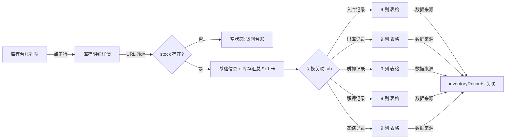

# 库存明细详情 - 设计文档

> 所属模块：智慧仓储 / 库存管理 / 库存台账
> 路径：`/pages/customer/inventory-detail.html?id={inv_xxx}`
> 跳转来源：库存台账列表行点击
> 版本：v1.7.29（与 v1.7.18 同步，移除 4 个状态机 tab）
> 角色：货主方（操作人 / 盖章人）

---

## 一、流程图

## 二、功能点表

| 功能点 | 适用角色 | 说明 |
|---|---|---|
| 库存明细查看 | 货主方 | 展示当前货品/库点维度的库存快照 + 9+1 汇总卡 + 5 个关联事件 tab |
| tab 切换 | 货主方 | 入库记录 / 出库记录 / 质押记录 / 解押记录 / 冻结记录 5 个 tab 互斥展示 |
| 数据来源 | 系统 | 根据当前 stock 的 `productFullName` + `warehouseName` 从 `inventoryRecords` 反查关联记录 |

## 三、数据范围表

| 角色 | 数据范围 | 说明 |
|---|---|---|
| 货主方·操作人 | 当前企业的全部库存详情 | 列表"库点名称"列点击进入 |
| 货主方·盖章人 | 同上（无差异）| 详情页无操作按钮，盖章人无业务约束 |
| 监管方 | 不展示 | 监管方走"在库监控大盘"独立路径 |
| 担保方 | 不展示 | 担保方走"质押管理"独立路径 |
| 资金方 | 不展示 | 资金方走"质押台账"独立路径 |

## 四、搜索条件

详情页不设搜索条件（一次性详情页）。

## 五、字段说明（基础信息卡 8 字段）

| 字段名称 | 字段说明 |
|---|---|
| 库点名称 | 货品所在仓库的全称（数据源：`MockData.inventoryLedger.warehouseName`） |
| 仓房-货位 | 货品在仓库内的具体位置编码（数据源：`MockData.inventoryLedger.location`） |
| 货物名称 | 货品全称（国家-品类-部位）格式（数据源：`MockData.inventoryLedger.productFullName`） |
| 国家类别 | 货品来源国家（数据源：`MockData.inventoryLedger.country`） |
| 金融机构 | 当前货品对应的融资银行（数据源：`MockData.inventoryLedger.bank`） |
| 状态 | 正常 / 质押中 / 已冻结（数据源：`MockData.inventoryLedger.state`） |
| 数量单位 | 货品计件单位，如"箱"/"件" |
| 重量单位 | 货品计重单位，固定"千克" |

## 六、字段说明（库存汇总 9+1 卡）

| 字段名称 | 字段说明 |
|---|---|
| 库存数量 | 当前货品的可流通件数（数据源：`MockData.inventoryLedger.stockPieces`） |
| 库存重量 | 当前货品的可流通重量，单位"千克" |
| 库存货值 | 库存重量 × 评估单价的金额合计 |
| 质押数量 | 在押件数 |
| 质押重量 | 在押重量，单位"千克" |
| 质押货值 | 质押重量 × 评估单价的金额合计 |
| 冻结数量 | 被监管/法院冻结的件数 |
| 冻结重量 | 被监管/法院冻结的重量 |
| 数量单位 | 同基础信息卡 |
| **可用库存（派生）** | 库存数量 - 质押数量 - 冻结数量，业务方最关心的"还能动多少" |

## 七、字段说明（关联事件流 9 列表头）

5 个 tab 共享同一套表头，按 type 过滤数据：

| 列名 | 需求说明 |
|---|---|
| 单据编号 | 入库单 / 出库单 / 质押单 / 解押单 等的业务编号 |
| 业务类型 | 入库 / 出库 / 质押 / 解押 |
| 货品名称 | 关联货品 |
| 库点 | 关联仓库 |
| 入库/出库/操作 数量 | 本单据涉及的件数 |
| 入库/出库/操作 重量 | 本单据涉及的重量（千克）|
| 货值（元）| 本单据金额 |
| 操作人 | 经办人 |
| 操作时间 | 单据创建时间 |

## 八、状态变化说明

详情页不涉及状态变更（只读视图）。汇总卡数字是**当前快照**，不随 tab 切换变化。

## 九、典型场景

### 场景 1：货主方查看冻牛肉质押情况

1. 在库存台账看到"巴西-牛肉-牛胸肉"在"物流港二期大河智链监管库"
2. 行点击进入详情页
3. 看到基础信息：库点=物流港二期、货位=冻品一区-A 仓-01 货位、货品=巴西-牛肉-牛胸肉、金融机构=中原银行、状态=正常（库点状态，不是单笔货品状态）
4. 看到汇总 9+1 卡：库存 80 箱 / 1440 kg / 货值 ¥4000；质押 64 箱 / 1152 kg / 货值 ¥3200；冻结 0；可用库存 = 80-64-0 = **16 箱**（业务方最关心）
5. 切到"质押记录"tab，看到 1 条记录：单号 PLG_2025_018，质押 64 箱，2025-01-18 经办
6. 切回"入库记录"，看到原始入库单 INB_2025_018 入库 80 箱，与质押记录关联

### 场景 2：货主方发现质押异常

1. 看到可用库存仅 16 箱，想确认是否还能再质押
2. 切到"质押记录" tab 看历史，发现已有 1 笔质押
3. 业务判断：若想再质押，需先解押已质押的 64 箱 → 走解押出库申请流程

## 十、版本演进历史

| 版本 | 内容 | 备注 |
|---|---|---|
| v1.7.18 | 初始版本：基础信息 + 9+1 汇总卡 + 5 个关联记录 tab | 当时标签"5 个 tab"按 type 反查 inventoryRecords |
| v1.7.24.1 | 移除右侧 4 个"自嗨"业务变更按钮 | 详情页不能加业务变更按钮 |
| v1.7.29 | 与列表页同步移除 4 个状态机 tab | 与你 docx 中"状态机"定义保持一致 |

## 十一、相关文件清单

- 页面：`/pages/customer/inventory-detail.html`
- 列表页（跳转来源）：`/pages/customer/inventory-ledger.html`
- 数据：`/shared/js/mockData.js` 的 `inventoryLedger` + `inventoryRecords`
- 共享组件：`/shared/js/components.js`（pageShell / statCard / breadcrumb）

## 十二、业务规则

1. **可用库存派生公式**：可用库存 = 库存数量 - 质押数量 - 冻结数量（**不**等于 0 时才显示，0 时显示"—"）
2. **关联数据来源**：根据 stock 的 `productFullName` + `warehouseName` 从 `inventoryRecords` 模糊匹配
3. **冻结 tab 即使没事件记录也显示当前 frozenWeight 的占位行**，保证 5 tab 都有数据
4. **货值计算公式**：货值 = 重量 × 评估单价（`evaluatePrice`）

## 十三、待确认事项

⚠️ **以下业务规则我没法从资料中确认，等你确认后补全**：

1. 评估单价（`evaluatePrice`）由谁定、怎么定？是货主方报、监管方核、还是市场参考价？
2. 质押数量 / 质押重量 / 质押货值 三个字段的更新时机：质押申请提交时？还是担保方审核通过时？还是银行放款时？
3. 冻结数量 / 冻结重量 由谁触发：监管方？法院？银行风控？
4. "可用库存"计算时是否考虑"已审批未放款"的在途质押？目前公式只减实际质押/冻结
5. 解押出库后，库存/质押/冻结三个字段的更新时机：解押申请审核通过时？还是实际出库后？
